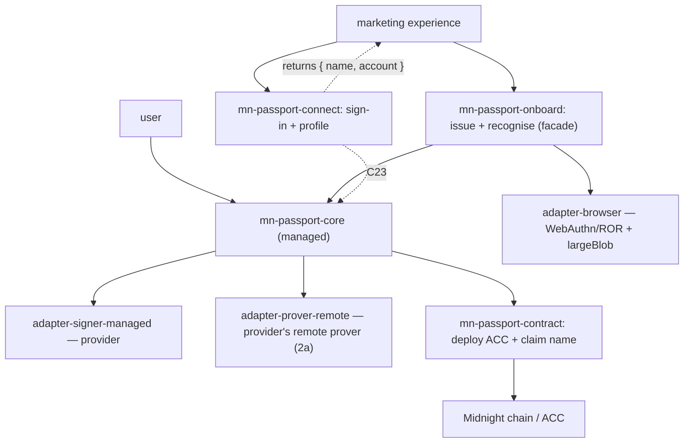

# Midnight Passport SDK — Beta (v1) scope

> **Status:** draft · 2026/07/29
> **Reduces:** [`sdk-requirements.md`](./sdk-requirements.md) and
> [`architecture.md`](./architecture.md) to the smallest slice that ships a
> usable beta. Every in-scope item points to its full-scope section; every
> deferral says where it will come from later. Built the way
> [`development-workflow.md`](./development-workflow.md) describes.

## 1. Purpose

Ship a reduced beta that does two things well:

1. proves **full account setup** works end to end on the **managed path**, and
2. lets a first reference dApp — a **marketing experience** — **issue a new
   Passport in place** (partner-origin onboarding, §2 item 5), sign a user
   in, and read their profile.

Everything not needed for those two is explicitly deferred (§4). The beta is
deliberately the *managed, provider-backed* path only: it is the fastest way
to something real in users' hands and it is what the account-custody
prototype already demonstrated.

## 2. In scope

**(1) Full account setup** — deploy the Account Custody Contract (ACC) and
claim the name (`alice.passport.night`). Covers onboarding (§3.1), the ACC
(§1.1 / C1) and the name service (§2 / C2). The DUST fees for these setup
transactions are **sponsored by the provider** (see item 3), so a zero-DUST
user can onboard with no faucet or separate fee mechanism.

**(2) Managed path first, with a self-custody fallback** — the account is set
up and used through the **wallet-infrastructure provider** (the managed
custody path, §2.1 / §2.6). Because the provider's signer integration is an
external gate that may not be ready in time, beta **also builds
`adapter-signer-local`** — the self-custody signer (in-circuit Jubjub device
keys, §2.1 decentralised / §2.3) — as a **contingency fallback** behind the
same signer seam: same flow, same ACC, one-line swap (architecture §4.6,
example 1). The managed path remains the primary beta experience; the
fallback is promoted only if the provider gate slips
([ADR 0001](./adr/0001-beta-includes-local-signer-fallback.md)). Progressive
decentralisation of the *default* path stays post-beta. Passkeys are
**always** used to
confirm transactions (§2.2): the provider's own login is passkey-based, and
that passkey is the presence gate on every managed-path action. The
decentralised *use* of the passkey (deriving an in-circuit device key) lives
only in the fallback adapter; as the default path it stays deferred.

**(3) Proving via the provider's remote proof server only (PWA flows)** —
all PWA-flow proofs route to the provider's remote prover (§2.5 **path 2a**,
provider-routed). Beta does **not** do in-tab WASM proving and does **not**
run the k-threshold router: every PWA-flow proof goes to the provider
regardless of circuit size. The one disclosed exception is item (5): the
partner-origin issuance facade reaches the **same third-party proving and
DUST sponsorship service directly** (no provider in the loop) — a distinct,
recorded decision (ADR 0005), not a second router. The SDK encrypts the witness to that prover's
enclave (§2.5); the provider returns the proof. The same provider path also
**sponsors the DUST fees** — including the account-setup transactions (item
1) — so beta needs no separate fee/sponsor mechanism (Capacity Exchange,
§3.11, stays out of beta). Because beta proves remotely by default (there
is no in-tab option yet), there is no in-tab → remote switch to consent to;
instead the reduced-privacy posture (the witness goes to the provider's
enclave) is disclosed at onboarding and shown as a standing reminder, per
§2.5.

**(4) dApp connect — sign-in + profile read only** — the connector (§3.9)
implements **Sign-In-with-Passport** and returns the user's **profile: the
ACC contract address plus the alias (name)**. That is the whole
conversational surface in beta. No witness provisioning (#58), no
scoped-grant issuance or spending, no deposits.

**(5) Partner-origin onboarding** — a partner dApp can **issue the Passport
itself** via `mn-passport-onboard` (§3.13,
[`onboarding-and-key-authorisation.md`](./onboarding-and-key-authorisation.md)): passkey created under
the Passport RP ID (Related Origin Request), ACC deployed over the same
provider rails as item (3) (fees sponsored), and the ACC address stamped
onto the credential via largeBlob so the Passport app recognises the account
in one ceremony. Sign-in with the existing passkey works at the partner
origin and at Passport. The deploy uses the **same third-party proving and
DUST sponsorship service as item (3), reached directly** — no provider in
the loop (passkey/PRF path only for now; the managed provider-authoriser
variant is deferred to a future iteration,
[`onboarding-and-key-authorisation.md`](./onboarding-and-key-authorisation.md) §5). The
redirect-to-Passport fallback is mandatory below the compatibility floor. **Scope consequence:** the facade embeds the `core`
kernel, so the kernel and seam foundations (FS-0.3–0.8) move onto the beta
critical path.

**Reference dApp — a marketing experience that onboards.** It installs
`mn-passport-onboard` + `mn-passport-connect`: it can **issue a new Passport
in place** (item 5), sign an existing user in, and read `{ name, account }`
to personalise. It still never spends, never asks for a grant, and never
touches **stored** witness state — with one qualified moment: during
issuance (item 5) the embedded kernel transiently holds the new account's
device secret, the accepted residual risk recorded in
[`onboarding-and-key-authorisation.md`](./onboarding-and-key-authorisation.md) §8. Issuance and
recognition only, which keeps it a safe first integration and a good
dogfooding partner for both packages.

## 3. The active slice (packages and adapters)

Live in beta:

- `mn-passport-core` — a slim build: the onboarding flow and the connect
  answer, the kernel, the seams.
- `mn-passport-contract` — ACC bindings for deploy and the calls onboarding
  needs.
- `mn-passport-connect` + `mn-passport-protocol` — the dApp side, sign-in and
  profile read only; `protocol` also carries the §3.13 shared constants
  (RP ID, PRF salt, largeBlob schema).
- `mn-passport-onboard` — the partner-origin issuance facade (§2 item 5):
  composition over `core` + adapters, exposing `createPassport` and `signIn`
  only.
- `adapter-browser` — the browser Platform adapter (WebAuthn/ROR ceremonies,
  bundled PRF + largeBlob assertions, fetch/WebSocket) the facade and the
  PWA share.
- `adapter-signer-managed` — the provider-backed custody path.
- `adapter-signer-local` — the self-custody signer, built as the
  **contingency fallback** should the provider integration slip (§2 item 2,
  [ADR 0001](./adr/0001-beta-includes-local-signer-fallback.md)).
- `adapter-prover-remote` — pinned to the provider's remote proof server
  (path 2a).

Not built for beta: `adapter-prover-wasm`,
`adapter-agent-ows`, `adapter-wallet-connect`, `adapter-fee-capacity-exchange`,
and the witness-provisioning half of the connector.

## 4. Out of scope for beta (deferred, with pointers)

| Deferred | Comes from |
|---|---|
| Decentralised / self-custody as the **default** path (the fallback adapter is in beta, §2 item 2) | §2.1 decentralised, §2.3 |
| In-tab WASM proving; the k-threshold prover router; the direct TEE *prove-and-broadcast* path (the §2(5) facade's direct service connection is in scope and disclosed there) | §2.5 paths 1 and 2b |
| Witness provisioning to dApps | #58 · §3.6 / §3.9 |
| Scoped grants (issue / spend) beyond sign-in | §3.2 · C10–C12 |
| Agents / OWS | §3.8 |
| External wallet connections | §3.10 |
| DUST sponsorship / Capacity Exchange | §3.11 |
| Deposit mechanism (paying a Passport account) | §3.12 |
| Recovery (lost-device / total-loss) | §3.4 · C13–C15 |
| DID (`did:midnight`) | §3.7 |
| Multi-device beyond the provider's own (except FS-2.4's authorising-additional-keys flow, specced against §3.5 — see [`onboarding-and-key-authorisation.md`](./onboarding-and-key-authorisation.md) §6) | §3.5 |

Beta leans on the **provider** for anything managed it happens to offer
(recovery, multi-device); Passport's own versions of those come after beta.

## 5. Open questions to close before beta ships

- **Provider remote-prover readiness.** Item (3) assumes the provider's
  remote proof-server integration (with fee sponsorship) exists. If it is not
  ready, beta proving and fee-paying are blocked or need an interim (a local
  proof server + a stopgap fee payer). Confirm the timeline with the
  provider.
- **Managed key binding.** In the prototype the managed device secret is a
  random, browser-local value that does not port across devices (§2.6,
  demo-grade). Acceptable for beta? If a beta user needs the same account on
  a second device, the portable §2.3 binding is needed sooner rather than
  later.
- **Fallback activation checkpoint.** `adapter-signer-local` is built as the
  contingency (§2 item 2, ADR 0001); define the date/milestone at which the
  provider's signer readiness is assessed and the fallback is either promoted
  to the beta onboarding path or left dark.
- **Kernel/seam critical path.** Item (5)'s facade embeds the `core` kernel,
  so FS-0.3–0.8 (kernel, signer, prover, settlement, storage, platform) are
  no longer parallel groundwork but beta-blocking — they need issues and
  plans first (ADR 0005). Assess this against the October date; the redirect
  fallback keeps the reference dApp shippable if the facade slips.

## 6. Delivery

Beta is anchored to a single GitHub issue and planned into small,
reviewable PRs via `mn-passport-skills-spec-driver` (development-workflow §3). Rough
tranches:

1. Managed onboarding — ACC deploy + name claim, proofs via the provider's
   remote prover.
2. Connect — Sign-In-with-Passport returning `{ name, account }`.
3. Marketing-experience integration against the connector (off-chain).
4. Hardening and the beta demo.
