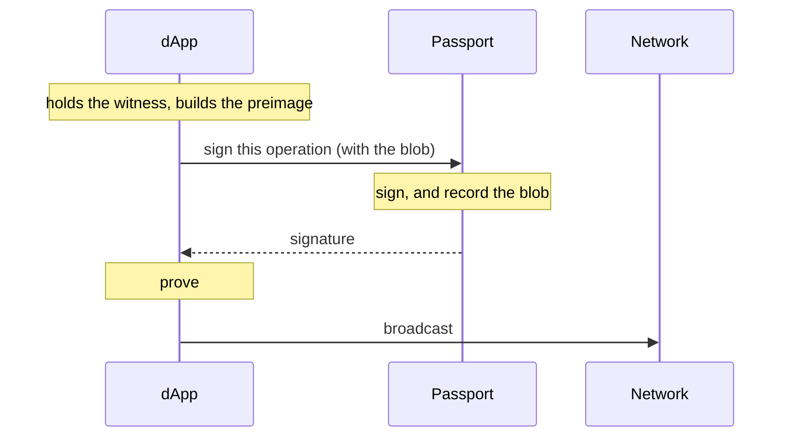
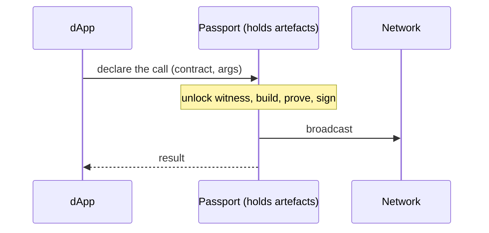
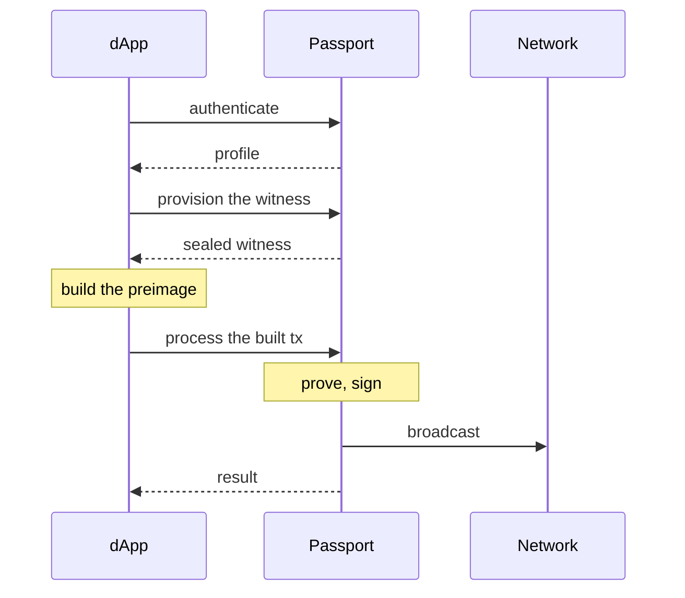
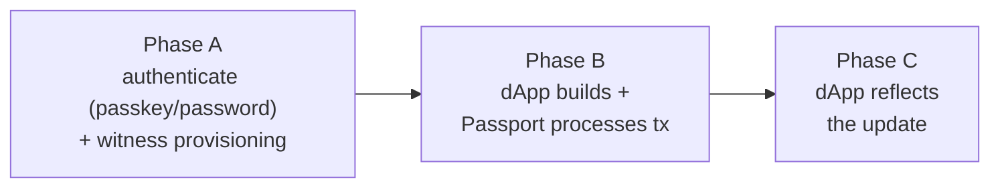
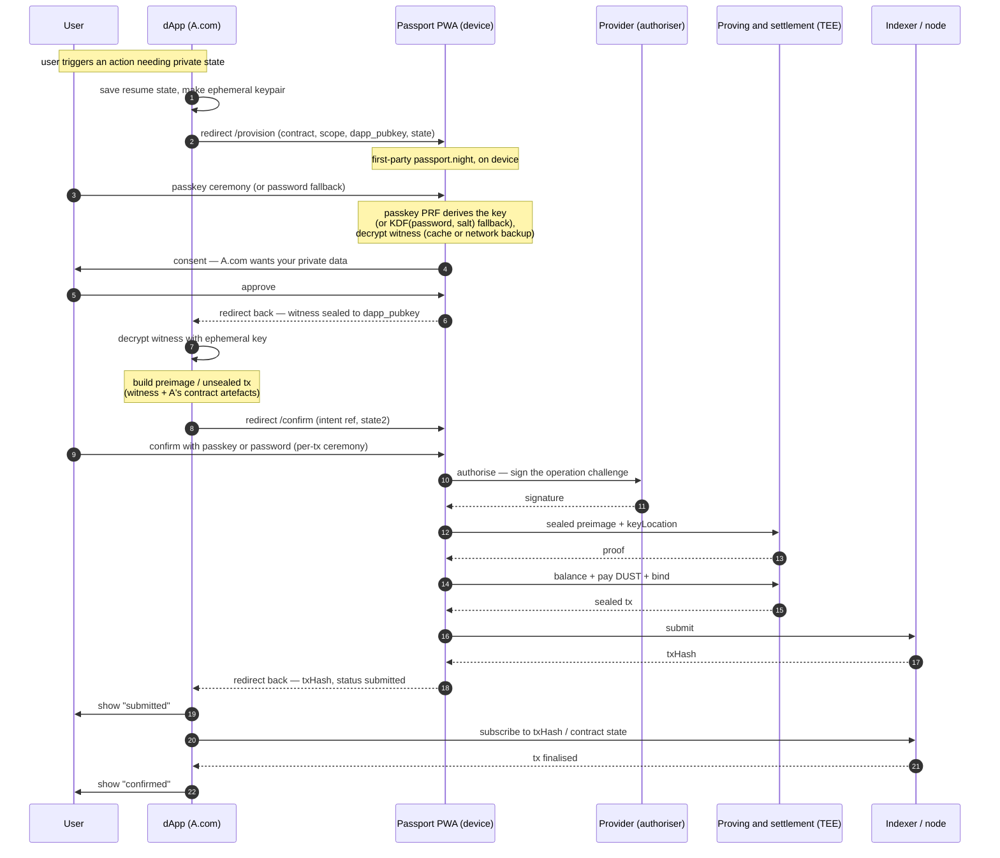

# dApp ↔ Passport connection

> **Status:** draft · 2026/07/30
> **Scope:** how an external dApp communicates with Passport to exchange data,
> under the browser storage-isolation constraint. **§3 compares three
> interaction models** — how much of *build / prove / broadcast* each side does,
> and how many dApp↔Passport jumps that costs. **§4–§5 detail Path 3**, end to
> end: the witness-provisioning + transaction case on a
> **mobile PWA**, using the **passkey (preferred) or password** ceremony. Feeds
> **C23** (dApp connection protocol) and the `mn-passport-connect` spec (§3.9).
> Companion to [`provider-integration.md`](./provider-integration.md).

## 1. The model, in brief

Because the dApp (origin **A**) and Passport (origin **P**) are isolated origins
with no shared storage, **the boundary between them is a message boundary** —
the dApp cannot read Passport's storage, so every interaction is an explicit,
consented **request → response** that Passport fulfils in its own first-party
context and answers with a **scoped result**. That is the whole interaction
model; the specific flows (connect, provision, confirm) are methods on it.

Three invariants make it work:

- **One RPC surface, pluggable transport.** The dApp calls the same typed
  methods; the transport varies by platform — **redirect** (mobile, same
  device), **relay** (cross-device), **extension / postMessage** (desktop).
  This doc uses the mobile **redirect** transport.
- **Passport executes on the device and returns only scoped results.** The
  "RPC" is not a server — it is the Passport PWA running in the browser on the
  user's device, in its own origin, reached by navigating to its routes
  (`/provision`, `/confirm`). The passkey/password ceremony gates every
  sensitive step, always in P's context.
- **The shared ledger is the out-of-band truth channel.** On-chain results
  (confirmations, contract state) are read from the **indexer** that both sides
  watch — never trusted from the return payload alone.

Storage isolation is neutralised at two seams: **A↔P** by the RPC (A never
touches P's storage — it asks), and **P-across-contexts** by making P's own
state portable without browser storage (the ceremony key + the on-chain ACC +
the #58 sealed backup).

## 2. Actors

- **User** — on a phone.
- **dApp (`A.com`)** — the external web app.
- **Passport PWA** — the RPC responder, running in the browser on the device at
  `passport.night`.
- **Provider** — the managed authoriser (signs the ACC operation challenge).
- **Proving & settlement service (TEE)** — proves in an enclave and sponsors
  DUST.
- **Indexer / node** — the network, and the truth channel.

## 3. Interaction models — three paths

The jumps between the dApp and Passport are just **handoffs**, and on a mobile
PWA every handoff is a full-page redirect. How many there are is decided by how
the work — **build the preimage · prove · broadcast** — and the **witness** are
split across the two parties. Concentrate the work on one side and the jumps
collapse. Three models span the space, trading **UX (jumps)** against **witness
custody (privacy)** and against **how much Passport must host**.

**Path 1 — Passport as signer only.** The **witness / private state lives on the
dApp**; the dApp builds the preimage, proves, and broadcasts. Passport's only job
is to **attach the signature** the ACC verifies and **keep a record of what it
signed**. Because the signing request carries the operation blob, Passport can
store that blob on the PWA — mirroring the state for history and recovery
without being its primary custodian. **One jump** (dApp → Passport to sign →
back). *Cost:* the private state lives on the dApp (weaker privacy — Passport
isn't the custodian), and the dApp runs the whole prove/broadcast pipeline.
Passport is effectively a remote authoriser plus an audit log.

**Path 2 — Passport holds the supported dApps' artefacts.** Passport (the PWA)
holds the contract + ZK artefacts for a **curated set of supported dApps**. The
dApp **declares** the call; Passport **builds the circuit, proves, and the PWA
broadcasts**. The **witness never leaves Passport**. **One jump** (dApp declares
→ Passport does it all → back). *Cost:* Passport must hold and maintain every
supported dApp's artefacts and run their circuits — a curation, trust, and QA
burden that does **not** scale to arbitrary dApps. Strongest privacy and best
UX, for a closed/curated dApp set.

**Path 3 — today: Passport proves and broadcasts, the dApp builds.** The dApp
builds the preimage, so the witness is **provisioned out** to it, then the built
transaction is handed **back** for Passport to prove and broadcast. **Multiple
jumps** (authenticate · provision · process). *Cost:* the split — dApp builds,
Passport proves — forces the witness to round-trip, which is exactly the poor
experience. Most flexible (any dApp, no curation) and the witness stays
Passport-custodied and scoped, but it pays the jump cost.

| | **Path 1** · signer only | **Path 2** · Passport holds artefacts | **Path 3** · today |
|---|---|---|---|
| Witness / private state | on the dApp (Passport keeps a record) | in Passport | Passport-custodied, provisioned to the dApp |
| Builds the preimage | dApp | Passport | dApp |
| Proves | dApp | Passport / its service | Passport / its service |
| Broadcasts | dApp | PWA | PWA |
| Passport's role | sign + record | build + prove + broadcast | prove + broadcast |
| dApp ↔ Passport jumps | **one** | **one** | **many** |
| dApp scope | any | curated / supported only | any |
| Witness privacy | weaker (on the dApp) | strongest (stays in Passport) | strong (scoped provisioning) |
| Chief cost | dApp holds state + runs the pipeline | Passport hosts + runs third-party circuits | the jumps |

**Reading it.** Path 3 is the multi-jump model the earlier walkthrough used, and
its split is the source of the jumps. Paths 1 and 2 each reach **one jump** by concentrating the work at
opposite ends — Path 1 pushes it all to the dApp (Passport is a signer), Path 2
pulls it all into Passport (for supported dApps). The choice is a triangle of
dApp flexibility, witness privacy, and how much Passport hosts:

- **Curated, first-party-ish dApps** → **Path 2**: one jump, best privacy,
  scales by adding supported dApps to Passport.
- **Arbitrary or self-sufficient dApps** → **Path 1**: one jump, minimal
  Passport, but the dApp becomes the custodian of the private state.
- **A dApp that must build its own circuit *and* keep the witness
  Passport-custodied** → **Path 3**, accepting the jumps.

The rest of this document details **Path 3**; **none of the three is decided
yet** — Paths 1 and 2 are the one-jump alternatives.

## 4. Path 3 in detail

The diagram and steps below detail **Path 3** — the flexible, multi-jump model
where the dApp builds and Passport proves and broadcasts. It is spelled out here
because the earlier walkthrough used it; **it is not a decision.** Paths 1 and 2
collapse it to a single jump.

## 5. Step by step

### Phase A — authenticate + witness provisioning

1. In the dApp, the user does something needing their private state for A's
   contract. The dApp records a pending action, a `state` nonce, and generates
   an **ephemeral keypair** (to receive the witness sealed).
2. The dApp redirects to
   `https://passport.night/provision?client_id=A&contract=<A's contract>&scope=<…>&redirect_uri=https://A.com/cb&state=<nonce>&dapp_pubkey=<ephemeral pub>`.
3. The browser loads the **real Passport PWA** on the device — first-party
   `passport.night`.
4. Passport runs the **passkey ceremony** (biometric); the passkey **PRF**
   derives the wrapping key. *(No passkey on this device → fall back to a
   **password**, `KDF(password, salt)`.)* It fetches the witness ciphertext
   (IndexedDB cache, or the #58 sealed backup if evicted) and decrypts. That
   ceremony is the gate.
5. Passport shows consent; the user approves.
6. Passport **seals the witness to the dApp's ephemeral public key** and
   redirects to `https://A.com/cb#witness=<sealed>&state=<nonce>`.
7. The dApp verifies `state`, decrypts the witness with its ephemeral private
   key. **The dApp now holds its witness.**

### Phase B — dApp builds, Passport processes

8. The dApp uses the witness (plus its own contract artefacts) to **build the
   preimage / unsealed transaction** locally — it must be the dApp, because
   Passport does not hold A's contract code.
9. The dApp redirects to
   `https://passport.night/confirm?client_id=A&request=<intent ref>&redirect_uri=https://A.com/cb&state=<nonce2>`
   (a **reference**, not the proof-sized blob).
10. The user **confirms with the passkey** (or password fallback) — the
    per-transaction ceremony.
11. Passport **processes the transaction**: the provider signs the ACC
    authorisation (for ACC-touching ops), the service proves the sealed preimage
    in its TEE, balances and pays the DUST fee and binds, then submits. Passport
    gets the `txHash`.
12. Passport redirects to `https://A.com/cb#txHash=<…>&status=submitted&state=<nonce2>`.
13. The dApp verifies `state`, correlates it to the pending action, and shows
    **"submitted"** (optimistic UI).

### Phase C — dApp gets the update

14. The dApp's **indexer subscription** on the `txHash` / contract state fires
    when the tx lands → the dApp shows **"confirmed."** This is the authoritative
    update, independent of the redirect.

## 6. The ceremony: passkey preferred, password fallback

The ceremony both authenticates the user and yields the wrapping key that
decrypts the witness. **Passkey is the default; password is the fallback.**

- **Passkey (preferred).** The passkey **PRF** derives the wrapping key. It is
  backed by the Secure Enclave, **iCloud / Google-synced**, **jar-independent**
  (the same PRF secret is returned in any `passport.night` context), and
  **phishing-resistant** (RP-ID bound). The last two are why it is preferred: it
  also solves the storage-context problem, because the key is available in
  whatever context the redirect lands in without depending on browser storage.
- **Password (fallback).** For a user or device without a passkey, the wrapping
  key is `KDF(password, salt)` (Argon2id). The password is never stored (typed
  each ceremony); the salt is non-secret and travels with the ciphertext / #58
  backup. It needs neither the keystore nor a synced passkey — only the salt +
  ciphertext reachable in the landing context, which #58 provides. Trade-off: no
  RP-ID phishing resistance and no hardware backing, so use a strong,
  rate-limited KDF and a clear domain cue (the user is typing into the real
  `passport.night`).

Either way the **witness ciphertext** must be reachable in the landing context
(IndexedDB cache or the #58 sealed backup); the only difference is the key
source — **PRF** (passkey) vs **KDF** (password).

## 7. Notes

- **Two visits, amortised.** Provisioning (Phase A) and processing (Phase B) are
  separate visits because the dApp must build the preimage itself and therefore
  needs the witness first. Provision **once per session** and cache the witness
  in the dApp's own storage; subsequent transactions are then just Phase B + C —
  one visit each.
- **Return is optimistic, indexer is truth.** Never treat the `status=submitted`
  redirect payload as proof of settlement; confirm via the indexer (§5.14).
  Guard the return with the `state` nonce and an origin/signature check so a
  spoofed redirect cannot fake a confirmation.
- **Where each step runs.** Ceremony, witness decryption, and preimage build are
  on the device (Passport and the dApp, in their own origins). The provider and
  the service are called **by Passport**, not by the dApp. The indexer is shared.
- **What each party sees.** The dApp receives only **its own** witness (scoped,
  consented). The provider sees the operation challenge, not the witness. The
  service's enclave sees the sealed preimage; its infrastructure sees only
  ciphertext. The indexer sees the public transaction.

## 8. Open items / what this feeds

- **Which interaction model to use** (§3) — Path 3 is today's, and the source of
  the jumps; Paths 1 (signer-only) and 2 (Passport holds artefacts) each reach a
  single jump from opposite ends. A possible split to weigh: curated dApps → Path 2,
  arbitrary or self-sufficient dApps → Path 1, must-build-and-keep-custody →
  Path 3.
- The **return transport for the witness** — sealed-to-ephemeral-key (shown) vs
  a one-time code the dApp exchanges over HTTPS. Pick one for the connect spec.
- The **session bridge** between Phase A and B — how long a single ceremony
  covers, before a fresh confirm is required.
- Feeds **C23** (the dApp connection protocol: the RPC surface, the transport
  matrix, the message envelope) and the `mn-passport-connect` spec (FS-2.2),
  whose "session persistence across origins" open question this resolves.
- The **cross-device** variant is the same shape with the **relay** transport
  in place of the redirect. The **password fallback** (KDF instead of PRF) is
  covered inline in §6.
