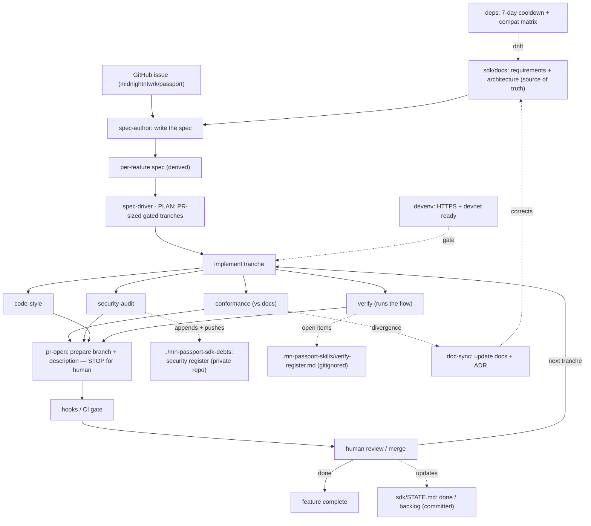
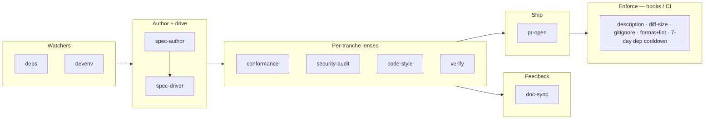

# Development workflow — the `mn-passport-skills` family

> **Status:** draft · 2026/07/31
> **Companion to:** [`sdk-requirements.md`](./sdk-requirements.md) (the *what/why*)
> and [`architecture.md`](./architecture.md) (the *how*). This document is the
> *how we build it* — the Claude-harness skills that drive SDK development and
> how they orchestrate a spec from plan to merged PR.

**Naming:** development-time skills are prefixed **`mn-passport-skills-*`**
(invoked `mn-passport-skills:<name>`); the shipped runtime packages are
**`@midnight-ntwrk/mn-passport-*`** (§4.4 of the architecture). The `-skills`
infix and the `@midnight-ntwrk/` scope tell them apart: `mn-passport-skills-*`
build the SDK; `@midnight-ntwrk/mn-passport-*` *are* the SDK.

---

## 1. Rationale

A development workflow has to do two things, and it is easy to build one that
only does the first:

1. **Produce and check code** — plan the work, write it, and review it for
   design conformance, security, and style.
2. **Close two feedback loops** — *does it actually run?* and *did we just
   learn the docs are wrong?*

The second is where the real surprises live. On this project specifically,
the two largest course-corrections during planning were exactly those loops
firing: discovering how the managed flow *actually* executes a contract call
(a "does it run" finding), and correcting the managed-path model in the docs
afterwards (a "the docs were wrong" finding). A workflow with no first-class
home for either will drift — the code stops matching reality, and the docs
stop matching the code.

Two principles fall out and shape everything below:

- **Skills assist and judge; hooks/CI enforce.** Anything that must be
  *guaranteed* — a PR always has a description, security findings never land
  in this repo, dependencies respect the cooldown — lives in the deterministic
  layer (hooks/CI), because the harness runs it, not the model. Skills draft,
  review, and advise; they never *guarantee*. Mixing the two produces a skill
  that "usually" adds a description.
- **`sdk/docs` is the source of truth; conformance gives it teeth; doc-sync
  keeps it true.** Per-feature specs are *derived from* the requirements and
  architecture. `mn-passport-skills-conformance` checks code against those docs, so
  they must stay current — which is `mn-passport-skills-doc-sync`'s job. Without the
  sync loop, conformance quietly validates against stale truth.

---

## 2. The skills

All prefixed `mn-passport-skills-`. Each entry: what it does, when it fires, and what
existing tooling it leans on (we wire, we do not reinvent).

### Spine

**`mn-passport-skills-spec-author`** — write the spec. Expands a feature-spec brief in
`docs/roadmap/milestones/` into a full per-feature spec in `docs/roadmap/specs/` (scope, decisions, interfaces,
acceptance, verify plan, and a *proposed* tranche outline), derived from the
source docs and checked against the planning workspace. Names the spec's GitHub
issue — **stops and asks if there is none** — so planning never stalls. Authors
only: it does not finalise the gated tranches (that is `spec-driver`), write
code, or perform outward actions.

**`mn-passport-skills-spec-driver`** — plan, then loop.
- *Plan phase* (harness plan mode): a per-feature spec → an ordered set of
  **tranches, each sized to one small/medium PR**, each with an acceptance
  gate. **Every tranche carries a size estimate** (files touched, rough net
  lines), against the **tranche budget**: target **≤ ~400 net changed lines**,
  hard split above **600** (both excluding lockfiles, generated code, and
  test fixtures — cheap-to-review mechanical lines don't count). A plan with
  a tranche estimated over budget is **invalid** — it gets re-split at plan
  time, when splitting is cheap, not after the code exists. The estimate is
  what lets the human reviewer catch an oversized tranche during plan review.
  PR boundaries are decided here, up front — not bolted on later. The
  plan phase also **requires the spec's GitHub issue** (from
  `midnightntwrk/passport/issues`); if the spec names none, it **stops and
  asks for it** before planning — no untraceable work.
- *Loop phase* (harness `/loop`): per tranche → implement → run the review
  lenses → `mn-passport-skills-pr-open` → **stop for human review/merge** → next
  tranche. On each tranche's completion or slip it updates **`STATE.md`**
  (§3) so the progress and backlog view stays current.

### Review lenses (run per tranche, parallelisable, each also invokable alone)

**`mn-passport-skills-conformance`** — the design guard. Checks the change against the
requirements + architecture: seam/adapter structure, package-dependency rules
(`connect` never links `core`; deposits ride `contract` — arch §4.4), the
normative MUSTs (ceremony gate §2.2, deposit-not-address §3.12,
encrypt-preimage-to-enclave §2.5), naming, and the two version axes. Its
checklist is *derived from* `sdk/docs`, which are themselves derived from the
**Midnight Passport planning workspace** — so conformance also checks the
change against that upstream (the `passport` repo: the component canvases
`[C…]`, promises `[P…]`, and recorded decisions), resolved at `../passport`
locally or the public `github.com/midnightntwrk/passport` when there is no
local checkout. Consulted at plan time so the plan aligns; enforced at review
time so the code does.

**`mn-passport-skills-security-audit`** — key-management review. Two outputs:
1. *Blocking findings* — fixable mismanagement (secret in the wrong place,
   witness not zeroised, missing ceremony gate) → fix now.
2. *Residual-risk register* — "insecure but not resolvable right now" items,
   each with **risk → why it can't be fixed yet → mitigations**, appended to
   the **security register in the private sibling repo
   `../mn-passport-sdk-debts`** (checked out at the same level as this repo),
   then committed and pushed there (§4). Security findings live in a private
   repo, not this one — they must never land in the SDK's public history.
   This is the demo's hand-written `DECISIONS.md` "Known gaps" list,
   automated and maintained per PR.

**`mn-passport-skills-code-style`** — project coding preferences. Grounded in
`.claude/rules/` (British English + Oxford comma, `YYYY/MM/DD` dates, Rust
style) plus TS conventions, and the **Midnight** brand for any UI —
Midnight Passport is a Midnight-branded product, not an IOG-branded one.
Judgment layer (prose in comments/docs, brand adherence, i18n,
error-taxonomy consistency); the mechanical part (format/lint) is
backstopped in CI.

**`mn-passport-skills-verify`** — *does it run?* Drives the affected flow end-to-end
rather than trusting that review passed. Leans on the repo's existing
`midnight-verify` (`/verify`, devnet, contract/witness/sdk testers) and
`midnight-cq` (test runner, test-quality). A change that passes conformance,
security, and style but does not prove or submit is not done. Open
validations it cannot close (e.g. a `[PROVISIONAL]` item awaiting a real
account) are recorded in the **verify register** (§4), owned here jointly
with doc-sync.

### Feedback

**`mn-passport-skills-doc-sync`** — *did we learn the docs are wrong?* When
implementation diverges from `sdk/docs` (reality contradicts an assumption),
the defined path is: update the requirements/architecture **and record the
decision as an ADR**. Closes the loop that conformance depends on. Leans on
the repo's existing ADR / `arcsop` machinery. Owns the **verify register** of
provisional decisions and open validations that still need re-checking.

### Ship

**`mn-passport-skills-pr-open`** — sizing check against the **same tranche budget as
the plan phase** (soft flag past ~400 net changed lines, split required past
600 — estimates drift, so this is the backstop) and the **PR description** ("what's being built" + link to
the spec tranche **and the spec's GitHub issue** — `Refs #NN`, or `Closes #NN`
on the tranche that finishes it). **Prepares** the branch, commits, and
description, then **stops for explicit human confirmation before
pushing/opening** — the loop never performs the outward action on its own.

### Watchers (fire on a schedule / on dependency changes, not per tranche)

**`mn-passport-skills-deps`** — upstream drift and supply-chain hygiene. Midnight
breaks often, and the SDK pins midnight-js / ledger / zkir / compact **and**
the ACC artefact (arch §8.2). This skill:
- **Never adopts a package version younger than 7 days.** A version published
  less than 7 days ago sits in a **cooldown quarantine** — the window in which
  a supply-chain compromise of an underlying library is most often caught and
  yanked. Adoption (new dependency or version bump) waits out the 7 days.
  Checked against registry publish time (`npm view <pkg> time`). The only
  override is an urgent security patch, taken as a *conscious, recorded*
  decision — never silently.
- Pins **exact versions** with a committed lockfile; verifies versions with
  `npm view`, never from memory; adds **no custom registry config**
  (`@midnight-ntwrk/*` are on public npm).
- Maintains the **compatibility matrix** — the two version axes (wire:
  `mn-passport-protocol`; binding: `mn-passport-contract` ↔ deployed ACC,
  arch §4.6) — and flags when an upstream bump requires a matrix update.
Leans on `release-notes` and `troubleshooting`.

**`mn-passport-skills-devenv`** — guards the dev environment. Passkeys require an
**HTTPS / secure context even locally** (a `localhost` HTTP redirect will not
do), alongside devnet + proof server + compact CLI. Also confirms the
**private debts repo is present and pushable** — `../mn-passport-sdk-debts`
checked out beside this repo, with a working remote — since `security-audit`
cannot record findings without it. Leans on `midnight-tooling:*` (devnet,
proof-server, doctor).

### Deferred (named, not built yet)

**`mn-passport-skills-release`** — version bump + changelog + publishing the
compatibility matrix. Publish-time; sequence after the core loop is proven.

### Not skills

- **Generic bug / quality review** — the harness's `/code-review` and
  `/review` already do this; the lenses above encode *our* rules, which a
  generic reviewer cannot know.
- **The merge decision** — human.
- **Per-feature spec *authoring*** — now its own Spine skill,
  `mn-passport-skills-spec-author`, feeding `mn-passport-skills-spec-driver`.

Fold-ins (not new skills): error-taxonomy + proof-provenance → conformance;
UX / a11y / i18n + brand → code-style.

---

## 3. Orchestrating a spec

The unit of work is a **per-feature spec derived from `sdk/docs`** (the big
docs are the source; a feature spec is what gets driven).

0. **Author the spec** — `mn-passport-skills-spec-author` expands a
   `docs/roadmap/milestones/` brief
   into a concrete feature spec (scope, decisions, interfaces, acceptance,
   verify plan, a proposed tranche outline), derived from requirements +
   architecture and checked against the planning workspace, naming its
   **GitHub issue** (stops and asks if none).
1. **Plan** — `mn-passport-skills-spec-driver` reads that spec and turns it into
   PR-sized, gated tranches; if the spec named no issue, it **stops and asks**
   before planning.
2. **Loop** — for each tranche:
   a. `mn-passport-skills-devenv` confirms the environment is ready.
   b. Implement the tranche.
   c. Run the lenses in parallel: `conformance`, `security-audit`,
      `code-style`, `verify`. Blocking findings are fixed before proceeding.
   d. Registers update: security-audit → security register (committed and
      pushed to the private `../mn-passport-sdk-debts` repo); verify/doc-sync
      → verify register (gitignored, local).
   e. If conformance finds the code diverging from the docs for a *good*
      reason, `mn-passport-skills-doc-sync` updates `sdk/docs` + records an ADR — the
      docs are corrected, not the code bent to a stale doc.
   f. `mn-passport-skills-pr-open` prepares the branch + description, links the PR to
      the spec's GitHub issue, and **stops**.
   g. The hooks/CI gate runs; a human reviews and merges.
3. **Repeat** until the spec's tranches are done. `STATE.md` reflects done /
   in-progress / backlog throughout; anything not completed lands in the
   backlog with a reason, never silently dropped.

Running alongside, on their own cadence: `mn-passport-skills-deps` (drift + cooldown +
matrix) and `mn-passport-skills-devenv`.

### The PR feedback loop (`gh`)

With an authenticated GitHub CLI (`gh auth login`), the review conversation
moves onto the PR itself — recommended, because it keeps feedback anchored
to the exact line it concerns and leaves a public record of the reasoning:

1. **Claude opens the PR with `gh pr create`** (title and full description
   in place) once a tranche passes its lenses — on the human's explicit go,
   as always.
2. **The developer reviews on GitHub**, leaving feedback as PR review
   comments (inline on a line, or on the PR as a whole) — questions,
   objections, and change requests alike.
3. **The developer asks Claude to pick them up** ("check the comments on
   PR #N"). Claude reads the threads (`gh api` / the REST API), works out a
   solution, and — **before committing anything — presents the proposed fix
   and its reasoning, and waits for the human to confirm they agree.**
4. On confirmation, Claude commits (staging explicit paths only), pushes to
   the PR branch, and **replies on the review thread** so the resolution is
   recorded where the question was asked.

The outward-action rule is unchanged: pushes, PR creation, and inline
replies happen on the human's instruction; merging stays human. Without
`gh`, the read-only fallback is the public REST API plus pre-filled compare
URLs (the `pr-open` convention).

### Diagram — the orchestration loop

*(All skills prefixed `mn-passport-skills-`; shortened in nodes.)*

### Diagram — the family by role

### `STATE.md` — progress and backlog

`sdk/STATE.md` is the human-readable, **committed** record of SDK development
— distinct from the registers (§4), which are kept out of this repo because
findings and open risks are not meant to ship with the code. `mn-passport-skills-spec-driver` maintains it as tranches land
or slip, in three parts:

- **Done** — completed tranches / PRs, each with its issue and PR links.
- **In progress** — the tranche currently in the loop.
- **Backlog** — tranches planned but **not completed** (deferred, blocked, or
  descoped), each with a reason and its issue. This is where non-completed
  tasks live so nothing is silently dropped.

Because every entry carries an issue number (below), "what's done / what
remains" is always traceable to the issue tracker.

### Issue traceability

Every per-feature spec **must name a GitHub issue** from
[`midnightntwrk/passport/issues`](https://github.com/midnightntwrk/passport/issues).
The chain runs **issue → spec → tranches → PRs → `STATE.md`**:

- A spec without an issue → `mn-passport-skills-spec-driver`'s plan phase **stops and
  asks** before starting work.
- `mn-passport-skills-pr-open` links each PR back to that issue (`Refs #NN`, or
  `Closes #NN` on the finishing tranche).
- The hooks/CI gate checks the PR references its issue (§4).
- `STATE.md` entries carry the issue number, closing the loop.

---

## 4. Enforcement layer (hooks / CI)

Deterministic guarantees, run by the harness/CI rather than judged by a skill:

- **PR description present**, referencing its spec tranche **and its GitHub
  issue** (`Refs`/`Closes #NN`).
- **Diff-size guardrail** — the same numbers as the tranche budget: **soft
  warning past 400 net changed lines, hard failure past 600** (excluding
  lockfiles, generated code, and test fixtures), pointing back to
  `mn-passport-skills-pr-open`'s split suggestion.
- **Security register never in this repo** — security findings live in the
  private sibling repo `../mn-passport-sdk-debts`; `.mn-passport-skills/` stays
  git-ignored as a backstop so no register file can be committed here.
- **Verify register gitignored** — `.mn-passport-skills/` is git-ignored; the verify
  register lives there and never pushes.
- **`STATE.md` committed** — `sdk/STATE.md` is *not* under `.mn-passport-skills/`;
  progress and backlog are shared project state, tracked in the repo.
- **Format + lint** pass.
- **7-day dependency cooldown** — CI rejects a lockfile that introduces a
  package version published less than 7 days ago, unless an override marker
  (with a recorded reason) is present. The cooldown is also enforced
  **natively at resolution time**: pnpm's `minimumReleaseAge: 10080` (with
  `blockExoticSubdeps` and `trustPolicy: no-downgrade`) in
  `pnpm-workspace.yaml`, and npm's `min-release-age = 7` in `.npmrc` — the
  CI script remains the reviewed-delta check and carries the recorded
  urgent-override mechanism.

`.mn-passport-skills/` joins the repo's existing gitignored working dirs (`.planning/`,
`.serena/`).

---

## 5. Conventions adopted

Stated so the doc is decisive; each is revisitable.

- **Prefix** `mn-passport-skills-` for every development skill.
- **Specs are per-feature**, derived from `sdk/docs`; the big docs are the
  source of truth.
- **Tranche budget: 400 soft / 600 hard** net changed lines (excluding
  lockfiles, generated code, and test fixtures). Applied three times with
  the same numbers: plan-phase estimates (a plan with an over-budget tranche
  is invalid), `pr-open`'s backstop check, and the CI guardrail.
- **Two registers, two homes.** The *security register* (owned by
  `security-audit`) lives in the **private sibling repo
  `../mn-passport-sdk-debts`** and is committed + pushed there per PR. The
  *verify register* of provisional / open-validation items (owned by
  `doc-sync`, fed by `verify`) stays gitignored under `.mn-passport-skills/`.
  Both persistent and appended — accepted risks and open validations
  accumulate and are re-checked, not regenerated.
- **The loop stops before outward actions** — it prepares PRs; it does not
  push or open them without explicit human go. **One recorded exception:**
  pushing the security register to the private `../mn-passport-sdk-debts`
  repo, which exists precisely to receive those findings.
- **Enforcement in hooks/CI, judgment in skills.**
- **Packaged as one `mn-passport-skills` plugin** — the skills and their backing
  hooks travel together.
- **Every spec names a GitHub issue**; planning refuses to start without one.
  Traceability runs issue → spec → tranches → PRs → `STATE.md`.
- **`STATE.md` (committed)** tracks done / in-progress / backlog; the two
  registers — security (private debts repo) and verify (gitignored) — track
  residual risks and open validations.

---

## 6. Open items

- Whether `mn-passport-skills-verify` is a distinct skill or simply "the loop always
  runs `/verify` before `pr-open`". Drafted here as distinct (it wraps
  existing tooling and owns register entries), revisitable.
- ~~Whether per-feature spec authoring warrants its own skill.~~ **Resolved:**
  authoring is now `mn-passport-skills-spec-author` (§2 Spine).
