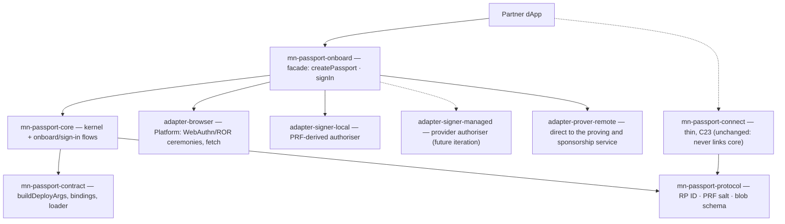
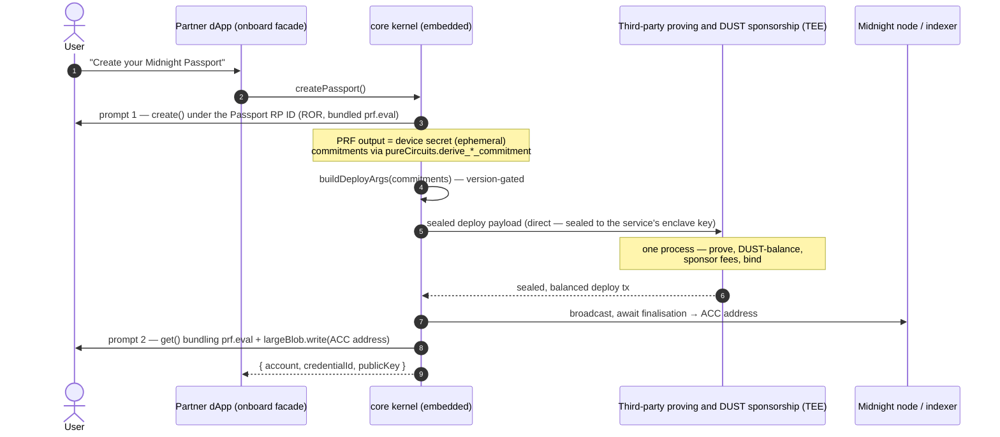
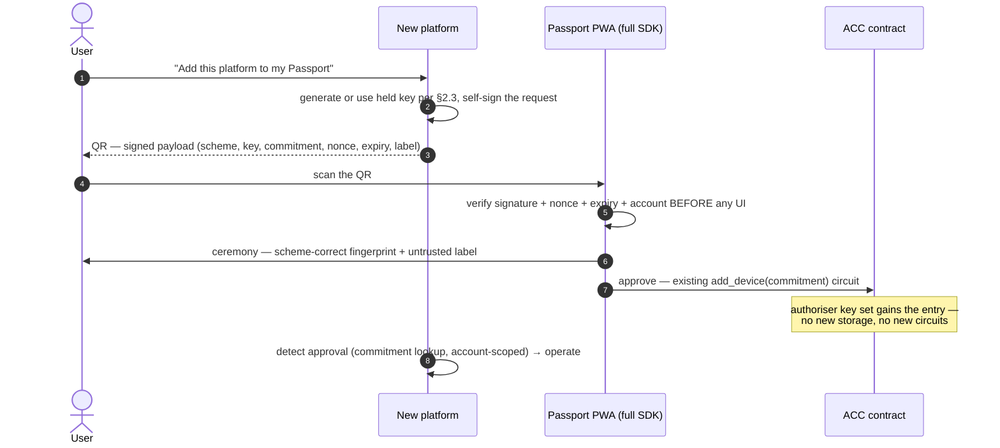

# Onboarding and key authorisation — Passports issued and recognised at partner origins; authority granted only in the PWA

> **Status:** draft · 2026/08/27
> **Companion to:** [`sdk-requirements.md`](./sdk-requirements.md) (§3.13 and
> §3.5's key-authorisation rule are the requirements this doc details), [`architecture.md`](./architecture.md)
> (§4.4 packaging), [`provider-integration.md`](./provider-integration.md)
> (the proving and settlement rails every deploy rides), and
> [`dapp-connection.md`](./dapp-connection.md) (the conversational surface
> this deliberately is *not*).
> **Grounded in:** the confirmed experiment
> `experiments/passkey-prf-linking/` (findings 2026/08/17–18: Related Origin
> Requests, PRF continuity, and the largeBlob round-trip all verified,
> including on a real macOS authenticator).

## 1. The idea

Today a user becomes a Passport user inside the Passport PWA. This design
adds the second door: **a partner dApp issues the Passport itself.** The
user, on `nightfi.example`, taps "Create your Midnight Passport"; a passkey
is created **under the Passport RP ID** (a WebAuthn Related Origin Request);
their Account Custody Contract is deployed; and the deployed **ACC address is
stamped onto the credential** via the largeBlob extension. When the user
later opens the Passport PWA, one passkey ceremony re-derives the same key
material and reads the same credential — the account is *recognised*, not
re-created.

```text
One passkey · one identity root · issued anywhere · recognised at Passport
```

Three surfaces, one credential:

1. **Issue** (partner dApp): create passkey → deploy ACC → attach address —
   the **passkey/PRF (self-custody) path**, the one documented here (§3).
2. **Sign in** (partner dApp or Passport): one ceremony → key + ACC address.
3. **Managed variant** *(future iteration)*: a wallet-infrastructure
   provider supplies the authoriser and presence gate instead of the
   passkey-derived key — same ACC, same signer seam; its flow is **not
   documented yet** (§5).

The centre does not move: **identity is the ACC, not the key** (requirements
§1.1). The passkey is the shared authentication and discovery credential; the
blob on it is a bootstrap pointer; the chain remains the source of truth.

## 2. Packaging — a facade over the core, never a fork

The capability ships as **`@midnight-ntwrk/mn-passport-onboard`**: the
dApp-side issuance package. It is **composition only** — no custody, ceremony,
contract, or proving logic of its own:

- It **links `mn-passport-core`** and instantiates the kernel with the
  browser adapters: `Passport.create({ signer, prover, settlement, storage,
  platform })` per the FS-0.3 kernel and the FS-0.4–0.8 seams.
- It exposes a deliberately **narrow API** — `createPassport`, `signIn`,
  `capabilities` (issuance and recognition), plus the §6 **key-authorisation
  request** pair (`createAuthoriserRequest`, `awaitApproval`) — requests
  only, never approvals. No scoped grants, no recovery, no asset surface,
  and no authority-changing operation: an externally issued account does
  *less* at the partner origin by design; the full lifecycle, and every
  approval, lives in the Passport PWA.
- **The `connect` rule is unchanged**: the conversational dApp package
  (`mn-passport-connect`) still never links `core`. `onboard` is the one
  recorded exception, and the reason is honest: **issuance is custody work.**
  A dApp that embeds `onboard` embeds the custody kernel for the duration of
  issuance — that is its threat model, stated plainly, not hidden behind a
  reimplementation (ADR 0005).



**Shared constants live in `mn-passport-protocol`** — its charter is exactly
"types and constants both sides compile against, no logic":

- `PASSPORT_RP_ID` — the Passport RP ID (e.g. `midnightpassport.com`;
  **config-overridable**, the domain may change — every ceremony API takes an
  optional `rpId`).
- `PRF_DEVICE_KEY_SALT` = `mn-passport/prf/device-key/v1` — this **fixes
  FS-0.8's provisional salt convention**: the partner package and the
  Passport PWA MUST evaluate the same salt or recognition breaks.
- The **largeBlob payload schema**, versioned and fixed-width:
  `{ v: 1, acc: 32-byte ACC address, binding: binding-version tag }` — types
  and constants only; the pure codec (`encodeBlob` / `decodeBlob`) lives in
  `core` (protocol ships zero runtime logic, architecture §4.4; both
  consumers of the codec — the facade and the Passport app — reach `core`).

### 2.1 What it looks like in code

The worked example lives with the others in
[`architecture.md`](./architecture.md) §4.6, **example 6**: the capability
gate with the redirect fallback, two-prompt issuance, one-prompt
recognition, and the contrast with `connect` (over-the-wire vs
embedded-core). Indicative API — signatures are fixed by the FS-2.3 spec.

## 3. Flow — issue (partner origin, passkey/PRF path)

> **This section documents the passkey/PRF (self-custody) path only.** The
> corresponding process for the **Provider (authoriser + routing)** — the
> managed path, where a wallet-infrastructure provider signs the
> authorisation and routes the proving payload
> ([`provider-integration.md`](./provider-integration.md)) — **will be
> documented in a future iteration** (§5). On this path there is **no
> provider in the loop**: the facade connects **directly** to the
> third-party proving and DUST sponsorship service.

Ceremony budget from the experiment findings: **two prompts**.



Notes:

- **Direct service connection.** The facade calls the third-party proving
  and DUST sponsorship service itself; the deploy preimage is **sealed to
  the service's enclave key before it leaves the device** (the §2.5 MUST,
  unchanged), the service proves, DUST-balances, sponsors, and binds in one
  process, and the SDK broadcasts. A zero-DUST user onboards from a partner
  origin because fees are sponsored. Provider *routing* of this payload is
  the **managed path's** decided topology (provider-integration §9:
  "decided — the provider routes"); the direct connection here is a
  **separate decision for the provider-less path**, recorded in ADR 0005 —
  it reuses the service's same §5 surface, it does not reinterpret the
  managed decision. With no provider in the loop, the **enclave-key pinning
  duty moves to Passport**: the service publishes its attestation-backed
  key (provider-integration §5.1) and the deployment pins it (§7).
- largeBlob writes are illegal at `create()`, so the second prompt is the
  spec floor; it doubles as the post-deploy confirmation gesture.
- **Prompt budget is conditional on PRF-at-create.** The deploy needs the
  PRF-derived secret, so on authenticators that withhold PRF results at
  `create()` the flow inserts one dedicated `prf.eval` assertion **before**
  the deploy — three prompts total on those providers, two everywhere else.
  The extra prompt is capability-determined and disclosed, never silent.
- A provider that drops PRF or largeBlob in a bundled ceremony is recorded as
  a measured finding and handled by the fallback ladder (§7) — never by
  silently adding prompts.

## 4. Flow — sign in (recognition)

**One prompt**, identical at a partner origin and at the Passport PWA: a
discoverable-credential `get()` bundling `prf.eval` + `largeBlob.read` →
re-derive the device key, decode the blob → `{ account, publicKey }`.

- **largeBlob is a cache, never the source of truth.** On a blob miss (the
  credential was issued where largeBlob is unsupported, or the provider does
  not store it — Google Password Manager and Windows Hello today) the flow
  falls back to an **indexer/registry lookup by device commitment**; on a
  hit, the account read from the blob is still verified against chain state
  (`detectDeployedVersion` + ACC read) before anything trusts it. Eviction or
  a stale blob degrades to discovery, never to failure.
- Providers that honour allowlisted assertions but do not enumerate
  discoverable credentials are mitigated the way the experiment did: the
  partner remembers its credential ID from issuance; Passport-side sign-in
  may also accept an explicit credential hint.

## 5. Flow — managed variant (future iteration)

> **TODO:** the managed flow — a wallet-infrastructure provider as the
> **authoriser + routing** party
> ([`provider-integration.md`](./provider-integration.md): the provider
> signs the per-operation challenge and routes the sealed proving payload)
> — **will be documented in a future iteration.** For now the onboard
> library implements only the passkey/PRF path (§3), connected directly to
> the third-party proving and DUST sponsorship service.

What the architecture already fixes, so the future iteration slots in
without redesign: the facade takes the same **signer seam** (FS-0.4) as the
rest of the SDK — `adapter-signer-local` fills it today (the PRF-derived
device secret, §3); `adapter-signer-managed` will fill it for the managed
variant. Same ACC, same facade API — requirements §2.1's progressive
decentralisation as a configuration choice, and migration between the two is
an authoriser swap on the ACC, as everywhere else.

## 6. Authorising additional keys — new platforms and providers on an existing account

§3 issues a *new* account. The complementary flow is a user who already has
a Passport appearing on a **new external platform** — a Passport-embedding
environment or a managed wallet-infrastructure provider that needs its own
authoriser key for the user, because the existing credential cannot follow
them there (outside the ROR origin set, a different passkey provider, or a
provider-held key that is not a passkey at all). This is a *platform*
concern, not a dApp one: **a dApp never holds an account key** — dApps
integrate through the Passport dApp connector (§3.9, scoped grants) and are
untouched by this flow.

**The problem.** The platform's new key must become an authoriser on the
ACC, but the platform cannot present an existing authoriser — that is
precisely what it lacks — and the ACC cannot accept authoriser-key-set
writes (the "device set" in C1's terms) from an unauthorised caller.

**The answer: the key travels out-of-band; the grant never leaves the
PWA.** Nothing about the *proposal* needs the chain at all — a public key
is public data. So:

1. **The platform generates (or already holds) its key** following the
   Passport signing requirements (§2.3) and **exposes a signed authoriser
   request, preferably as a QR code** — a versioned,
   scheme-discriminated payload carrying the public key, the §2.3-derived
   **device commitment** (what the ACC's existing `add_device` circuit
   takes), an optional account hint, a **nonce**, an **expiry**, a bounded
   label, and a **self-signature over all of it** (the §2.3 binding
   message: proof the platform controls the key, and the anti-replay
   anchor). Defined in `mn-passport-protocol` with its codec in `core`,
   like the largeBlob schema. **Providers never use passkey/PRF** — PRF is
   the self-custody passkey mechanism; a managed provider signs with its
   **P-256 secure-signer key** (the private key never leaves the HSM — the
   facade takes a signing callback), attached per §2.3: binding verified
   by the PWA at approval time today, the typed on-chain entry once
   in-circuit verification lands (midnightntwrk/passport#117). QR is the
   primary transport (the cross-device case); a copyable string / deep
   link covers the same-device case, where a screen cannot scan itself.
2. **The Passport PWA scans the QR**, verifies the payload **before any
   ceremony UI** (self-signature, nonce freshness, expiry, account match),
   shows the scheme-correct key fingerprint and the untrusted label, and —
   with an **existing authorised key** under the §2.2 ceremony —
   **approves the key into the ACC's authoriser key set** through the
   existing **`add_device(commitment)`** circuit. The PWA, through the full
   SDK, is the only party that receives the request and the only party
   that signs the approval.
3. The platform learns the approval landed by watching for its **device
   commitment** in the account's authoriser key set (the same
   commitment-indexed lookup as §4's blob-miss fallback — the public key
   itself never appears on chain), scoped by the account hint, or simply
   by the user continuing on the platform, whose next authorised call now
   verifies.



**Why this shape wins:**

- **No ACC contract change.** The proposal never touches the chain, so
  there is no candidate storage, no on-chain cap or expiry policy (the
  payload carries its own expiry), and no new circuits — the existing
  `add_device(commitment)` circuit is the whole on-chain surface. The
  contract-team gate disappears.
- **No spam surface.** Nothing unauthorised ever writes to the contract, so
  there is nothing to cap and nothing an attacker can fill.
- **The scan is deliberate — but QR codes travel.** A QR arrives by
  screenshot, chat, or a phishing page as easily as by a screen in front
  of the user ("quishing"), so the deliberate scanning act alone is not a
  proximity proof. The defences are layered instead: the payload's
  **self-signature** proves the key's controller composed it, the
  **expiry** kills stale copies, the **account hint** stops wrong-account
  approvals, and the approval UI shows the **fingerprint the platform
  displays beside its QR** — the user matches the two before the ceremony.
  What remains (a user talked into approving a remotely delivered, live,
  attacker-controlled request) is recorded as a residual risk in §8.

**SDK surfaces:** platform side — the `onboard` facade gains
`createAuthoriserRequest()` (generate a key per §2.3 *or* wrap a caller-held
provider key via a signing callback; returns the signed payload and its
QR/string encoding) and `awaitApproval()` (commitment-indexed detection,
bounded polling, expiry timeout); PWA side — `addAuthoriserKey(payload)`
joins `core`'s devices flow (payload verification first, then ceremony +
`require_device`, then `add_device`). The name avoids the §3.8 term of art
"grant authoriser", which denotes a *lesser, scoped* key — this flow adds a
full one. Approving authority remains exclusively a PWA act; the facade
carries requests only.

## 7. Where this does not work — the fallback ladder

From the experiment's measured compatibility floor (2026/08/18; re-verify per
C9 on hardware). **This table is the canonical floor statement — other
documents cite it rather than restating figures:**

| Constraint | Consequence | Fallback |
|---|---|---|
| ROR floor — Safari < 18 (ships with iOS 18, so the ROR and PRF floors coincide on Apple), Chrome/Edge < 128, Firefox < 152 | partner-origin ceremonies fail (`SecurityError`) | **redirect to the Passport PWA** (first-party onboarding over the C23 surface) — mandatory in every integration; the same fallback catches a `SecurityError` on a capable browser (e.g. the well-known momentarily unreachable or the origin not yet listed) |
| No PRF (e.g. Windows below 11 25H2) | no derivable device key at the partner origin | managed variant (§5), or redirect |
| No largeBlob (Google Password Manager, Windows Hello) | no attached pointer | indexer/registry lookup by device commitment (§4) |
| No passkeys at all (no platform authenticator enrolled) | nothing WebAuthn works | managed variant or redirect; the §2.2 password/KDF ceremony exists for exactly this population |
| ~5-label cap on the ROR origins list | partner set is **curated**, not open | growth beyond the cap uses the C23 connection surface, not ROR |

The full flow (ROR + PRF + largeBlob) exists today on Apple platforms
(iOS 18 / macOS 15+, practically 18.4+); Android gets ROR + PRF without the
blob; Windows trails. The facade MUST expose capability detection so a dApp
can choose the right door before prompting the user.

## 8. Security framing (normative)

- **Authoriser approval is the highest-stakes ceremony in this document** —
  it confers full 1-of-n authority. Normative rules: the PWA verifies the
  payload (self-signature, nonce, expiry, account) **before** showing any
  approval UI; the fingerprint the user confirms is displayed by the
  platform **beside its QR** so there are two independent renderings to
  match; the label is attacker-chosen data and is rendered as such (never
  styled as a trusted identity); revocation is the existing
  remove-authoriser flow (`remove_device`) and the PWA surfaces it beside
  the approval history. Residual risk (register): a user socially
  engineered into approving a remotely delivered, live attacker request —
  mitigated by the fingerprint match and the expiry, not eliminated.
- **Enclave-key provenance on the direct path.** §2.5 assigns enclave
  attestation to "the provider / upstream"; on the provider-less path that
  duty is reassigned: the third-party service publishes its
  attestation-backed enclave key and **Passport configuration pins it**
  (provider-integration §5.1). Same accepted residual risk, explicit new
  owner — recorded for the security register.
- **The origins list is a governed security surface.** Every listed origin
  can run ceremonies against Passport credentials; the well-known file is
  fetched per ceremony, so listing is a security decision with a recorded
  process, and removal is instant revocation (proven by the experiment's
  negative control).
- **The partner origin transiently holds the device secret at issuance.**
  The PRF output materialises inside the embedded kernel in the dApp's JS
  context. Onboarding through a partner therefore trusts that partner with
  the *initial* device key. Mitigations: kernel zeroisation after use; the
  ACC's key-rotation model (identity is the ACC — the user can add a clean
  device and retire the issuance key from the Passport PWA); the curated
  origins list. Accepted residual risk, recorded in the security register.
- **Challenge verification topology is open.** Sign-in assertions must be
  verified against a challenge someone issued — Passport-side verification
  service vs in-circuit assertion verification is an open item carried by
  the spec, not decided here. Note the in-circuit option is **envelope
  verification, not a bare signature check**: a passkey never signs the
  challenge itself — it signs `authenticatorData ‖ SHA-256(clientDataJSON)`,
  a browser-built JSON envelope that *contains* the challenge. The upstream
  `p256-in-circuit` experiment (midnightntwrk/passport#117) has now measured
  exactly this on midnight-zk: the whole-envelope relation (fixed
  `webauthn.get` prefix, base64url challenge binding expanded natively by
  the verifier, rpIdHash and flags checks, two in-circuit SHA-256 layers,
  P-256 ECDSA) verifies a real platform-authenticator assertion at
  **36,466 rows (k = 16, ~4 KB proof)** against **1,467 rows for native
  Jubjub Schnorr** — roughly 25×. Which is why the §2.3 one-time binding to
  a cheap native key remains a *choice*, not a workaround secp256r1
  deletes.
- All existing MUSTs hold unchanged: ceremony gate before witness use
  (§2.2), preimage encrypted to the enclave on remote proving (§2.5),
  deposit-not-address (§3.12), and the two version axes (§4.6) — the blob's
  `binding` field exists so recognition can route to the right contract
  bindings.

## 9. Open items

- Dedicated GitHub issue for FS-2.3 (currently anchored to
  midnightntwrk/passport#77, C27 Passport Facade).
- The managed (provider authoriser + routing) flow — future iteration (§5).
- The authoriser-request payload encoding (§6): QR size budget, the
  copyable/deep-link form for the same-device case, and how the approval UI
  renders the attacker-chosen label without lending it authority.
- **Sponsorship policy for direct, provider-less deploys**: what authorises
  the third-party service to sponsor DUST for a call that arrives without a
  provider in front of it (per-partner credentials, rate limits, or open
  sponsorship)?
- Challenge-verification topology (§8).
- The RP ID's production value and the origins-list governance process
  (who approves a partner, where the file is served and monitored).
- Whether the Passport PWA's own onboarding adopts the same two-prompt
  bundled-ceremony shape (it should — one implementation in `core`).
- Indexer lookup shape for the blob-miss fallback (feeds the FS-0.6 open
  question on a read-side indexer seam).
