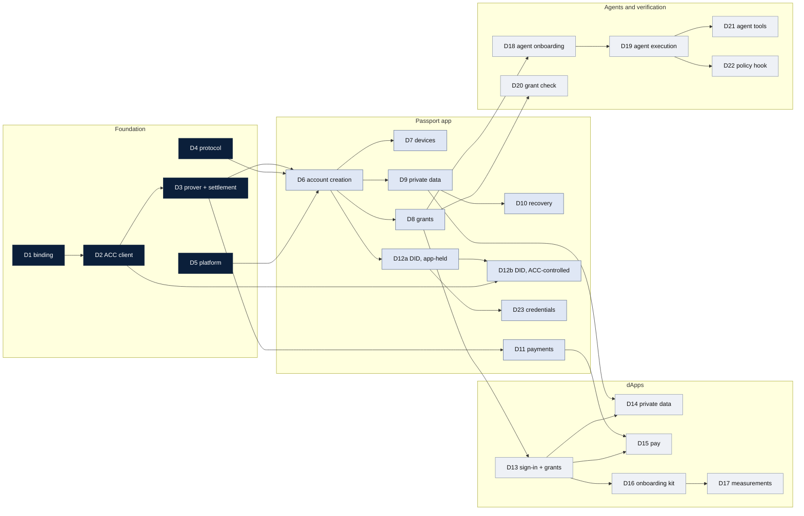

# SDK deliverables — working draft

> **Status:** working draft · 2026/09/25
> **Purpose:** the SDK's deliverables as functional buckets, in dependency order,
> mapped to the Passport product roadmap, as input to the SDK statement of work.
> **Builds on:** [`2026-09-25-sdk-realignment.md`](./2026-09-25-sdk-realignment.md),
> the proposal that defines the packages, adapters, and flows named here.
> **Roadmap:** item IDs (R01–R41) and quarters follow the product roadmap as of
> 2026/09/25 (Q3 2026 is the current demo; Q4 2026 runs to mid-December).

---

## 1. How to read this

A **deliverable** is an SDK capability that can be built, tested, and handed over
on its own. Each has an ID (D1–D23, with D12 in two parts), a package, the roadmap items it serves, what
it depends on, and what it needs from outside the SDK.

Deliverables fall into five lanes. The foundation lane comes first, because
everything else depends on it. After that the other four lanes can run in
parallel, by different teams if need be:

| Lane | Package | Serves |
|---|---|---|
| Foundation | `mn-passport-contract`, `mn-passport-account`, `mn-passport-protocol`, adapters | Everything |
| Passport app | `mn-passport-core` | The user's own account: creation, devices, grants, private data, recovery, payments, identity |
| dApps | `mn-passport-connect` | Sign-in, grants, private data, and payments for apps |
| Agents | `mn-passport-agent` | Agent onboarding and execution |
| Verification | a new server-side verifier | Services that check a grant or a proof |

---

## 2. The deliverables at a glance

| ID | Deliverable | Lane | Roadmap | Target | Depends on |
|---|---|---|---|---|---|
| D1 | Contract binding v2 | Foundation | all | Q4 (first) | ACC v2 artefact |
| D2 | ACC client | Foundation | all | Q4 (first) | D1 |
| D3 | Proving and settlement clients | Foundation | all | Q4 (first) | D2 |
| D4 | Protocol v2 | Foundation | R05, R12, R37 | Q4 (first) | — |
| D5 | Platform adapters | Foundation | all | Q4 (first) | — |
| D6 | Account creation | Passport app | R01, R02, R03 | Q4 | D1–D5 |
| D7 | Devices and existing wallets | Passport app | R07, R10 | Q4 | D6 |
| D8 | Grants: approve, review, revoke | Passport app | R12, R16, R37, R41 | Q4 | D6 |
| D9 | Private data and backup | Passport app | R06, R09 | Q4 | D6 |
| D10 | Recovery | Passport app | R08 | Q4 | D6, D9 |
| D11 | Payments | Passport app | R04 | Q4 | D2, D3 |
| D12a | DID, held by the Passport app | Passport app | R39 | Q4 (initial) | D6 |
| D12b | DID controlled by the ACC | Passport app | R39, R40 | Q1 | D12a, D2; DID contract change, ACC circuit, MIP extension |
| D13 | Sign-in and grants for dApps | dApps | R05, R12 | Q4 | D2–D4, D8 |
| D14 | Private data for dApps | dApps | R05, R09 | Q4 | D9, D13 |
| D15 | Pay with Passport | dApps | R05, R04 | Q4 | D11, D13 |
| D16 | Onboarding kit for apps | dApps | R11 | Q4 | D6, D13; decision §6 |
| D17 | Onboarding measurements | dApps | R14 | Q4 | D6, D16 |
| D18 | Agent onboarding | Agents | R37 | Q4 | D4, D8 |
| D19 | Agent execution | Agents | R15, R22 | Q1 | D2, D3, D18; registry |
| D20 | Grant check and grant proof | Verification | R19, R21, R25 | Q1 | D2, D8 |
| D21 | Agent tools (MCP server and skill) | Agents | R20 | Q1 | D19 |
| D22 | Off-chain policy hook | Agents | R38, R22 | Q2 | D19 |
| D23 | Credentials | Passport app | R40, R23–R27 | Q1 onwards | D12a |

---

## 3. Sequence

| Wave | When | Deliverables | What it proves |
|---|---|---|---|
| **0 — Foundation** | Start now | D1–D5 | A client can build, prove, and submit an ACC call without the Passport app's core |
| **1 — The account** | Q4, early | D6, D7, D8, D11, D12a | A user creates a Passport, adds devices, approves and revokes grants, and pays, all in the Passport app |
| **2 — Apps and agents join** | Q4, late | D9, D13, D14, D15, D18, D10 | A dApp signs a user in through a grant and uses their private data; an agent is granted on the ACC |
| **3 — Adoption** | Q4 end / Q1 | D16, D17 | Apps integrate in a few lines; onboarding numbers can be published |
| **4 — Agents act** | Q1 | D19, D20, D21, D12b, D23 (start) | Agents execute calls through dApps; services check grants from outside; the DID answers to the ACC |
| **5 — Richer rules** | Q2 | D22, D23 (proofs) | Conditions beyond contract, token, and amount; proofs without documents |

Agent execution (D19) is the step that most depends on something outside the
SDK: a registry where dApps publish their code, so an agent can fetch it (§5).

---

## 4. The deliverables

### Foundation

**D1 — Contract binding v2** (`mn-passport-contract`)
Typed bindings for the ACC at `spec_version = 2` (scoped grants), the version
registry and artefact integrity checks, detection of a partly deployed account,
the client artefact set (compiled module, ledger decoder, manifest; ZKIR goes to the
prover only), and loading a dApp's artefacts with integrity checks.
*Needs:* the reference ACC v2 artefact, published and deployed on the target network.

**D2 — ACC client** (`mn-passport-account`)
The code every client shares: the key-provider interface; challenge builders for
the JubJub and k256 arms (envelopes 0 and 1); the coin store, including reading a
coin's position from the chain; the inbox codec (seal and open); payments (full
shielded addresses, and sealing to a recipient Passport's key at the moment of
payment); the helper that joins two calls into one transaction; and grant-scope
helpers.
*Depends on:* D1.

**D3 — Proving and settlement clients** (`mn-passport-account`, adapters)
A prover interface that takes an unproven transaction and returns it proven, and
the settlement client (balancing, fees, submission, and bounded waits for
inclusion).
*Needs:* a proving service that holds or rebuilds proving keys itself, so clients
never upload them; fee sponsorship.

**D4 — Protocol v2** (`mn-passport-protocol`)
The messages dApps, agents, and the Passport app exchange: the grant request and
response of the scoped-grants MIP (§9), the possession proof, the sign-in message,
and the signed out-of-band request for keys and grants (FS-2.4, extended), in a
form that travels as a link or a QR code. Versioned.

**D5 — Platform adapters** (`adapter-browser`, `adapter-node`)
Browser wiring (passkeys with PRF, WASM runtimes loaded in order) and Node wiring
(for the agent library and server-side use).

### Passport app

**D6 — Account creation** (R01, R02, R03)
A passkey becomes the first device (JubJub, derived from the passkey's PRF
output); the ACC is deployed in its three waves; the name is claimed; fees and the
opening balance are sponsored.
*Needs:* the name service and fee sponsorship on the target network.

**D7 — Devices and existing wallets** (R07, R10)
Add and remove devices through FS-2.4's signed request (shown as a QR code or a
link); the provider's wallet key as a device; a Midnight connector wallet as a
device. States the limits of device revocation (errata 7 and 8).
*Gap:* Ethereum-style wallets such as MetaMask cannot sign for the ACC today (§5).

**D8 — Grants: approve, review, revoke** (R12, R16, R37, R41 basic)
The approval page for dApp and agent requests; consent; `issue_grant`; the list of
granted dApps and agents with their limits; revoking one grant or all of them in
one action. A key for a family member with a spending limit (the basic form of
R41) is a grant like any other.

**D9 — Private data and backup** (R06, R09)
The Witness Protection Program (WPP) integrated into the Passport app: encrypted
backup to the user's own cloud storage, restore, the backup states the user sees,
and the account details every client needs (ACC address, viewing key).
*Needs:* WPP's storage adapters and package format.

**D10 — Recovery** (R08)
Recovery through trusted people or services when every device is lost, composed
with WPP so private records come back with the account.
*Needs:* the recovery design from the research team.

**D11 — Payments** (R04)
Send to a shielded address, to another Passport by name, and NIGHT to an ordinary
address; receive deposits.

**D12a — DID, held by the Passport app** (R39, initial work)
Create the account's `did:midnight` identifier at account creation, link it to the
Passport name and the ACC, hold its controller and recovery keys, sign its
updates, and resolve it. As built, the DID is its own contract with its own key,
so in Q4 the Passport app operates it with a key only the app holds (realignment
proposal §8.6).
*Needs:* the DID packages on the same toolchain as the ACC (§5).

**D12b — DID controlled by the ACC** (R39, R40)
The DID authenticates through Passport the way every dApp does: its controller is
the user's ACC, and each update calls into the ACC, which checks a grant allowing
the signer to act for that DID. The DID's separate keys disappear, and device
changes, recovery, and revocation on the account apply to the identity too.
*Needs — the DID contract adapted to Passport:* a controller mode whose controller
is an account contract, with recovery following the account's; the DID contract
on ledger 9. That is the DID team's change and needs their agreement.
*Needs — on the Passport side:* a new exported ACC circuit, with no witness, that
checks a device or grant signature for an operation that is not a payment; and a
scoped-grants MIP extension for a grant that may act on another contract.
`kernel.caller()` in a release adds a check on the caller, but is not required.

**D23 — Credentials** (R40, then R23–R27)
Receive, hold, and present credentials anchored to the DID; later, prove a single
fact without handing over the document.
*Needs:* the verifiable-credentials project; issuer integrations.

### dApps

**D13 — Sign-in and grants for dApps** (R05, R12)
The dApp library: the grant ceremony (the dApp's key for its own website, the
redirect to the Passport app, checking the grant on-chain), sign-in backed by the
grant, and calls into the ACC, including joining a shielded spend with the dApp's
own call.

**D14 — Private data for dApps** (R05, R09)
A private-state provider for the dApp whose store is Passport: release of that
dApp's data after consent, and write-back after each confirmed transaction.

**D15 — Pay with Passport** (R05, R04)
Checkout, payouts, and refunds: paying a Passport user by name and taking payment
under a grant.

**D16 — Onboarding kit for apps** (R11)
Drop-in pieces so an app adds Passport in a few lines: the sign-in button, sending
a user without a Passport to create one and straight back to the grant request,
sponsored first fees, and a starter project as an AI-agent skill.
*Decision needed:* where a new user creates their Passport (§6).

**D17 — Onboarding measurements** (R14)
Privacy-preserving counts of sign-up completion, time to first action, and
retention, emitted by the Passport app and the dApp library, so the numbers can be
published.

### Agents and verification

**D18 — Agent onboarding** (R37)
The agent's side: create its key in OWS, build the grant request, and present it as
a QR code or a link (the agent provider chooses). The user approves it in the
Passport app (D8). The agent receives its readable scope, so OWS can check limits
before signing. No execution yet.

**D19 — Agent execution** (R15, R22)
The agent library fetches a dApp's code from the registry and checks it, builds the
call into the ACC, asks OWS for the signature, has it proved, and submits it.
*Needs:* a registry of dApp code (§5); a decision on whether agents may receive a
dApp's private data.

**D20 — Grant check and grant proof** (R19, R21, R25 foundation)
A server-side library a service runs to check an agent's grant: read it from the
chain, verify the agent's signature over the request, check it against the scope,
and return yes or no with a receipt. The same result can travel as a field in a
payment (x402 first).

**D21 — Agent tools** (R20)
An MCP server and an agent skill over D19, so agents use Passport without installing
a wallet.

**D22 — Off-chain policy hook** (R38, R22)
A hook where an agent wallet's policy engine can refuse an action before it is
signed, for conditions the on-chain grant cannot express. The on-chain scope stays
the hard limit.

---

## 5. What the roadmap adds to the SDK plan

Checking the roadmap against the realignment proposal, these are the capabilities
it asks for that the proposal did not yet name, or that need work outside the SDK.

**New SDK functionality:**

| Roadmap | What the SDK needs | Deliverable |
|---|---|---|
| R19, R21, R25 | A server-side grant verifier that returns yes/no with a receipt, and a grant proof that fits in a payment field. Nothing in the proposal covers verification by a third party. | D20 (new package) |
| R20 | An MCP server and an agent skill on top of the agent library | D21 |
| R38, R22 | A policy hook in the agent library | D22 |
| R14 | Privacy-preserving onboarding measurements | D17 |
| R39 | A defined DID module (create, link, hold keys, resolve) | D12a |
| R40, R23–R27 | Holding and presenting credentials | D23 |
| R11 | Drop-in onboarding pieces and a starter project | D16 |
| R05 | A starter app and an app directory. The directory is a natural first form of the registry agents need (D19). | D13, D19 |

**Needs work beyond the SDK:**

| Roadmap | Why | What is needed |
|---|---|---|
| R10 (Ethereum-style wallets) | The ACC's k256 arm accepts a raw digest (envelope 0) and the Midnight connector's framing (envelope 1). Ethereum wallets sign under EIP-191 with a keccak-256 digest and cannot sign a raw digest. | A new envelope (a contract change needing keccak-256 in-circuit), or bringing such users in through a provider wallet with raw signing. Midnight connector wallets work today. |
| R15 ("contracts, assets, amount") | A grant covers one token and at most one pinned recipient. A list of contracts is a list of grants — one per contract and token — which works but is clumsy. A grant that lists callable contracts is a non-goal of the current MIP. | Many grants per agent now; a list-valued scope is a MIP extension, and checking the caller needs `kernel.caller()` in a release. |
| R18, R41 full (authority down a chain) | Only a device can issue a grant, so a grantee cannot pass on a narrower one, and revoking a parent does not end grants beneath it. | A MIP extension for chained grants. |
| R39, R40 (a DID that authenticates through Passport) | The DID contract checks only its own stored key, so the ACC cannot control it today. | A DID contract controller mode for account contracts, on ledger 9 (the DID team); a witness-free authorisation circuit on the ACC; a MIP extension for grants that act on another contract (D12b). |
| R17 (the agent's own identity) | Nothing gives an agent an identity today, and "one agent per service per person" needs a nullifier scheme. | A design: an agent DID, a name subdomain, or both. |
| R41 (a child account under the parent's name) | A family member's own account under a subdomain needs subdomains in the name service, on top of a grant. | Name-service subdomains. |
| R13 (assets from other chains) | Depends on the cross-chain signing partner adapting to Passport accounts. | Partner work, then an SDK adapter. |
| R19 (one agent per service) and R24 (unlinkable reuse) | Need privacy-preserving proofs beyond grants. | Cryptographic design. |
| R30–R36 (organisations and operators) | Officer sets and seats need threshold or m-of-n control, which the ACC does not have. | A contract extension (H2 2027). |

**External dependencies for the Q4 set:**

| Dependency | Blocks | Status |
|---|---|---|
| ACC v2 (scoped grants) deployed on the target network | D1, D8, D13, D18 | Reference implementation and evidence exist; deployment pending |
| A proving service that holds or rebuilds proving keys | D3 and everything after | The demo's fee sponsor does this; server-side artefact loading and key regeneration are upstream |
| Fee sponsorship and the name service | D6 | Working in the demo |
| WPP storage adapters and package format | D9, D14 | Prototype; Google Drive first |
| The DID packages on the ACC's toolchain | D12a | DID pins ledger 8 and midnight-js 4; the ACC is on ledger 9 and midnight-js 5 |
| The DID contract adapted to Passport | D12b (Q1) | Not started; needs the DID team's agreement |
| A registry of dApp code | D19 | Not built; the capsule work points the same way |

---

## 6. Decision needed: where a new user creates their Passport

The realignment proposal creates accounts only in the Passport app. A dApp gets a
scoped key, never the account's master key, and the account's metadata and backup
are set up in the app the user controls. The 2026/09/25 product review raised the
concern that apps will not integrate if a new user has to leave the app to create
a Passport. Both are real, and D16 cannot be scoped until this is settled.

| Option | New user's experience | What it costs |
|---|---|---|
| **A. Create in the Passport app, then return** (current design) | Tap "Continue with Passport"; the Passport app opens, creates the account, and goes straight back to the app's grant request | One hand-off. The master key, backup, and metadata stay in the Passport app. |
| **B. Passport opened inside the app** | The Passport app's creation flow runs in an embedded frame or pop-up without leaving the page | Still Passport's own origin, so the security model holds; subject to browser limits on embedded passkeys and storage |
| **C. The app creates the Passport itself** (superseded partner-origin onboarding) | No hand-off | The app's code handles the master key during creation, device revocation cannot reliably take it back (errata 7 and 8), and the app must also set up backup and metadata |

Options A and B keep the model; C reopens it. The proposal recommends A for Q4,
with B investigated as the smoother version of the same model.

---

## 7. Where the roadmap and this plan differ on timing

- **R37 (agent onboarding)** sits in the roadmap's current-demo column. In the SDK
  it is D18, a Q4 deliverable after grants (D8).
- **R41 (an account delegates to another under its name)** is in Q4 on the
  roadmap. The basic form — a key with a limit, granted like any other — is Q4
  (D8). The form with its own account under a subdomain needs name-service
  subdomains, and the form where revoking the parent ends everything beneath needs
  chained grants (§5).
- **R12 (one permission model)** and **R19 (check a grant from the outside)** are
  distinct in the SDK: R12 is the grant mechanism (D8, D13), R19 is verification
  by a third party (D20).
- **Package name.** The roadmap names the dApp library `@midnight-passport/connect`;
  the SDK publishes `@midnight-ntwrk/mn-passport-connect`. One should change.

---

## 8. Open questions

1. Where does a new user create their Passport (§6)?
2. Who builds the registry of dApp code, and in what form (§5, D19)?
3. May an agent receive a dApp's private data (D19)?
4. Ethereum-style wallets: a new envelope, or through a provider wallet (D7)?
5. Until the ACC controls the DID, is its controller key derived from the passkey
   or stored in WPP (D12a)?
6. Do the DID packages move to ledger 9 before D12a, or does Passport run both eras?
   D12b needs ledger 9 in any case.
7. Will the DID team take on a controller mode for account contracts (D12b)?
8. Which roadmap items (R17, R18, R41 full, and the grant for acting on another
   contract that D12b needs) should start MIP work now, so they are ready for Q1?
