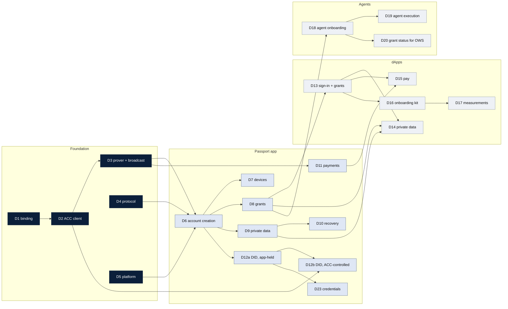

# SDK deliverables — working draft

> **Status:** working draft · 2026/09/25
> **Purpose:** this file lists the SDK's deliverables as functional groups, in the
> order of their dependencies. It maps them to the Passport product roadmap. It is
> input to the SDK statement of work.
> **Builds on:** [`2026-09-25-sdk-realignment.md`](./2026-09-25-sdk-realignment.md).
> That proposal defines the packages, adapters, and flows that this file names.
> **Roadmap:** the item IDs (R01–R41) and the quarters come from the product
> roadmap of 2026/09/25. Q3 2026 is the current demo. Q4 2026 continues to
> mid-December.

---

## 1. How to read this

A **deliverable** is an SDK capability that a team can build, test, and deliver
independently. Each deliverable has an ID (D1–D20 and D23, with D12 in two parts).
Each deliverable also has a package, the roadmap items that it serves, its
dependencies, and the items that it needs from outside the SDK.

The deliverables are in four lanes. The foundation lane is first, because all
other work depends on it. After the foundation, the other three lanes can run in
parallel. Different teams can do them, if necessary:

| Lane | Package | Serves |
|---|---|---|
| Foundation | `mn-passport-contract`, `mn-passport-account`, `mn-passport-protocol`, adapters | All other lanes |
| Passport app | `mn-passport-core` | The user's own account: creation, devices, grants, private data, recovery, payments, and identity |
| dApps | `mn-passport-connect` | Sign-in, grants, private data, and payments for apps |
| Agents | `mn-passport-agent` | Agent onboarding, execution, and the on-chain grant status for OWS |

---

## 2. The deliverables at a glance

| ID | Deliverable | Lane | Roadmap | Target | Depends on |
|---|---|---|---|---|---|
| D1 | Contract binding v2 | Foundation | all | Q4 (first) | ACC v2 artifact |
| D2 | ACC client | Foundation | all | Q4 (first) | D1 |
| D3 | Proving and broadcast clients | Foundation | all | Q4 (first) | D2 |
| D4 | Protocol v2 | Foundation | R05, R12, R37 | Q4 (first) | — |
| D5 | Platform adapters | Foundation | all | Q4 (first) | — |
| D6 | Account creation | Passport app | R01, R02, R03 | Q4 | D1–D5 |
| D7 | Devices and existing wallets | Passport app | R07, R10 | Q4 | D6 |
| D8 | Grants: approve, review, revoke | Passport app | R12, R16, R37, R41 | Q4 | D6 |
| D9 | Private data and backup | Passport app | R06, R09 | Q4 | D6 |
| D10 | Recovery | Passport app | R08 | Q4 | D6, D9 |
| D11 | Payments | Passport app | R04 | Q4 | D2, D3 |
| D12a | DID, held by the Passport app | Passport app | R39 | Q4 (initial) | D6 |
| D12b | DID controlled by the ACC | Passport app | R39, R40 | Q1 | D12a, D2; a DID contract change, an ACC circuit, and a MIP extension |
| D13 | Sign-in and grants for dApps | dApps | R05, R12 | Q4 | D2–D4, D8 |
| D14 | Private data for dApps | dApps | R05, R09 | Q4 | D8, D9, D13 |
| D15 | Pay with Passport | dApps | R05, R04 | Q4 | D11, D13 |
| D16 | Onboarding kit for apps | dApps | R11 | Q4 | D6, D13 |
| D17 | Onboarding measurements | dApps | R14 | Q4 | D6, D16 |
| D18 | Agent onboarding | Agents | R37 | Q4 | D4, D8 |
| D19 | Agent execution | Agents | R15, R22 | Q1 | D2, D3, D18; a registry |
| D20 | On-chain grant status for OWS | Agents | R19, R22 | Q1 | D2, D18 |
| D23 | Credentials | Passport app | R40, R23–R27 | Q1 and later | D12a |

```mermaid
flowchart LR
    subgraph F[Foundation]
        D1[D1 binding] --> D2[D2 ACC client] --> D3[D3 prover + broadcast]
        D4[D4 protocol]
        D5[D5 platform]
    end
    subgraph A[Passport app]
        D6[D6 account creation]
        D7[D7 devices]
        D8[D8 grants]
        D9[D9 private data]
        D10[D10 recovery]
        D11[D11 payments]
        D12[D12a DID, app-held]
        D12B[D12b DID, ACC-controlled]
        D23[D23 credentials]
    end
    subgraph P[dApps]
        D13[D13 sign-in + grants]
        D14[D14 private data]
        D15[D15 pay]
        D16[D16 onboarding kit]
        D17[D17 measurements]
    end
    subgraph G[Agents]
        D18[D18 agent onboarding]
        D19[D19 agent execution]
        D20[D20 grant status for OWS]
    end

    D3 --> D6
    D4 --> D6
    D5 --> D6
    D6 --> D7
    D6 --> D8
    D6 --> D9
    D9 --> D10
    D3 --> D11
    D6 --> D12
    D12 --> D12B
    D2 --> D12B
    D12 --> D23
    D8 --> D13
    D8 --> D14
    D9 --> D14
    D13 --> D14
    D11 --> D15
    D13 --> D15
    D13 --> D16
    D16 --> D17
    D8 --> D18
    D18 --> D19
    D18 --> D20

    classDef found fill:#0b1f3a,color:#ffffff,stroke:#0b1f3a
    classDef app fill:#dfe7f5,color:#111111,stroke:#5a6b8c
    classDef other fill:#eef1f6,color:#111111,stroke:#8a94a6
    class D1,D2,D3,D4,D5 found
    class D6,D7,D8,D9,D10,D11,D12,D12B,D23 app
    class D13,D14,D15,D16,D17,D18,D19,D20 other
```

---

## 3. Sequence

| Wave | When | Deliverables | What it proves |
|---|---|---|---|
| **0 — Foundation** | Start now | D1–D5 | A client can build, prove, and submit an ACC call without the core of the Passport app |
| **1 — The account** | Q4, early | D6, D7, D8, D11, D12a | A user creates a Passport, adds devices, approves and revokes grants, and pays, all in the Passport app |
| **2 — Apps and agents join** | Q4, late | D9, D13, D14, D15, D18, D10 | A dApp gets its grant and the handoff of the private data, and then operates with the Passport app closed. The ACC records a grant for an agent |
| **3 — Adoption** | Q4 end / Q1 | D16, D17 | Apps integrate Passport in a few lines. The onboarding numbers are ready for publication |
| **4 — Agents act** | Q1 | D19, D20, D12b, D23 (start) | Agents run the circuits of dApps. OWS enforces each grant as it reads it from the chain. The DID answers to the ACC |
| **5 — Richer rules** | Q2 | D23 (proofs) | Proofs without documents |

Agent execution (D19) is the step that depends most on something outside the
SDK. It needs a registry where dApps publish their code, so that an agent can
get it (§5).

---

## 4. The deliverables

### Foundation

**D1 — Contract binding v2** (`mn-passport-contract`)

D1 contains these items:

- typed bindings for the ACC at `spec_version = 3` (scoped grants with caller
  pins). Version 3 adds `caller_commit` to `GrantScope`. It is a
  fresh-deployment schema, not an upgrade of version 2 (passport PR #176);
- the version registry and the integrity checks for artifacts, with the exact
  zkir and midnight-zk crate revisions, because the keys change with them;
- the detection of an account that is only partly deployed;
- the client artifact set: the compiled module, the ledger decoder, and the
  manifest. A client that only builds calls does not need the ZKIR;
- the ACC's interface for dApp circuits, so that the contract of a dApp can call
  the ACC;
- a loader for the artifacts of a dApp, with integrity checks. This loader
  verifies circuits, so it gets the ZKIR and uses the SRS. It makes the verifier
  key again and compares it with the verifier key on chain (passport PR #170).
  The proving keys stay with the prover.

*Needs:* the reference ACC v2 artifact, published and deployed on the target
network.

**D2 — ACC client** (`mn-passport-account`)

D2 is the code that all clients share:

- the key-provider interface;
- challenge builders and grant signatures for the JubJub and k256 arms
  (envelopes 0 and 1);
- the grant-ceremony client, which dApps and agents share;
- on-chain grant reads;
- the coin store, which also reads the position of a coin from the chain;
- the inbox codec (seal and open);
- payments: full shielded addresses, and the seal to the key of a recipient
  Passport at the time of payment;
- the transaction joiner, a helper that the caller can use to join two intents
  into one transaction;
- grant-scope helpers.

*Depends on:* D1.

**D3 — Proving and broadcast clients** (`mn-passport-account`, adapters)

D3 has two clients:

- A prover interface. It takes an unproven transaction and returns the proven
  transaction.
- The broadcast client (`adapter-broadcast`). It gives the proven transaction to
  the sponsor, which pays the fees and broadcasts the transaction. The client
  then monitors the transaction until it is final, with bounded waits and
  resubmission.

A user never handles DUST. Either a sponsor pays the fees, or the fees come from
a swap through the Capacity Exchange.

*Needs:* a proving service that holds or rebuilds the proving keys itself, so
that clients never upload them; fee sponsorship. Passport PR #170 shows that the
service can make each key again from the ZKIR and the on-chain verifier key.

**D4 — Protocol v2** (`mn-passport-protocol`)

D4 defines the messages that dApps, agents, and the Passport app exchange:

- the grant request and the response of the scoped-grants MIP (§9);
- the possession proof;
- the sign-in message;
- the signed out-of-band request for keys and grants (FS-2.4, extended).

The grant request is one message format for dApps and agents, with two binding
profiles:

- the browser profile binds the web origin with the possession proof (MIP §9),
  and travels as a redirect;
- the agent profile has no web origin. It binds the agent key with the FS-2.4
  fields (a self-signature, a nonce, an expiry, and a label), and travels as a
  QR code or a link.

D4 gives the messages a version.

**D5 — Platform adapters** (`adapter-browser`, `adapter-nodejs`)

D5 has two runtimes:

- the browser runtime for web apps: passkeys with PRF, and WASM runtimes that
  load in the correct order;
- the Node.js runtime for backends, which the agent library also uses.

### Passport app

**D6 — Account creation** (R01, R02, R03)

A passkey becomes the first device (JubJub, from the PRF output of the passkey).
The Passport app deploys the ACC in waves and claims the name. The deploy
planner packs the circuits into waves within a 15,000-byte verifier budget, from
the actual artifacts. On 2026/10/09 that is seven waves with caller pins, and ten
waves with the p256 arm. A sponsor pays the fees and the opening balance.

*Needs:* the name service and fee sponsorship on the target network.

**D7 — Devices and existing wallets** (R07, R10)

D7 contains these items:

- add and remove devices through the signed request of FS-2.4, which shows as a
  QR code or a link;
- the key of the provider's wallet as a device;
- a Midnight connector wallet as a device. Only a wallet whose `signData` uses
  the `ecdsa_secp256k1_sha256` scheme of the connector fits. The ACC verifies
  `H(ASCII("midnight_signed_message:32:") || c)`, where `H` is SHA-256 and `c`
  is the 32-byte challenge (passport PR #180);
- a passkey on the p256 arm, within the profiled WebAuthn form `wa-json134`
  (passport PR #175).

D7 also states the limits of device revocation (errata 7 and 8).

*Gap:* Ethereum-style wallets, for example MetaMask, cannot sign for the ACC
today (§5).

**D8 — Grants: approve, review, revoke** (R12, R16, R37, R41 basic)

D8 contains these items:

- the approval page for requests from dApps and agents;
- consent;
- `issue_grant`;
- the list of dApps and agents that have grants, with their limits;
- the revocation of one grant, or of all grants in one action;
- after the revocation of a grant with read access, a rotation of the
  encryption key (`rotate_enc_key`). Notes sealed before the rotation stay
  readable to the revoked party, and the user sees this.

A key for a family member, with a limit on what the member can spend, is a
grant the same as all other grants. This is the basic form of R41.

**D9 — Private data and backup** (R06, R09)

D9 adds the Witness Protection Program (WPP) to the Passport app. It contains
these items:

- encrypted backup to the user's own cloud storage;
- restore;
- the backup states that the user sees;
- the account details that all clients need (the ACC address and the viewing
  key).

*Needs:* the storage adapters and the package format of WPP.

**D10 — Recovery** (R08)

D10 recovers the account through trusted persons or services when the user
loses all devices. It works with WPP, so that the private records return with
the account.

*Needs:* the recovery design from the research team.

**D11 — Payments** (R04)

D11 lets the user send to a shielded address and to another Passport by name,
and send NIGHT to an ordinary address. It also lets the user receive deposits.

**D12a — DID, held by the Passport app** (R39, initial work)

D12a contains these items:

- create the `did:midnight` identifier of the account when the user creates the
  account;
- link the identifier to the Passport name and the ACC;
- hold its controller key and its recovery key;
- sign its updates;
- resolve it.

In its current design, the DID is its own contract, with its own key. Thus in Q4
the Passport app operates the DID with a key that only the app holds
(realignment proposal §8.6).

*Needs:* the DID packages on the same toolchain as the ACC (§5).

**D12b — DID controlled by the ACC** (R39, R40)

The DID authenticates through Passport in the same way as all dApps. Its
controller is the user's ACC. Each update calls the ACC, which checks for a grant
that lets the signer act for that DID. The DID then has no separate keys. Device
changes, recovery, and revocation on the account also apply to the identity.

*Needs — the DID contract, adapted to Passport:*

- a controller mode in which the controller is an account contract, and the
  recovery follows the recovery of the account;
- the DID contract on ledger 9.

This change belongs to the DID team, and it needs the agreement of that team.

*Needs — on the Passport side:*

- a new exported ACC circuit, with no witness, that checks a device or grant
  signature for an operation that is not a payment;
- a scoped-grants MIP extension for a grant that can act on another contract.

The ACC can also pin the grant to the DID contract as its immediate caller,
through `kernel.caller()` (passport PR #176). But this check is not necessary.

**D23 — Credentials** (R40, then R23–R27)

The user can receive, hold, and present credentials with an anchor to the DID.
Later, the user can prove one fact and not give the full document.

*Needs:* the verifiable-credentials project; issuer integrations.

### dApps

**D13 — Sign-in and grants for dApps** (R05, R12)

D13 is the dApp library. It contains these items:

- the grant ceremony with the browser profile: the key of the dApp for its own
  website, a request and a possession proof that bind its web origin, and a
  check of the grant on chain;
- sign-in that uses the grant.

The dApp builds the circuit that composes the user's ACC. The library supplies
these items for that circuit:

- the ACC's interface;
- the challenge;
- the signature of the grant key;
- the joiner helper, for a shielded spend that must start its own intent.

The dApp signs each call with its grant key. It never asks Passport to sign a
call. This is the difference between a delegation of authority and Passport as
an intermediary for each transaction (realignment decision 12).

*Acceptance:* the dApp operates independently. The test has four steps:

1. Request and approve the grant. Confirm its registration on chain, and verify
   the approved scope and the key binding.
2. Complete each data or viewing handoff that has a separate consent (D14).
3. Close Passport. The dApp makes several allowed calls, tracks confirmation,
   and keeps its own state. This also works after a reload of the dApp or a
   retry of a transaction.
4. A revoked, expired, or exhausted grant stops the authorization. A request or
   a change of the grant goes back to Passport.

**D14 — Private data for dApps** (R05, R09)

D14 is the private-data handoff. It completes inside the connection flow of
D13, before the dApp operates independently:

- The user gives separate consents for the grant, for private-state access, and
  for the viewing key (only with read access). Each one has its own scope.
- Passport gives the dApp a key for its own encrypted package in WPP, and only
  for that package.
- After the handoff, the private-state provider of the dApp reads and writes
  that package in WPP directly. Passport is not on the read or write path.
- The dApp writes back new state only after the transaction finalizes with
  `SucceedEntirely`. If that write fails, the dApp keeps the state as not yet saved, and
  tries again, also after a reload.

A revocation does not take back data that the dApp already read. Thus, a
revocation of private-state access rotates the key of the package. A revocation
of read access rotates the viewing key (D8).

*Acceptance:* the same four steps as D13, with the data handoff in step 2.

**D15 — Pay with Passport** (R05, R04)

D15 gives dApps checkout, payouts, and refunds. A dApp can pay a Passport user by
name and take payment under a grant.

**D16 — Onboarding kit for apps** (R11)

D16 gives an app ready parts, so that the app can add Passport in a few lines:

- the sign-in button;
- a flow that sends a user without a Passport to create one, and then directly
  back to the grant request;
- sponsored first fees;
- a starter project as an AI-agent skill.

D16 also lets an app onboard a new user inside the app, through a WaaS provider
that supports metadata attached to the user's key (§6). The entry point
`mn-passport-connect/onboard` does these steps:

- it deploys the ACC and activates the key of the provider as the first device;
- it claims the name;
- it writes the account metadata to the key of the user at the provider.

`adapter-waas` supplies the key of the provider and the metadata. The app does
not issue its own grant. It then gets its grant through the usual grant
ceremony (D13), and the user approves it in the Passport app. After onboarding,
the app never uses the key of the provider again.

During activation, the page of the app drives the signatures of the provider.
Open question 1 asks which guard makes sure that the provider
signs only the activation (§6).

**D17 — Onboarding measurements** (R14)

The Passport app and the dApp library send counts of sign-up completion, time to
first action, and retention. The counts keep the privacy of users, so that the
numbers are ready for publication.

### Agents

**D18 — Agent onboarding** (R37)

D18 is the side of the agent:

- The agent creates its key in OWS.
- The agent builds the grant request, in the same message format that a dApp
  uses, with the agent profile. The request has no web origin. It binds the
  agent key with a self-signature, a nonce, an expiry, and a label.
- The agent shows the request as a QR code or a link. The agent provider selects
  the form.

The user approves the request in the Passport app (D8). The agent receives its
readable scope, so that OWS can check limits before it signs. After the grant,
the agent operates with the Passport app closed. D18 has no execution yet.

**D19 — Agent execution** (R15, R22)

The agent library does these steps:

1. It gets the circuit and the code of a dApp from the registry, and checks them.
2. It runs the circuit of the dApp, which composes the ACC.
3. It asks OWS for the signature.
4. It sends the transaction to the prover for a proof.
5. It broadcasts the transaction.

*Needs:* a registry of dApp code (§5); a decision: can agents receive the private
data of a dApp?

**D20 — On-chain grant status for OWS** (R19, R22)

The agent library reads the grant of the agent from the ACC on chain. It reads
the status of the grant (live or not), and the commitments that its readable
scope opens. OWS then enforces the grant as its policy before it signs. This is a
read of the chain, not a server-side verifier. The ACC is the source of truth,
and its scope is the hard limit.

---

## 5. What the roadmap adds to the SDK plan

This section compares the roadmap with the realignment proposal. It shows the
capabilities that the roadmap needs and the proposal does not name yet. It also
shows the capabilities that need work outside the SDK.

**New SDK functionality:**

| Roadmap | What the SDK needs | Deliverable |
|---|---|---|
| R19, R22 | The on-chain status of the grant. The agent library reads it from the ACC, so that OWS enforces it | D20 |
| R14 | Onboarding measurements that keep the privacy of users | D17 |
| R39 | A defined DID module (create, link, hold keys, and resolve) | D12a |
| R40, R23–R27 | Hold and present credentials | D23 |
| R11 | Ready parts for onboarding, and a starter project | D16 |
| R05 | A starter app and an app directory. The directory can be the first form of the registry that agents need (D19). | D13, D19 |

**Needs work outside the SDK:**

| Roadmap | Why | What is necessary |
|---|---|---|
| R10 (Ethereum-style wallets) | The k256 arm of the ACC accepts a raw digest (envelope 0) and the framing of the Midnight connector (envelope 1). Envelope 1 fits only wallets that use the `ecdsa_secp256k1_sha256` scheme. Ethereum wallets sign under EIP-191 with a keccak-256 digest, and cannot sign a raw digest. | A new envelope (a contract change that needs keccak-256 in the circuit). Or, the users of these wallets join through a provider wallet that can sign raw digests. Midnight connector wallets work today. |
| R15 ("contracts, assets, amount") | A grant covers one token and a maximum of one pinned recipient. A list of contracts is a list of grants, one for each contract and token. This works, but it is not easy to use. A grant that lists contracts to call is a non-goal of the current MIP. | Many grants for each agent now. A scope with a list of values is a MIP extension. A grant can already pin one contract that calls the ACC directly, through `kernel.caller()` (passport PR #176). |
| R18, R41 full (authority down a chain) | Only a device can issue a grant. Thus a grantee cannot give a narrower grant to a different key, and the revocation of a parent does not stop the grants below it. | A MIP extension for chained grants. |
| R39, R40 (a DID that authenticates through Passport) | The DID contract checks only its own stored key, so the ACC cannot control it today. | A controller mode in the DID contract for account contracts, on ledger 9 (the DID team). A witness-free authorization circuit on the ACC. A MIP extension for grants that act on another contract (D12b). |
| R17 (the agent's own identity) | Nothing gives an agent an identity today. Also, "one agent per service per person" needs a nullifier scheme. | A design: an agent DID, a name subdomain, or both. |
| R41 (a child account under the parent's name) | The own account of a family member under a subdomain needs subdomains in the name service, in addition to a grant. | Subdomains in the name service. |
| R13 (assets from other chains) | It depends on the partner for cross-chain signatures, which must adapt its work to Passport accounts. | Work by the partner, then an SDK adapter. |
| R19 (one agent per service) and R24 (unlinkable reuse) | These items need proofs that keep privacy, which grants cannot give. | A cryptographic design. |
| R30–R36 (organizations and operators) | Officer sets and seats need threshold control or m-of-n control. The ACC does not have this control. | A contract extension (H2 2027). |

**External dependencies for the Q4 set:**

| Dependency | Blocks | Status |
|---|---|---|
| ACC v2 (scoped grants) deployed on the target network | D1, D8, D13, D18 | The reference implementation and the evidence exist. The deployment is not done yet |
| A proving service that holds or rebuilds proving keys | D3 and all later deliverables | The fee sponsor of the demo does this. Passport PR #170 shows that the keys come again, byte-identical, from the ZKIR and the on-chain verifier key. A proof-server mode that does this is upstream work |
| Fee sponsorship and the name service | D6 | They work in the demo |
| WPP storage adapters and package format | D9, D14 | A prototype exists. Google Drive is the first storage |
| The DID packages on the ACC's toolchain | D12a | The DID packages pin ledger 8 and midnight-js 4. The ACC is on ledger 9 and midnight-js 5 |
| The DID contract adapted to Passport | D12b (Q1) | There is no work on it yet. It needs the agreement of the DID team |
| A registry of dApp code | D19 | It does not exist yet. The capsule work goes in the same direction. For circuits, a registry entry needs only the ZKIR, the verifier key, and the crate revisions (passport PR #170) |

---

## 6. Decided: where a new user creates their Passport

The product review of 2026/09/25 identified a risk: apps will not integrate
Passport if a new user must leave the app to create a Passport. The decision is:
a new user can create a Passport inside the app. The condition is that the app
onboards the user through a wallet-as-a-service (WaaS) provider. That provider
must support metadata attached to the user's key.

The app uses the key of the provider only to create the account. It does not
issue its own grant. The app then gets its grant through the usual grant
ceremony, as each other app does. The user approves it in the Passport app,
where the user signs in with the same provider. After onboarding, the app never
uses the key of the provider again.

**Known risk.** During activation, the page of the app drives the signatures of
the provider. Thus, a hostile app can try to get more than the activation
signed, for example a new device. Open question 1 asks which guard closes this
risk: a signing policy at the provider, an ACC rule for a new first device, or a
risk that the team accepts and records.

| Route | Experience of a new user | What it costs |
|---|---|---|
| **In the app, through a WaaS provider** | The user signs in with the provider inside the app. The app creates the Passport there, with no hand-off | The key of the provider for the user is the first device of the account. The provider holds it for the user, and the code of the app does not hold it. The provider attaches the metadata of the account (its address and viewing key) to that key. Thus the user finds and recovers the account anywhere they sign in with the same provider, also in the Passport app. The provider can read that metadata, so it can see the payments to the account. The metadata alone gives no authority to spend. But the provider holds a full-authority key for the user, so the account is only as safe as the signing security of the provider. |
| **In the Passport app, then return** | The user taps "Continue with Passport". The Passport app opens, creates the account, and goes directly back to the grant request of the app | One hand-off. This is the route for an app without a WaaS provider. |

One route stays forbidden: the app creates the Passport with a device secret in
its own code (the superseded partner-origin facade). Device revocation cannot
reliably remove such a key (errata 7 and 8). Also, the app must then configure
backup and metadata itself. The reference demo already recovers an account on a
new device from the metadata on the user's key at its provider. The team can now
define the scope of D16.

---

## 7. Where the dates in the roadmap and this plan differ

- **R37 (agent onboarding)** is in the current-demo column of the roadmap. In the
  SDK it is D18, a Q4 deliverable after grants (D8).
- **R41 (an account delegates to another account under its name)** is in Q4 in
  the roadmap. The basic form is a key with a limit, which the user grants the
  same as all other keys. This form is in Q4 (D8). The form with its own account
  under a subdomain needs subdomains in the name service. The form in which the
  revocation of the parent ends all grants below it needs chained grants (§5).
- **R12 (one permission model)** and **R19 (check a grant from the outside)** are
  different items in the SDK. R12 is the grant mechanism (D8, D13). R19 is a read
  of the grant status from the ACC on chain (D20). There is no server-side
  verifier.
- **R20 (agent tools: an MCP server and a skill)** and **R38 (an off-chain policy
  hook)** are not SDK deliverables. OWS enforces the grant that it reads from the
  chain (D20).
- **Package name.** The roadmap names the dApp library
  `@midnight-passport/connect`. The SDK publishes
  `@midnight-ntwrk/mn-passport-connect`. One of the two names must change.

---

## 8. Open questions

1. When an app creates a Passport, which guard makes sure that the provider
   signs only the activation (§6; realignment open question 15)? The options
   are a signing policy at the WaaS provider, an ACC rule for a new first
   device, or a risk that the team accepts and records.
2. Who builds the registry of dApp code, and in which form (§5, D19)?
3. Can an agent receive the private data of a dApp (D19)?
4. Ethereum-style wallets: do they need a new envelope, or do they join through a
   provider wallet (D7)?
5. Until the ACC controls the DID, does the controller key of the DID come from
   the passkey, or does WPP store it (D12a)?
6. Do the DID packages move to ledger 9 before D12a, or does Passport run both
   eras? D12b needs ledger 9 in all cases.
7. Does the DID team agree to add a controller mode for account contracts
   (D12b)?
8. Which roadmap items must start MIP work now, so that they are ready for Q1?
   The candidates are R17, R18, R41 full, and the grant that D12b needs to act on
   another contract.
9. Does the team still want a grant proof for third parties (R21, R25: a proof
   that travels in a payment field)? If yes, where does it go, now that there is
   no server-side verifier?
