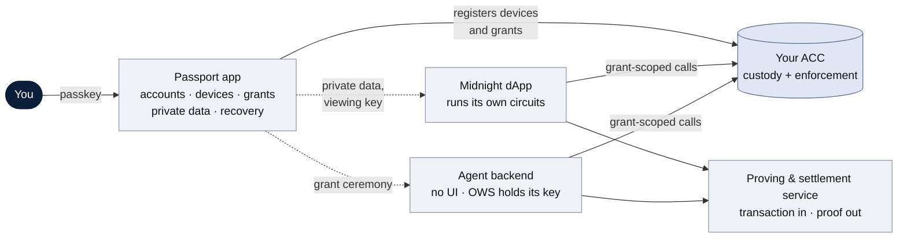
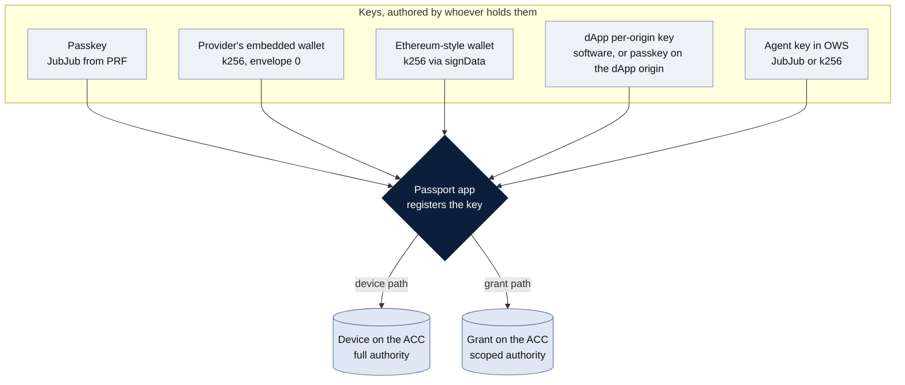
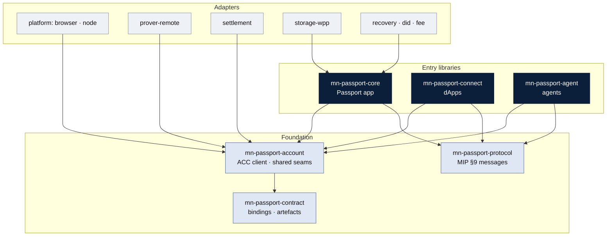
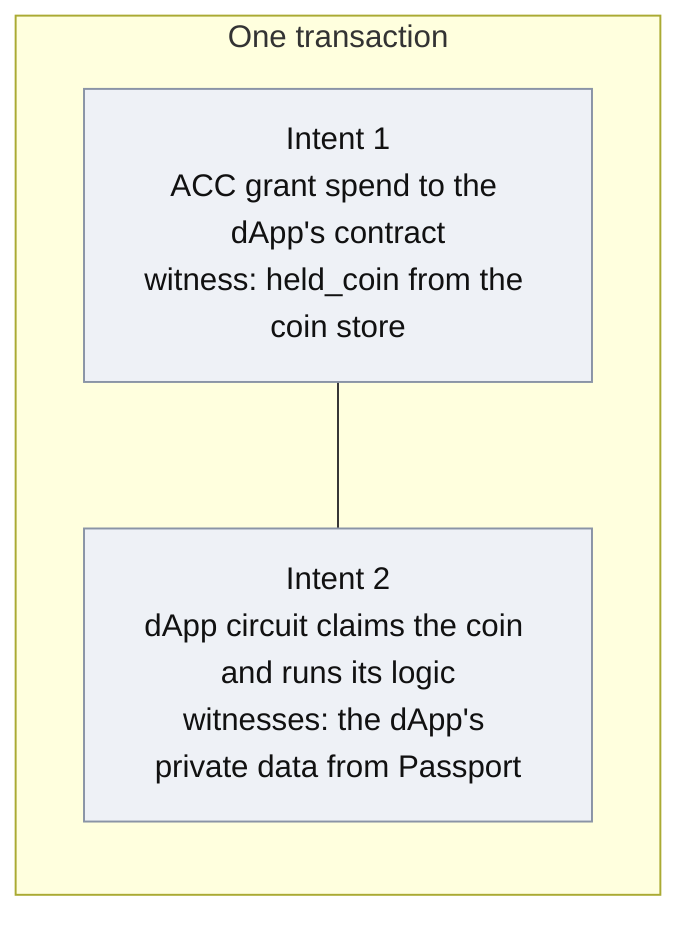

# SDK realignment — proposal of changes

> **Status:** proposal for decision · 2026/09/25
> **Scope:** the SDK's packages, core seams, adapters, normative rules, and the
> docs that describe them.
> **When accepted:** each change lands through `mn-passport-skills:doc-sync` with
> an ADR, as `CLAUDE.md` requires. Until then the existing docs remain the source
> of truth and this file records what should change in them and why.
> **Inputs:** the Passport direction (planning workspace `docs/passport-direction.md`),
> the scoped-grants MIP (`docs/mps-mip/mips/mip-xxxx-scoped-grants.md`),
> MPS-0040 (cross-contract call provenance), the reference ACC
> (`contract/contracts/account.compact`), the demo's account-custody work
> (passport-demo `main`, 2026/09/18–24), the Witness Protection Program (WPP)
> integration notes, and the architecture call of 2026/09/25. Every midnight-js
> behaviour cited was checked against the source at `v5.0.0-beta.7` (the version the
> demo pins) and at `main` as of 2026/09/24. The SDK docs it amends were read at
> `main` `5dff89f` (2026/09/03). Sources are listed in §14.

---

## 1. Why this proposal

The SDK docs were written for a model in which Passport is the place where
transactions happen: it builds, proves, signs, and submits on the user's behalf,
and dApps ask it to do so through a wallet-connector protocol. They also assume
that proving in the browser will be the normal path.

Both assumptions no longer hold. The direction has changed: dApps and agents run
their own circuits, the ACC enforces what each of them may do, and Passport
becomes the place where accounts are created, keys are approved, and private data
is kept. The evidence has changed too: the ACC's proving keys run to hundreds of
megabytes per circuit, and calls from one contract into another have limits the
docs do not mention.

This proposal sets out what to keep, change, add, and retire. It gives most of
its attention to the adapters, because that is where the old model is most
visible: several adapters exist only to let Passport act on behalf of a dApp or
an agent, and in the new model neither needs Passport to act for it.

---

## 2. The model in one page

**The ACC** holds the user's funds and enforces the rules. Every key that acts on
it is registered in it, either as a *device* (full authority) or as a *grant*
(scoped authority: operations, one token colour, per-call and total caps, a coin
bound, an optional recipient pin, and an expiry).

**The Passport app** is where an account is created, where device keys live, where
grants are approved and revoked, where private data is kept, and where recovery
happens. It is the only place that holds full authority. It is not where dApp or
agent transactions are built.

**A dApp** connects through the grant ceremony, receives a scoped key of its own,
and runs its own circuits in its own UI. Passport supplies what the dApp cannot
have by itself: the ACC's client code, the user's private data for that dApp, and
the viewing key if the grant includes read access.

**An agent** is set up the same way. The agent provider decides how the request
reaches the user — a QR code printed by a command-line tool, or a link or button in
its own app — and the Passport app handles it the same way either way. Its key is held by the agent's own wallet engine (OWS). It then
builds and executes calls without any UI, fetching each dApp's client code from a
registry.

**Every key is authored by whoever holds it and registered by Passport.** That is
the single method this proposal builds around: the same interface serves a
passkey, the provider's embedded wallet, an Ethereum-style wallet, a dApp's
per-origin key, and an agent's OWS key. What differs is only whether Passport
registers the key as a device or as a grant.



---

## 3. Decisions this proposal records

These were settled in the direction work and the architecture call. The proposal
treats them as fixed inputs.

1. **Onboarding happens only in the Passport app.** The passkey created there is a
   full-authority device. No dApp onboards a user, and no dApp or agent ever
   receives a device key. This supersedes ADR 0005 (§3.1).
2. **dApps and agents use the same grant mechanism.** Each holds one scoped key
   registered on the ACC. The ACC checks what the key may do, not which dApp is
   calling: one grant to an agent covers every dApp that agent calls.
3. **The dApp connector protocol (C23) is retired.** Connection is the grant
   ceremony defined by the scoped-grants MIP (§9); there is no request/response
   channel through which Passport acts for a dApp.
4. **Circuits run where the caller is.** A dApp runs its circuits in its UI; an
   agent runs them in its backend; the Passport app runs only its own operations
   (onboarding, devices, grants, recovery).
5. **The OWS adapter is retired.** OWS authors the agent's key; Passport registers
   it through the grant ceremony, delivered however the agent provider chooses (a
   QR code in a command-line tool, or its own app); OWS reads the grant from the
   ACC to decide what it will sign.
6. **Clients carry about 1 MB per contract** — the compiled contract module, the
   ledger decoder, and the manifest. ZKIR goes to the prover only. Proving keys
   stay with the prover and can be rebuilt there from the ZKIR and the verifier
   key.
7. **dApps publish their own client code; agents fetch it.** Each dApp bundles its
   own app; the SDK provides a project template as an AI-agent skill.
8. **Private data is kept by Passport and backed up through WPP.** A dApp receives
   its own private data through the SDK and returns updates the same way.

### 3.1 What this changes in designs already on `main`

Two designs merged to `main` in August and September meet this proposal head-on.

**Partner-origin onboarding is superseded.** ADR 0005 (accepted 2026/08/18),
requirements §3.13, FS-2.3, and architecture example 6 let a partner dApp issue a
Passport through the `mn-passport-onboard` facade, which links `core` into the
dApp's bundle. Decision 1 reverses that, and the reasons are already recorded on
`main`:

- the facade holds the plaintext device secret in the partner origin during
  issuance (ADR 0005's own residual risk), and the key it creates is a
  full-authority device;
- errata 7 and 8 (`onboarding-and-key-authorisation.md` §8) show that removing a
  device cannot evict a key that planted a spare entry, so a full-authority key
  issued at a dApp cannot reliably be taken back.

What survives is the experiment behind it: Related Origin Requests work, the PRF
output is identical across origins, and a largeBlob written at one origin reads
back at another, with the rule that the largeBlob is a cache and never the source
of truth. Those findings serve the Passport app's own recognition of an account,
and make the largeBlob a candidate carrier for account metadata (open question 4),
bearing in mind that among platform authenticators only Apple's support it. The
redirect fallback in §3.13, which sends the user to the Passport app, becomes the
only route.

**Authorising additional keys (FS-2.4) is kept and generalised.** FS-2.4 already
has the shape §4 argues for. The holder generates its key and exposes a signed
request out of band, preferably as a QR code (scheme tag, public key, commitment,
account hint, nonce, expiry, label, and a self-signature); only the Passport app
verifies it and signs the approval, through the existing `add_device` circuit.
This proposal keeps that as the device path and extends the same request to the
grant path: the request also carries a requested scope, and the approval is
`issue_grant`. The agent ceremony (§8.3) is that request; the dApp ceremony
(§8.2) is its MIP §9 redirect form. Two amendments:

- FS-2.4 has a managed provider sign with a P-256 secure-signer key. The ACC has
  no p256 arm yet (it waits on the secp256r1 surface), and the demo enrols the
  provider's key on the k256 arm (envelope 0). FS-2.4 should say k256 until the
  p256 arm lands (open question 11).
- FS-2.4 gives the platform full authority. Given errata 7 and 8, only a platform
  that genuinely acts as the user's own device should receive that; any other
  platform, agent, or dApp gets a grant. A grant key cannot plant a spare —
  issuing a grant needs a device — so revoking it retires it, and
  `revoke_all_grants` retires every grant at once.

**The embedded (iframe) transport** in `dapp-connection.md` (Passport top-level,
the dApp in a full-page iframe, `postMessage` between them) loses its role as an
RPC carrier but is a candidate channel for the private-data handoff (open
question 2). It makes Passport the host of the dApp, which is a product choice as
much as a technical one.

---

## 4. Key authoring: one method for every principal

Today the docs describe five separate ways a key reaches the ACC:
`adapter-signer-managed`, `adapter-signer-local`, `adapter-agent-ows`,
`adapter-wallet-connect`, and the dApp grantee key inside `mn-passport-connect`.
They are the same thing seen from five places. This proposal replaces them with
one interface and two registration paths.

**The interface.** A *key provider* is anything that holds a private key and can
sign an ACC challenge:

```ts
// Indicative shape; signatures are fixed when the package is specced.
interface KeyProvider {
  readonly scheme: 'jubjub' | 'k256' | 'p256';
  readonly envelope?: 0 | 1;          // k256 only: raw digest, or the connector's signData framing
  publicKey(): Promise<Uint8Array>;
  sign(challenge: Challenge): Promise<Authorisation>;
}
```

`Challenge` is the ACC's per-circuit challenge (a finished digest for k256, a
builder for JubJub's grinding rule). `Authorisation` is the argument tuple the
circuit takes. The demo already has this split: `custodyJubjubSigner.ts` and the
k256 signer behind `custodyContractSigning.ts` feed one send engine through
`authArgs`.

**The two registration paths.**

| Path | Circuits | Authority | Who may perform it | Where |
|---|---|---|---|---|
| **Device** | `activate_initial_device_with_*`, `add_device_with_*` | Full | The user, with an existing device | Passport app only |
| **Grant** | `issue_grant_with_*` | Scoped | The user, approving a request | Passport app, via the grant ceremony |



**The key providers the SDK ships.**

| Key provider | Scheme | Typical registration | Lives in | Notes |
|---|---|---|---|---|
| Passkey | JubJub, derived from the passkey's PRF output | Device | `core` (Passport app) | Signs in the tab, no third party. The demo's device model. |
| Passkey on secp256r1 | p256 through the WebAuthn envelope | Device or grant | `core`, `connect` | Waits on the ACC's p256 arm (the secp256r1 surface). |
| The provider's embedded wallet | k256, envelope 0 | Device | `core` | Signs ACC challenges through the provider's raw-signing call; enrolled once from a signature over a known digest, because the provider exposes no public-key read. |
| Ethereum-style wallet | k256 through the connector's `signData` framing (envelope 1) | Grant (read-only) | `connect` | The MIP refuses envelope-1 keys on the spend seam, so such grants are read-only by construction. |
| dApp per-origin key | JubJub or k256 (envelope 0), or p256 on the dApp origin | Grant | `connect` | One key per account per origin; never reused (MIP §3.2). |
| Agent key in OWS | JubJub or k256 (envelope 0) | Grant | `mn-passport-agent` (OWS side) | OWS signs; the SDK builds the challenge. |

**Why this matters beyond tidiness.** It removes the idea that the provider is
only a presence gate (requirements §2.6), which the demo has overtaken: the
provider's key is now a k256 device that signs ACC challenges. It makes OWS an
ordinary key provider rather than something Passport wraps. And it gives dApps and
agents one code path, which is what decision 2 asks for.

---

## 5. Packages

| Package | Today | Proposal |
|---|---|---|
| `mn-passport-protocol` | C23 wire types: EIP-6963 discovery, CAIP-25-shaped requests, Sign-In-with-Passport | **Change.** Carry the MIP §9 messages instead: `GrantRequest`, the possession proof, the redirect response (`grant_id`, `scope_salt`, approved scope, `view`), the sign-in message (MIP §10), and the agent's grant request in a form that can travel as a QR code or a link. Keeps the wire version axis. |
| `mn-passport-contract` | Typed ACC bindings, version registry, artefact integrity; loads ZKIR, binary ZKIR, and verifier keys | **Change.** Keep bindings, registry, and integrity. Load only what a client needs to build a call (compiled module, ledger decoder, manifest); ZKIR is for the prover. Accept a partly deployed account (§7, wave rule). Generalise the loader to dApp artefacts. |
| **`mn-passport-account`** | — | **New foundation package.** The ACC client that `core`, `connect`, and the agent library all need, so `connect` still never links `core`: per-arm challenge builders, the coin store and position lookup, the inbox codec (seal and open), payments, the transaction joiner, grant-scope helpers, and the seam interfaces the three entry libraries share (key provider, prover, settlement). The demo's `custodyContractClient.ts`, `custodyInbox.ts`, `custodyInboxIndex.ts`, and `k1CoinStore.ts` are the quarry. |
| `mn-passport-core` | The kernel for every face: onboarding, connect answer, witness lifecycle, grants, agents | **Narrow.** The Passport app's engine: onboarding, devices, grant issuance and revocation (the authoriser page of MIP §9), private-data custody through WPP, recovery, and distribution of the viewing key. No longer on the dApp or agent path. |
| `mn-passport-connect` | Thin dApp connector over C23: sign-in, grant requests, witness provisioning, deposit | **Change.** The dApp library: grant ceremony client, dApp per-origin key provider, a Passport-backed private-state provider, ACC calls and payments through `mn-passport-account`, and a project-template skill. Still never links `core`. |
| `mn-passport-onboard` | Planned facade over `core` for partner-origin issuance (ADR 0005, FS-2.3) | **Retire before it is built** (§3.1). Recognising an account from the passkey and its largeBlob moves into `core`; the shared constants ADR 0005 placed in `mn-passport-protocol` (RP ID, PRF salt, largeBlob schema) stay there. |
| **`mn-passport-agent`** | — (was `adapter-agent-ows`) | **New entry package** (Node). Builds the agent's grant request, with helpers to present it as a QR code or a link, a registry client for dApp artefacts, compose and execute, OWS as key provider, and the private-data channel (open question 3). Never links `core`. |



*Arrows read "depends on". The prover, settlement, and platform adapters now
implement interfaces from `mn-passport-account`, because the dApp and agent
libraries need them and must not reach `core`. Storage, recovery, DID, and fees
stay behind `core`, because only the Passport app uses them.*

---

## 6. Core seams

| Seam | Today | Proposal |
|---|---|---|
| Signer (FS-0.4) | `requestAuthorisation(bundle) → { R, s, scheme }` | **Becomes the key provider** (§4), moved to `mn-passport-account`. `core` uses only the device path. |
| Prover (FS-0.5) | `prove(preimage, keyLocation)`, `check(…)`; preimage sealed to the enclave | **Change the shape to transaction in, proof out:** `prove(unprovenTx, circuitIds) → provenTx`. The demo's fee sponsor does exactly this (`POST /prove-account-custody`), with the proving keys on its disk. Moved to `mn-passport-account`. |
| Settlement (FS-0.6) | `balanceAndSubmit`, `awaitFinalised` | **Keep**, moved to `mn-passport-account`. Add the bounded waits and resubmission the demo learnt it needs. |
| Storage (FS-0.7) | Ciphertext-at-rest `get`/`put`; IndexedDB, vendor keystore, and #58 behind it | **Rebuild around WPP.** Keep "no plaintext crosses the seam"; adopt WPP's package and catalog model, conflict retention, and backup states (§8.5). |
| Platform (FS-0.8) | Network and ceremony primitives | **Keep.** |
| Agent | OWS access mapped onto grants | **Remove.** Replaced by the agent package and the key provider. |
| dApp connection | Wallet side of C23 | **Remove.** Replaced by grant issuance in `core`. |
| Private state | — | **Add**, in `mn-passport-account`: a `PrivateStateProvider` that `connect` and the agent library implement against Passport (§8.5). |
| Registry | — | **Add**, in `mn-passport-contract`: fetch a dApp's artefacts by content hash and verify them before use (§8.3). |

---

## 7. Adapters

Sixteen adapters are named across `architecture.md` §4.4 and the M0 specs. This
proposal keeps nine, retires five, merges two into the key-provider model, and
redefines two.

| Adapter | Today | Verdict | Why | Replacement |
|---|---|---|---|---|
| `adapter-agent-ows` | Wraps `ows-core`; maps OWS onto grants | **Retire** | OWS is not something Passport wraps. It authors the agent's key; Passport registers it like any grantee key; OWS reads the grant from the ACC as its policy. | The OWS key provider inside `mn-passport-agent`, plus agent grant handling in `core`. |
| `adapter-dapp-connection` | Answers C23 discovery, sign-in, and grant requests | **Retire** | There is no C23 channel to answer. Connection is the MIP §9 ceremony. | Grant issuance in `core`: the authoriser page, validation of the request and its proof, consent, `issue_grant`, and the redirect. |
| `adapter-wallet-connect` | Passport connecting out to external wallets | **Retire as an adapter** | An external wallet is a key provider (k256 through the connector's `signData`), registered as a device or a read-only grant. | The Ethereum-style wallet key provider (§4). |
| `adapter-storage-vendor` | Native vendor-keystore sync | **Retire** | A PWA cannot write to it; it does not cross ecosystems; WPP covers the durable copy. | `adapter-storage-wpp`. |
| `adapter-storage-shared` (#58) | Portable sealed-backup service; source of dApp witness provisioning | **Replace** (pending open question 7) | WPP claims the same job, with a fuller design: packages, catalogs, conflict retention, and a Passport integration contract. Provisioning moves to the private-state seam. | `adapter-storage-wpp`: WPP's storage adapters behind the storage seam, Google Drive first. |
| `adapter-signer-managed` | The provider as a presence gate over a local device secret | **Merge into key providers** | The provider's key is now a k256 device that signs ACC challenges. | The provider's embedded-wallet key provider (§4). |
| `adapter-signer-local` | PRF-derived JubJub device, plus an interim hash-preimage signer | **Merge into key providers** | The passkey is now the primary device, not a fallback; the hash-preimage signer is gone from the reference ACC. | The passkey key provider (§4). ADR 0001's contingency framing needs revisiting. |
| `adapter-prover-wasm` | In-tab proving for small circuits | **Defer beyond V1** | The ACC's circuits sit at k=15–17 with 112–224 MB proving keys; the zkir WASM package does not expose key generation; browsers cannot hold the memory. The demo proves nothing in the tab. | Revisit for small circuits when WASM key generation ships. |
| `adapter-prover-remote` | Seals the preimage to an enclave; key by `keyLocation` | **Redefine** | The working shape is transaction in, proof out, with keys held by the prover. It is shared by all three entry libraries. | Same name, new interface (§6), implementing the seam in `mn-passport-account`. The prover sees the coin and amount; say so (§9). |
| Settlement adapter | Balancing, DUST, submit through the proving & settlement service | **Keep** | Unchanged in purpose. | Moves under `mn-passport-account`. |
| `adapter-fee-capacity-exchange` | Sponsored DUST through liquidity-provider quotes | **Keep, deferred** | Still the route for users without DUST. Contract-held NIGHT cannot generate DUST, which makes it more important, not less. | — |
| `adapter-recovery` | Guardians and paper keys for total-loss recovery (C14/C15) | **Keep** | Account recovery is unchanged. WPP key recovery is a separate operation and does not replace it. | — |
| `adapter-did` | `did:midnight` create and resolve | **Keep, deferred** | Unaffected. | — |
| `adapter-browser` | Browser wiring | **Keep** | Unchanged. Load the two WASM runtimes in order (the demo found Safari fails otherwise). | — |
| `adapter-node` | Node wiring | **Keep** | Now also the platform for `mn-passport-agent`. | — |
| Registry adapter | — | **Add** | Agents need a dApp's artefacts at run time. | Behind the registry seam: content-addressed fetch, verification, local cache. |

---

## 8. Flows

### 8.1 Onboarding — Passport app only

The user creates an account in the Passport app. The ACC is deployed in three
waves (the circuit roster exceeds one block's write budget), the passkey is
activated as the first device, and the name is claimed. The provider's embedded
wallet, if used, is enrolled as a second device, through FS-2.4's signed request.
No other application runs any part of this: a partner dApp whose user has no
Passport sends them to the Passport app (§3.13's fallback, now the only route),
and the user returns through the grant ceremony.

The contract binding must accept a partly deployed account. midnight-js's
`findDeployedContract` checks every circuit's verifier key, so it refuses an
account whose later waves have not landed; the demo's fee sponsor checks only the
circuits it calls. FS-0.2's connect-time version check needs the same rule.

### 8.2 A dApp connects and makes a call

1. The dApp generates a key for its origin and navigates to the Passport
   authoriser page with a `GrantRequest` and a possession proof (MIP §9). If the
   user has no account, the authoriser page walks them through creating one first,
   then returns to the request.
2. The user approves with their passkey; Passport submits `issue_grant` and
   redirects back. The dApp re-reads the grant from the chain before trusting it.
3. The dApp receives, through `connect`, the ACC address, its private data for
   its own contract, and the viewing key if the grant includes read access.
4. The dApp builds its call in its own UI and has the prover prove it.

**What a dApp's contract may call inside its own circuit.** Compact runs witnesses
only in the contract a transaction starts from; a contract called by another
cannot use one. The reference ACC declares one witness, `held_coin`, and eight of
its thirty circuits use it — every shielded spend, including the four shielded
grant spends. So:

| May be called from a dApp's circuit | Must start its own intent |
|---|---|
| Deposits, unshielded withdrawals (device and grant), device, grant, and key management, `append_inbox` | `withdraw_shielded_*`, `withdraw_shielded_to_contract_*`, and their grant forms |

**Moving shielded value out of the ACC therefore uses the transaction joiner.** The
ACC's spend starts one intent, with its witness supplied from the coin store; the
dApp's own call starts another, with the dApp's witnesses supplied by Passport;
`mn-passport-account` joins them into one transaction (`addIntent`, never
`merge`). This is how the demo sends from one Passport to another.



This rule lifts when called contracts can run witnesses (MPS-0021 phase 2, the
capsule work) and when midnight-js carries a called contract's shielded spends
into the transaction (§12).

### 8.3 An agent is set up and makes a call

1. The agent backend creates its key in OWS and builds a grant request through
   `mn-passport-agent`.
2. The agent provider presents that request in whatever way suits its product: a
   QR code printed by a command-line tool and scanned with the Passport app, or a
   link or button in the provider's own app that opens the Passport app. The SDK
   offers helpers for both; it does not prescribe either. The request itself, and
   how Passport validates it, is the same in every case.
3. The user approves a scope in the Passport app; Passport submits
   `issue_grant`. The readable scope and its salt go to the agent, because OWS
   cannot check limits from the chain alone: the colour, recipient, coin bound,
   host, and running total are stored as salted commitments.
4. To act, the agent library fetches the target dApp's artefacts from the registry
   by content hash and verifies them, builds the call through
   `mn-passport-account`, asks OWS for the signature, has the prover prove it, and
   submits.

The registry follows the pattern the capsule MIP describes: code named by content
hash, fetched from any store, and trusted only through an on-chain reference. That
on-chain reference does not exist yet (open question 5), so in V1 the agent
verifies what it fetches against a hash the dApp publishes.

### 8.4 Payments

| Recipient | Circuit | What the payer must supply |
|---|---|---|
| A regular shielded wallet | `withdraw_shielded_*` | The **full** shielded address. The circuit takes the coin public key; midnight-js needs the encryption public key to build the note the recipient's wallet finds. Pass it as `additionalCoinEncPublicKeyMappings`; without it midnight-js's resolver has no key for the recipient and the transaction cannot be built. Neither key derives from the other. |
| Another Passport | `withdraw_shielded_to_contract_*` plus the recipient's `deposit_shielded`, joined in one transaction | A 192-byte inbox entry sealed to the recipient account's advertised `enc_key`, **read at the moment of sealing** and again on every retry, because the recipient can rotate it. Without the entry the coin arrives and can never be spent. The transaction publicly links the two accounts (MIP-0012 §6.6). |
| An unshielded address | `withdraw_unshielded_*` | An `mn_addr` address. There is no circuit that moves NIGHT between two accounts. |

Two further rules the docs need. Take both halves of a shielded address from one
parsed address, never from two sources: the signed challenge covers the coin key
but not the encryption key, so a wrong encryption key makes a payment that lands
but is never found (open question 9). And before spending, read the change coin's
position from the indexer's commitment tree; the demo lost a proof — about 45
seconds — to every wrong guess.

Requirements §3.12 also names `deposit_night`; the circuit is `deposit_unshielded`.

### 8.5 Private data

A dApp's witness functions read its private state from a midnight-js
`PrivateStateProvider`. "Passport injects the witnesses" means the SDK gives the
dApp a provider whose store of record is Passport; the dApp's own witness code is
unchanged.

- **Release.** After the grant ceremony, `connect` returns a provider scoped to the
  dApp's contract. On first read, Passport releases that contract's state,
  encrypted to the dApp's session key, under consent and a passkey tap. Never the
  whole profile.
- **Write-back only after confirmation.** midnight-js already follows this rule:
  building a call never writes private state, and `submitCallTx` writes the next
  state only after the transaction finalises with `SucceedEntirely`. The
  asynchronous `submitCallTxAsync` leaves the write to the caller, and its docs say
  a partial success "must NOT store private state updates". So on the ordinary path
  the Passport-backed provider's `set` *is* the commit, and the SDK must make the
  asynchronous path follow the same rule. Passport may additionally track a
  submitted transaction's state as pending, so that a reopened session can resume
  it; the demo does this for its coin store, but that is Passport's bookkeeping,
  not something midnight-js requires.
- **The signing-key half.** The same provider interface also stores a per-contract
  signing key (`setSigningKey`, `getSigningKey`, `exportSigningKeys`, and so on),
  and `findDeployedContract` creates and stores one if none exists. The
  Passport-backed provider must implement this half too; for a dApp that only calls
  an existing contract, keeping it local to the dApp is enough (open question 10).
- **Storage through WPP.** `core` holds the WPP encryption layer, which seals and
  opens private state only after the passkey tap and scoped authorisation. WPP's
  storage adapters sit behind the storage seam. The dApp sees backup status, never
  keys or a bulk export. These are WPP's own stated terms for integrating with
  Passport.
- **What goes where.**

| Data | Tier | Where |
|---|---|---|
| A dApp's private state | Irreplaceable | WPP |
| The ACC's coin store (`held_coin`'s data, queued coins, positions) | Rebuildable from the on-chain inbox with the viewing key | Local cache only |
| Viewing key, ACC address, grant references | Small, rarely changing, needed by every client | WPP metadata, or the passkey's `largeBlob` (open question 4) |
| Device keys | Regenerable from the passkey | Not stored |

The storage doc also needs three WPP rules it lacks: a user-visible Google Drive
folder under `drive.file` (the hidden `appDataFolder` may only ever be a cache),
retaining conflicting histories instead of letting the last write win, and
reporting when a backup's freshness is unknown.

---

## 9. Normative rules to amend

`CLAUDE.md` lists five MUSTs that `conformance` checks. Two change, two extend, one
stands.

| Rule | Today | Proposal |
|---|---|---|
| Ceremony gate | Before any witness use (requirements §2.2) | **Change.** A passkey tap when a grant is issued and when private data is released. Within a session, the dApp holds its released state and signs with its own key; a per-call tap applies only if that key is a passkey on the dApp's origin. |
| Encrypt the preimage to the enclave | Before remote proving (§2.5) | **Change.** V1's prover receives the transaction and sees the coin and the amount; the user is told so. Encryption to an enclave becomes required when a trusted-hardware prover exists (the proving-service MPS). |
| Deposit, not address | Paying an account is a deposit call (§3.12) | **Extend** with the inbox rule of §8.4 and the correct circuit name. |
| `connect` never links `core` | Architecture §4.4 | **Extend** to `mn-passport-agent`. Shared code lives in `mn-passport-account`. |
| Two version axes | Wire and binding | **Stands.** The wire axis now versions the MIP §9 messages. |

New rules to add: a payment takes a full shielded address; a payment to a Passport
reads the recipient's key at the moment of sealing; private data is written back
only after the transaction finalises with `SucceedEntirely`, on every submit path;
one grantee key per account per origin.

---

## 10. Changes by document

| Document | Sections | Change |
|---|---|---|
| `sdk-requirements.md` | §1.1 | Keep; add devices versus grants. |
| | §2.1–§2.3 | Replace custody paths and signing with key authoring (§4). |
| | §2.2 | Amend the ceremony rule (§9). |
| | §2.5 | Remote by default; transaction in, proof out; small circuits only in the tab, later. |
| | §2.6 | Narrow to the Passport app's own operations; the provider's key is a device. |
| | §3.1 | Onboarding in the Passport app only; three-wave deploy. |
| | §3.2, §3.9 | Rewrite: grant ceremony, per-origin key, private-state provider, joiner. |
| | §3.6 | Rebuild around WPP and the tiers in §8.5; add the viewing key. |
| | §3.8 | Rewrite: agents as key providers, the agent grant ceremony (delivery chosen by the agent provider), registry. |
| | §3.10 | Fold into key providers. |
| | §3.11 | Note that contract-held NIGHT cannot generate DUST. |
| | §3.12 | Extend with §8.4. |
| `architecture.md` | §1 | Three entry libraries over a shared foundation; `core` is the Passport app. |
| | §4.2 | Seams per §6. |
| | §4.4 | Packages and adapters per §5 and §7. |
| | §4.5 | Tiers and WPP. |
| | §2, §4.4 | Remove the `onboard` facade. |
| | §4.6 | Replace examples 1–4 and 6 with: onboarding in the app; connect and a joined call; an agent call; a payment to a shielded address. |
| `dapp-connection.md` | whole | Rewrite around the two processes and the MIP §9 ceremony; keep only the Phase A release, as §8.5. |
| `storage-and-recovery.md` | §3–§8 | Rebuild on WPP (§8.5). |
| `provider-integration.md` | §2–§6 | Narrow to the Passport app; transaction in, proof out; the provider's key as a k256 device. |
| `beta-scope.md`, roadmap, M1–M3 | — | See §11. |
| FS-0.2 | loader, OQ-2 | Client loads module, decoder, and manifest; partly deployed accounts; dApp artefacts. |
| FS-0.4, FS-0.5, FS-0.7 | interfaces | Key provider; transaction-in prover; WPP storage. |
| ADR 0001 | — | Revisit: the passkey is primary, not a fallback. |
| ADR 0005 | — | Superseded by a new ADR recording decision 1 (§3.1). |
| `onboarding-and-key-authorisation.md` | §1–§5, §7 | Retire partner-origin issuance; keep the experiment's findings as recognition in the Passport app. |
| | §6 | Keep; extend the signed request to the grant path; k256 until the p256 arm lands. |
| | §8 | Keep, including the revocation limits; add that grants, not devices, are the default for platforms, agents, and dApps. |
| `sdk-requirements.md` | §3.5 | Keep the out-of-band key-authorisation rule; extend it to grants. |
| | §3.13 | Remove; its redirect fallback becomes §3.1's only route. |
| FS-2.3 | whole | Retire. |
| FS-2.4 | §1–§3 | Keep; amend per §3.1. |

---

## 11. Roadmap and beta

- **M1 (managed onboarding)** becomes passkey-first, with the provider's key as a
  second device. The three-wave deploy and the partly deployed check are in scope.
- **M2 (connect)** becomes the grant ceremony. Sign-in without a grant does not
  exist in the MIP (§10: "There is no identity-only on-chain grant"), so the
  `{ name, account }` profile read is a grant with read scope or waits for the
  unfiled sign-in MIP (open question 1).
- **M2** also loses FS-2.3 and keeps FS-2.4 (§3.1). Beta-scope item 5
  (partner-origin onboarding) is removed.
- **M3 (reference dApp)** must hold a grant for the same reason, and connects
  existing Passports instead of issuing them.
- **Not built for beta** changes: remove `adapter-agent-ows`,
  `adapter-wallet-connect`, and `adapter-dapp-connection` from the list (they are
  retired, not deferred); add `mn-passport-agent` and the registry as post-beta
  work.

---

## 12. External dependencies

| Dependency | Needed for | Status |
|---|---|---|
| midnight-js carrying a called contract's shielded spends into the transaction's offer (`Custom error: 217`) | Shielded value through calls between contracts | Reproduced, and a fix measured, in passport-demo `docs/demo/midnight-js-callee-offer-issue.md`. Not filed upstream: on both `v5.0.0-beta.7` and `main`, `createUnprovenCallTx` builds the offer from the one Zswap state the execution returns. The closest open issue, midnight-js #968, covers the same gap between sibling calls. The 2026/09/16 offer refactor (#1309) changed how the offer is split across segments, not this. |
| Witnesses in called contracts | Shielded ACC spends called from a dApp's circuit | MPS-0021 phase 2; the capsule MIP (draft) |
| `kernel.caller()` in a Compact release | Caller checks on the ACC | Merged to the compiler's main branch 2026/09/24 (compact PR #447). Undefined in root circuits that move unshielded tokens; lendable but not forgeable (MPS-0040); the calling circuit is not recorded. Applies to witness-free circuits first. |
| A prover that holds or rebuilds keys | Every client | Artefacts loaded from disk (midnight-ledger PR #770); keys rebuilt from ZKIR (passport PR #170); a key-distribution MPS in preparation |
| Key generation exposed in the zkir WASM package | Proving small circuits in the tab | Requested |
| Contract-held NIGHT generating DUST | Accounts whose funds live in the ACC | Not supported; an upstream ask |
| The ACC's p256 arm | Passkeys on secp256r1 | Waits on the secp256r1 surface |
| A midnight-js version to build on | Every package | The demo pins `5.0.0-beta.7`. `main` has moved on with breaking changes: both ledger eras dispatched through a protocol facade (#1194, #1218), the offer composer (#1309), and compact-js `3.0.0-rc.0` (#1341). The SDK should pin one version and state which behaviour it relies on. |
| An on-chain reference for dApp artefacts | Trusting fetched artefacts without a published hash | The capsule MIP's governed reference; not yet specified |

---

## 13. Open questions

1. **Sign-in.** Is sign-in a read-scoped grant, or does it wait for the sign-in MIP?
2. **Private-data handoff.** Is each release and write-back a redirect, a
   long-lived session key, or the embedded (iframe) transport already sketched in
   `dapp-connection.md`? This sets how many round trips a busy dApp makes.
3. **Agents and private data.** Does Passport release a dApp's private data to an
   agent backend, over which channel and under which ceremony, or are agents
   limited to calls that need none?
4. **The viewing key.** How does it reach OWS and dApps with read grants: WPP
   metadata, the passkey's `largeBlob` (which needs PRF support), or another route?
   Passkey sync carries the signing key but not the viewing key.
5. **The registry.** Where do dApps publish their artefacts, and how do agents
   verify them before an on-chain reference exists?
6. **`kernel.caller()`.** When does the ACC adopt it, and may a grant be tied to
   named calling contracts (a non-goal in the current MIP)?
7. **WPP and #58.** Does WPP replace the #58 sealed-backup service?
8. **Shielded grant spends in V1.** Confirm that they use the transaction joiner
   with the ACC's spend as its own intent.
9. **The recipient's encryption key.** Should the signed challenge cover it, or is
   "one parsed address" a documented rule?
10. **Contract signing keys.** The midnight-js private-state provider also stores a
    per-contract signing key. Does Passport keep it for a dApp, or does it stay
    local to the dApp?
11. **The provider's key scheme.** FS-2.4 specifies P-256; the ACC has no p256 arm
    yet and the demo uses k256. Which does the provider enrol with for V1?

---

## 14. Sources

- Passport direction: planning workspace `docs/passport-direction.md`.
- SDK docs on `main` (`5dff89f`): ADR 0005; `onboarding-and-key-authorisation.md`
  §6 and §8 (errata 7 and 8, commit `64fe00d`); FS-2.3; FS-2.4;
  `dapp-connection.md` (the embedded transport, commit `29da155`).
- Scoped grants and dApp connection: planning workspace
  `docs/mps-mip/mips/mip-xxxx-scoped-grants.md` (§3.2, §6, §8, §9, §10); reference
  implementation evidence in passport PR #155.
- MPS-0040, cross-contract call provenance: `midnight-improvement-proposals`
  `mps/mps-0040-cross-contract-call-provenance.md`.
- `kernel.caller()`: LFDT-Minokawa/compact PR #447 and its review thread.
- The reference ACC: planning workspace `contract/contracts/account.compact`
  (`witness held_coin`, line 171).
- The demo's account-custody work, passport-demo `main`: `d884fec` (recipient key
  read at seal time), `424236e` (one send engine for both arms), `22ce134` (NIGHT to
  an address only), `c3fe625` (coin position from the chain), `21247fc` (queued
  deliveries), `6ebd8f1` (partly deployed accounts), `2586f9c` (WASM load order),
  `8cf7ed8` (one key enrols another); `examples/passport-balancer/src/proveAccountCustody.ts`
  (transaction in, proof out); `docs/demo/account-custody-layer-design.md` §3c
  (the one-transaction send); `docs/demo/midnight-js-callee-offer-issue.md`.
- Proving-key sizes and regeneration: servicedesk issue #203 and its comments;
  passport PR #170.
- Capsule runtime: shieldedtech/product PR #155 (`capsule-runtime/MIP.md`).
- Witness Protection Program: `docs/integrations.md`, `docs/security-and-recovery.md`,
  and `docs/explanation/application.md` in its repository.
- midnight-js, checked at `v5.0.0-beta.7` and `main` (2026/09/24):
  `packages/types/src/private-state-provider.ts` (the provider interface);
  `packages/contracts/src/submit-call-tx.ts` and `src/internal/transaction.ts`
  (private state written only after `SucceedEntirely`);
  `packages/contracts/src/unproven-call-tx.ts` and `src/utils/zswap-utils.ts` (the
  encryption-key resolver and the offer built from one Zswap state);
  `packages/contracts/src/find-deployed-contract.ts` (`verifyContractState` checks
  every declared circuit); `packages/http-client-proof-provider/src/http-client-proving-provider.ts`
  and `packages/types/src/midnight-types.ts` (every proof uploads the proving key,
  verifier key, and ZKIR); issues #968 and #1351; PR #1309.
- The witness rule for called contracts: LFDT-Minokawa/compact `runtime/src/contract.ts`
  (`forbiddenCalleeWitnesses`: "calls to witnesses in non-root contracts are not yet
  supported").
