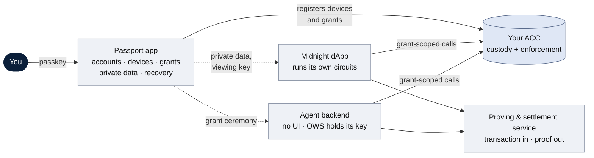
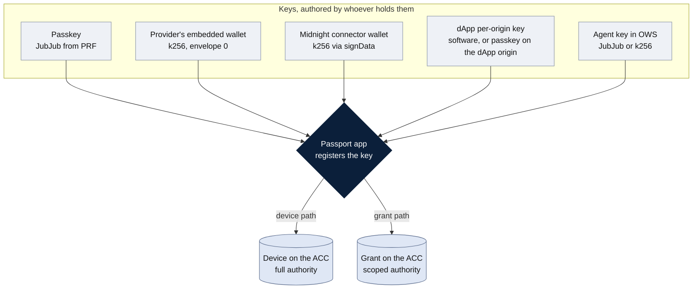
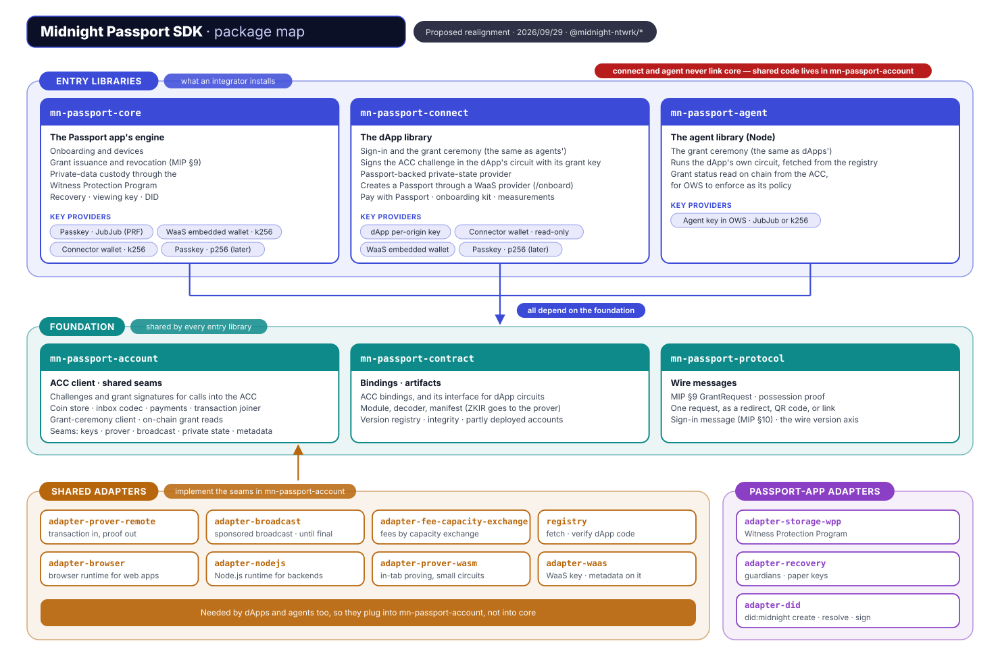
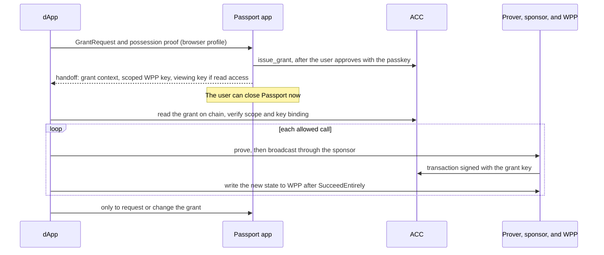
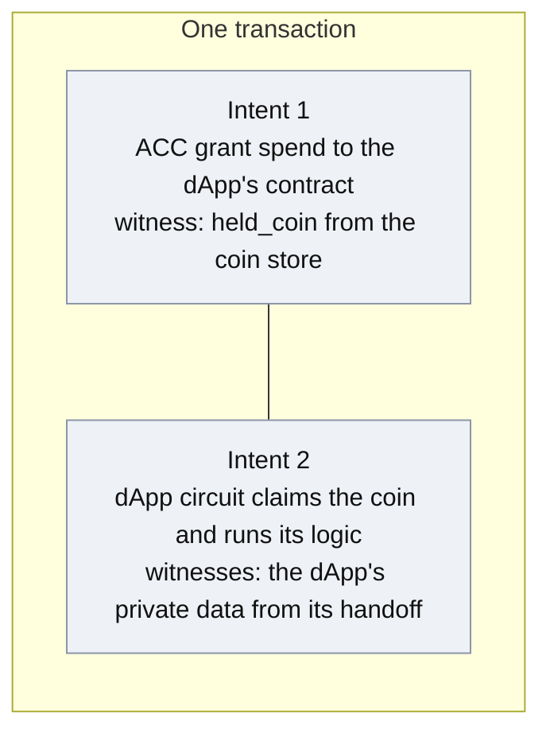

# SDK realignment — proposal of changes

> **Status:** proposal for decision · 2026/09/25
> **Scope:** the SDK packages, the core seams, the adapters, the normative rules,
> and the documents that describe them.
> **When accepted:** each change goes into the docs through
> `mn-passport-skills:doc-sync`, with an ADR, as `CLAUDE.md` specifies.
> Until then, the current docs stay the source of truth.
> This file records the necessary changes to them, and the reasons.
> **Inputs:**
>
> - the Passport direction (planning workspace `docs/passport-direction.md`);
> - the scoped-grants MIP (`docs/mps-mip/mips/mip-xxxx-scoped-grants.md`);
> - MPS-0040 (cross-contract call provenance);
> - the reference ACC (`contract/contracts/account.compact`);
> - the account-custody work of the demo (passport-demo `main`, 2026/09/18–24);
> - the integration notes of the Witness Protection Program (WPP);
> - the architecture call of 2026/09/25.
>
> **Checks:** we checked each cited midnight-js behavior against the source at
> `v5.0.0-beta.7` (the version that the demo pins) and at `main` on 2026/09/24.
> We read the SDK docs that this file amends at `main` `5dff89f` (2026/09/03).
> §14 lists the sources.

---

## 1. Why this proposal

The SDK docs describe a model in which Passport is the place where transactions
occur. In that model, Passport builds, proves, signs, and submits transactions
for the user. A dApp asks Passport to do these steps through a wallet-connector
protocol. The docs also assume that the browser will usually make the proofs.

These two assumptions are no longer correct. The direction changed. Now dApps
and agents run their own circuits, and the ACC enforces what each of them can
do. Passport becomes the place where the user creates accounts, approves keys,
and keeps private data.

The evidence also changed. The proving keys of the ACC are hundreds of
megabytes for each circuit. Also, calls from one contract into another have
limits that the docs do not mention.

This proposal gives the items to keep, change, add, and retire. Most of it is
about the adapters, because the old model is most visible there. Some adapters
exist only to let Passport act for a dApp or an agent. In the new model, a dApp
or an agent does not need Passport to act for it.

---

## 2. The model in one page

**The ACC** holds the funds of the user and enforces the rules. Each key that
acts on the ACC has a registration in it, as a _device_ or as a _grant_. A
device has full authority. A grant has scoped authority, with these limits:

- the permitted operations;
- one token color;
- a cap for each call, and a total cap;
- a coin bound;
- an optional recipient pin;
- an expiry.

**The Passport app** is where the user creates an account, keeps device keys,
approves and revokes grants, keeps private data, and does recovery. It is the
only place with full authority. The Passport app does not build the
transactions of dApps or agents.

**A dApp** connects through the grant ceremony and gets a scoped key of its own.
The dApp builds its own circuit, which composes the ACC of the user, and runs it
in its own UI. Passport supplies the items that the dApp cannot have by itself:

- the interface and the client code of the ACC;
- access to the private data of the user for that dApp, through a handoff in
  the connection flow;
- the viewing key, if the grant includes read access.

After the grant and the handoff, the dApp operates alone, with the Passport app
closed (decision 12).

**An agent** uses the same approval flow in the Passport app. A dApp and an
agent send one message format, but the request binds to different things:

- a dApp request binds the web origin of the dApp, and it comes by a redirect;
- an agent request has no web origin. It binds the agent key, and it comes as a
  QR code from a command-line tool, or as a link in the app of the provider.

The Passport app shows which of these two profiles it validates. The wallet engine of the
agent (OWS) holds the key of the agent. OWS reads the grant from the ACC on
chain and enforces it as its policy. The agent then runs the circuit of each
dApp without a UI. It gets the client code of the dApp from a registry. After
the grant, the agent also operates with the Passport app closed (decision 12).

**The holder of a key makes the key, and Passport registers it.** This proposal
uses that one method for all keys. The same interface serves these keys:

- a passkey;
- the embedded wallet of the provider;
- a Midnight connector wallet;
- the per-origin key of a dApp;
- the OWS key of an agent.

The only difference is if Passport registers the key as a device or as a grant.


```mermaid
flowchart LR
    You([You])
    App[Passport app<br/>accounts · devices · grants<br/>private data · recovery]
    Dapp[Midnight dApp<br/>runs its own circuits]
    Agent[Agent backend<br/>no UI · OWS holds its key]
    Prover[Proving & settlement service<br/>transaction in · proof out]
    ACC[(Your ACC<br/>custody + enforcement)]

    You -->|passkey| App
    App -->|registers devices<br/>and grants| ACC
    App -.->|private data,<br/>viewing key| Dapp
    App -.->|grant ceremony| Agent
    Dapp -->|grant-scoped calls| ACC
    Agent -->|grant-scoped calls| ACC
    Dapp --> Prover
    Agent --> Prover

    classDef person fill:#0b1f3a,color:#ffffff,stroke:#0b1f3a
    classDef box fill:#eef1f6,color:#111111,stroke:#8a94a6
    classDef store fill:#dfe7f5,color:#111111,stroke:#5a6b8c
    class You person
    class App,Dapp,Agent,Prover box
    class ACC store
```

---

## 3. Decisions this proposal records

The direction work and the architecture call settled these decisions. This
proposal uses them as fixed inputs.

1. **Onboarding occurs in the Passport app, or in a dApp through a
   wallet-as-a-service (WaaS) provider.** The passkey that the user makes in the
   Passport app is a device with full authority. A dApp can onboard a new user
   only through a WaaS provider, whose embedded key becomes the first device. The provider must support metadata on the key of the user. That
   metadata holds the data to find and recover the account (§8.1). This
   decision replaces ADR 0005 (§3.1).

   The code of the dApp never holds a device secret, and no dApp or agent gets a
   device key of its own. The dApp uses the key of the provider only to onboard
   the user. It deploys the ACC, activates the key as the first device, claims
   the name, and writes the account metadata (§8.1). After that, the dApp never
   uses that key again.

   The dApp then gets its grant through the usual grant ceremony, as each other
   dApp does. The user approves the grant in the Passport app. There, the user
   signs in with the same provider, and the code of the Passport app asks the key
   of the provider to sign `issue_grant`. Outside onboarding, owner use of that
   key occurs only from the Passport app. `connect` does this onboarding, with
   `adapter-waas` (§5, §7).

   One narrow risk stays. During activation, the page of the dApp drives the
   signatures of the provider. Thus, a hostile dApp can try to get more than the
   activation signed, for example `add_device`. Open question 15 asks which
   guard closes this risk (§8.1).
2. **A dApp and an agent use the same grant mechanism.** Each one holds one
   scoped key, with a registration on the ACC. The ACC checks what the key can
   do. Thus, one grant to an agent can cover all the dApps that the agent calls.
   A grant can also pin the contract that calls the ACC directly. Then the ACC also checks
   that contract through `kernel.caller()` (passport PR #176).
3. **This proposal retires the dApp connector protocol (C23).** The grant
   ceremony of the scoped-grants MIP (§9) replaces it. Passport has no request
   and response channel through which it acts for a dApp.
4. **Circuits run where the caller is.** A dApp runs its circuits in its UI. An
   agent runs them in its backend. The Passport app runs only its own
   operations: onboarding, devices, grants, and recovery.
5. **This proposal retires the OWS adapter.** OWS makes the key of the agent.
   Passport registers that key through the grant ceremony. The agent provider
   chooses the delivery: a QR code in a command-line tool, or its own app. OWS
   reads the grant from the ACC to decide what it will sign.
6. **Clients carry about 1 MB for each contract.** This is the compiled contract
   module, the ledger decoder, and the manifest. A client that only builds calls
   does not need the ZKIR. A client that verifies circuits gets the ZKIR and the
   SRS for that check. Examples are the registry adapter of the agent library and
   the loader for dApp artifacts (§8.3).

   The proving keys stay with the prover. The verifier key of each circuit is on
   chain. Thus, the prover needs only the ZKIR to make the proving key again,
   byte for byte (passport PR #170).
7. **A dApp publishes its own client code, and agents get it.** Each dApp
   bundles its own app. The SDK supplies a project template as an AI-agent
   skill.
8. **Passport keeps the private data and makes backups through WPP.** In the
   connection flow, Passport gives the dApp access to its own encrypted package
   in WPP. After that, the dApp reads and writes that package directly (§8.5).
9. **One message format, with two binding profiles.** dApps and agents use the
   same grant message and the same approval flow in the Passport app. But the
   checks are different:
   - **Browser profile.** The request and the possession proof bind the web
     origin of the dApp (MIP §9). The request comes by a redirect.
   - **Agent profile.** The request has no web origin. It binds the agent key
     with the FS-2.4 fields: a self-signature, a nonce, an expiry, and a label.
     The request comes as a QR code or a link.

   The Passport app shows which profile it validates.
10. **The dApp builds the circuit that composes the ACC of the user.** The dApp
    is responsible for the composition of the ACC into a call. The SDK supplies
    the interface of the ACC for the circuit of the dApp, the challenge, and the
    signature of the grant key. The SDK does not compose the call for the dApp.
11. **A Passport user never holds or pays with DUST.** A sponsor pays the fees,
    or the user swaps for them through the Capacity Exchange. No SDK path
    assumes that the user holds DUST.
12. **Request the grant, the owner approves, the handoff completes, and then the
    dApp operates independently.** Passport is where a dApp or an agent requests
    or changes its authority. After the grant exists, the dApp builds, signs,
    proves, and submits its calls. It also tracks confirmation and keeps its own
    state, with the Passport app closed. It signs with its own grant key, never
    through Passport.

    The dApp checks the grant on chain, and the ACC enforces the limits. Shared
    proving, sponsorship, and storage services stay as dependencies. But an
    operation must not need a live Passport tab, an iframe, or an owner ceremony.
    The same rule applies to an agent (§8.3).

### 3.1 What this changes in designs already on `main`

Two designs on `main`, merged in August and September, conflict with this
proposal.

**This proposal replaces partner-origin onboarding in its current form.** ADR
0005 (accepted 2026/08/18), requirements §3.13, FS-2.3, and architecture example
6 let a partner dApp issue a Passport. The dApp uses the `mn-passport-onboard`
facade for this. The facade links `core` into the bundle of the dApp and makes a
passkey device in the partner origin. Decision 1 keeps onboarding from a dApp,
but a WaaS provider replaces that mechanism. The reasons to remove the facade
are already on `main`:

- The facade holds the plaintext device secret in the partner origin during
  issuance. ADR 0005 records this as a residual risk. The key that the facade
  makes is a device with full authority.
- Errata 7 and 8 (`onboarding-and-key-authorisation.md` §8) show that the
  removal of a device cannot remove a key that added a spare entry. Thus, the
  user cannot reliably revoke a full-authority key that a dApp issued.

The experiment behind the facade stays valid. It showed these results:

- Related Origin Requests work.
- The PRF output is the same across origins.
- A largeBlob that one origin writes, another origin can read. The rule is that
  the largeBlob is a cache and never the source of truth.

The Passport app uses these results to recognize an account. They also make the
largeBlob a possible carrier for account metadata (open question 4). But among
platform authenticators, only the Apple authenticators support it.

With a WaaS provider, neither objection applies. The device key is the embedded
key of the user. The provider holds it for the user, and the code of the dApp
does not hold it. This agrees with the FS-2.4 rule for a platform that acts as
the device of the user. The metadata of the account (the ACC address and the
viewing key) is on that key at the provider. Thus, the user can find and recover
the account at each place where they sign in with the same provider, the
Passport app included.

The reference demo already does this for recovery on a new device. The redirect
fallback in §3.13 sends the user to the Passport app. It stays as the route for
a dApp without a WaaS provider.

**This proposal keeps FS-2.4 (authorization of more keys) and makes it
general.** FS-2.4 already has the form that §4 recommends. The holder makes its
key and shows a signed request out of band, as a QR code if possible. The
request contains these items:

- a scheme tag;
- a public key;
- a commitment;
- an account hint;
- a nonce;
- an expiry;
- a label;
- a self-signature.

Only the Passport app verifies the request and signs the approval, through the
current `add_device` circuit. This proposal keeps that as the device path. It
also uses the same request for the grant path. On that path, the request also
carries a requested scope, and the approval is `issue_grant`.

A dApp (§8.2) and an agent (§8.3) use this message format (decision 9). The
agent profile uses the FS-2.4 fields as they are. The browser profile binds the
web origin with the MIP §9 possession proof. This proposal makes two amendments
to FS-2.4:

- In FS-2.4, a managed provider signs with a P-256 secure-signer key. The ACC
  now has a p256 arm (passport PR #175). It accepts only the profiled WebAuthn
  form `wa-json134`, so FS-2.4 can use P-256 only within that profile. The
  demo enrolls the key of the provider on the k256 arm (envelope 0). Open
  question 11 asks which scheme the provider uses.
- FS-2.4 gives full authority to the platform. Because of errata 7 and 8, only a
  platform that acts as the device of the user can get full authority. Each
  other platform, agent, or dApp gets a grant. A grant key cannot add a spare,
  because only a device can issue a grant. Thus, revocation retires a grant key,
  and `revoke_all_grants` retires all grants at the same time.

**The embedded (iframe) transport** in `dapp-connection.md` puts Passport at the
top level and the dApp in a full-page iframe. The two use `postMessage` between
them. It is no longer an RPC carrier. The private-data handoff does not need
it either, because the handoff is part of the connection redirect (§8.5, open
question 2). The iframe makes Passport the host of the dApp. This is a product
decision and also a technical decision.

---

## 4. Key creation: one method for each principal

Now the docs describe five different ways for a key to get to the ACC:

- `adapter-signer-managed`;
- `adapter-signer-local`;
- `adapter-agent-ows`;
- `adapter-wallet-connect`;
- the dApp grantee key in `mn-passport-connect`.

These five are the same thing, seen from five places. This proposal replaces
them with one interface and two registration paths.

**The interface.** A _key provider_ is a component that holds a private key and
can sign an ACC challenge:

```ts
// Indicative shape; signatures are fixed when the package is specced.
interface KeyProvider {
  readonly scheme: 'jubjub' | 'k256' | 'p256';
  readonly envelope?: 0 | 1;          // k256 only: raw digest, or the Midnight dApp connector's signData framing
  publicKey(): Promise<Uint8Array>;
  sign(challenge: Challenge): Promise<Authorisation>;
}
```

`Challenge` is the challenge of the ACC for each circuit. For k256 it is a
finished digest, and for JubJub it is a builder for the grinding rule.

The ACC verifies these exact digests. `H` is SHA-256, `||` joins bytes, and `c`
is the 32-byte challenge (planning workspace `mip-xxxx-signature-schemes.md` §2,
passport PR #180):

- k256, envelope 0: `H(c)`;
- k256, envelope 1: `H(ASCII("midnight_signed_message:32:") || c)`. The prefix
  is exactly 27 bytes;
- p256: `H(authenticatorData || H(exact clientDataJSON))`. The client data
  carries `c` as 43 unpadded base64url characters.

The k256 arm never verifies the raw challenge directly. The device enrolls
with one envelope, and that envelope does not change.
`Authorisation` is the argument tuple that the circuit takes. The demo already
has this split. `custodyJubjubSigner.ts` and the k256 signer in
`custodyContractSigning.ts` feed one send engine through `authArgs`.

**The two registration paths.**

| Path       | Circuits                                              | Authority | Who can do it                      | Where                                                                                      |
| ---------- | ----------------------------------------------------- | --------- | ---------------------------------- | ------------------------------------------------------------------------------------------ |
| **Device** | `activate_initial_device_with_*`, `add_device_with_*` | Full      | The user, with a current device    | The Passport app, or a dApp through a WaaS provider (the key of the provider as the first device) |
| **Grant**  | `issue_grant_with_*`                                  | Scoped    | The user, who approves a request   | The Passport app, through the grant ceremony. This includes the grant of a dApp that onboarded the user through a WaaS provider (§8.1) |


```mermaid
flowchart TB
    subgraph authored[Keys, authored by whoever holds them]
        direction LR
        PK[Passkey<br/>JubJub from PRF]
        PV[Provider's embedded wallet<br/>k256, envelope 0]
        EW[Midnight connector wallet<br/>k256 via signData]
        DK[dApp per-origin key<br/>software, or passkey on the dApp origin]
        OK[Agent key in OWS<br/>JubJub or k256]
    end
    APP{Passport app<br/>registers the key}
    DEV[(Device on the ACC<br/>full authority)]
    GR[(Grant on the ACC<br/>scoped authority)]

    PK --> APP
    PV --> APP
    EW --> APP
    DK --> APP
    OK --> APP
    APP -->|device path| DEV
    APP -->|grant path| GR

    classDef key fill:#eef1f6,color:#111111,stroke:#8a94a6
    classDef gate fill:#0b1f3a,color:#ffffff,stroke:#0b1f3a
    classDef store fill:#dfe7f5,color:#111111,stroke:#5a6b8c
    class PK,PV,EW,DK,OK key
    class APP gate
    class DEV,GR store
```

**The key providers that the SDK supplies.**

| Key provider | Scheme | Usual registration | Lives in | Notes |
|---|---|---|---|---|
| Passkey | JubJub, from the PRF output of the passkey | Device | `core` (Passport app) | Signs in the tab, with no third party. This is the device model of the demo. |
| Passkey on secp256r1 | p256 through profiled WebAuthn (`wa-json134`) | Device or grant | `core`, `connect` | The p256 arm exists (passport PR #175, Compact 0.35.0, runtime 0.20.0). It accepts exactly 134 bytes of `clientDataJSON` in a fixed field order, with a 21-byte origin. Other origin lengths, cross-origin iframes, and authenticator extensions are outside the profile. |
| The embedded wallet of the provider | k256, envelope 0 | Device | `core` | Signs ACC challenges through the raw-signing call of the provider. The SDK enrolls it one time from a signature over a known digest. The reason is that the provider has no call to read the public key. |
| Midnight connector wallet | k256 through the `signData` framing of the Midnight dApp connector (envelope 1, `midnight_signed_message:32:`) | Device, or a read-only grant | `core`, `connect` | Only a wallet whose `signData` uses the `ecdsa_secp256k1_sha256` scheme of the connector fits envelope 1. Other connector schemes do not make ECDSA over this digest, and they cannot enroll. The ACC accepts envelope-1 keys as devices. The scoped-grants MIP refuses them on the spend seam. Thus, as grants, they can only read. |
| Ethereum-style wallet (for example MetaMask) | secp256k1 under EIP-191 (a keccak-256 digest) | — | — | **The ACC does not support it today.** The ACC accepts envelopes 0 and 1 only, and these wallets cannot sign a raw digest. Support needs a new envelope, which is a contract change with keccak-256 in the circuit. The other option is to sign through a provider wallet that can sign a raw digest (roadmap R10; open question 13). |
| dApp per-origin key | JubJub or k256 (envelope 0), or p256 on the dApp origin | Grant | `connect` | One key for each account and each origin. The dApp never uses the same key again (MIP §3.2). |
| Agent key in OWS | JubJub or k256 (envelope 0) | Grant | `mn-passport-agent` (OWS side) | OWS signs, and the SDK builds the challenge. |

**Why this is more than a clean-up.** It removes the idea that the provider is
only a presence gate (requirements §2.6). The demo made that idea out of date:
the key of the provider is now a k256 device that signs ACC challenges. OWS
becomes a usual key provider, not a component that Passport wraps. Also, a dApp
and an agent get one code path, as decision 2 asks.

---

## 5. Packages

| Package | Today | Proposal |
|---|---|---|
| `mn-passport-protocol` | C23 wire types: EIP-6963 discovery, CAIP-25-shaped requests, Sign-In-with-Passport | **Change.** Carry the MIP §9 messages instead. These are `GrantRequest`, the possession proof, the redirect response (`grant_id`, `scope_salt`, approved scope, `view`), and the sign-in message (MIP §10). The grant request is one message format for dApps and agents, with two binding profiles (decision 9). The browser profile binds the web origin and travels as a redirect. The agent profile binds the agent key with the FS-2.4 fields and travels as a QR code or a link. Keep the wire version axis. |
| `mn-passport-contract` | Typed ACC bindings, version registry, artifact integrity; loads ZKIR, binary ZKIR, and verifier keys | **Change.** Keep the bindings, the registry, and the integrity checks. The version registry records the exact zkir and midnight-zk crate revisions, because the keys change with them (passport PR #170). Load only what a client needs to build a call: the compiled module, the ledger decoder, and the manifest. Load the ZKIR only for a client that verifies circuits (decision 6). Support `spec_version = 3`, which adds `caller_commit` to `GrantScope`. It is a fresh-deployment schema, not an upgrade of version 2 (passport PR #176). Accept a partly deployed account (§7, wave rule). Publish the interface of the ACC for dApp circuits, so that a dApp contract can call into the ACC (decision 10). Make the loader general, for dApp artifacts too. |
| **`mn-passport-account`** | — | **New foundation package.** It is the ACC client that `core`, `connect`, and the agent library all need. With it, `connect` still never links `core`. It contains the challenge builders for each arm and the grant signatures for calls into the ACC. It contains the grant-ceremony client that `connect` and the agent library share, and the on-chain grant reads. It also contains the coin store and the position lookup, the inbox codec (seal and open), and payments. It also has the transaction joiner, a helper that the caller can use (§8.2), and the grant-scope helpers. Last, it has the seam interfaces that the three entry libraries share: key provider, prover, and broadcast. The demo files `custodyContractClient.ts`, `custodyInbox.ts`, `custodyInboxIndex.ts`, and `k1CoinStore.ts` are the source for this code. |
| `mn-passport-core` | The kernel for every face: onboarding, connect answer, witness lifecycle, grants, agents | **Narrow.** It becomes the engine of the Passport app. It does onboarding, devices, grant issuance and revocation (the authorizer page of MIP §9), and recovery. It also keeps private data through WPP and gives out the viewing key. It is no longer on the path of a dApp or an agent. |
| `mn-passport-connect` | Thin dApp connector over C23: sign-in, grant requests, witness provisioning, deposit | **Change.** It becomes the dApp library. It does the grant ceremony with the browser profile (decision 9), through `mn-passport-account`. It holds the per-origin key provider of the dApp. It signs the ACC challenge with the grant key of the dApp, for the circuit of the dApp. It completes the private-data handoff in the connection flow. Then it gives the dApp a private-state provider that reads and writes its package in WPP directly (§8.5). It also supplies Pay with Passport and a project-template skill. After the grant and the handoff, the dApp operates with the Passport app closed (decision 12). A separate entry point, `mn-passport-connect/onboard`, creates a Passport through a WaaS provider (§8.1). It deploys the ACC, activates the key of the provider as the first device, claims the name, and writes the account metadata. It does not issue a grant: the dApp then gets its grant through the usual grant ceremony (decision 1). A dApp that only signs in users does not load this code. The dApp composes the ACC in its own circuit (decision 10). It still never links `core`. |
| `mn-passport-onboard` | Planned facade over `core` for partner-origin issuance (ADR 0005, FS-2.3) | **Retire it before the build** (§3.1). Onboarding from a dApp goes into `connect`, as the entry point `mn-passport-connect/onboard`, over `mn-passport-account` and `adapter-waas` (§8.1). Thus, `connect` still never links `core`. `core` gets the function that recognizes an account from the passkey and its largeBlob. The shared constants that ADR 0005 put in `mn-passport-protocol` stay there: the RP ID, the PRF salt, and the largeBlob schema. |
| **`mn-passport-agent`** | — (was `adapter-agent-ows`) | **New entry package** (Node.js). It does the grant ceremony with the agent profile (decision 9). Its registry client gets the circuit of a dApp and runs it. It reads the on-chain status of the grant from the ACC, so that OWS can enforce it as its policy. It uses OWS as the key provider, and it has the private-data channel (open question 3). It never links `core`. |



_The entry libraries depend on the foundation. The shared adapters implement
interfaces from `mn-passport-account`: the prover, broadcast, fees, the
registry, and the browser and Node.js runtimes. The dApp and agent libraries
need these adapters and must not reach `core`. Storage, recovery, and DID stay
behind `core`, because only the Passport app uses them.
([PNG](./assets/2026-09-25-sdk-packages.png))_

---

## 6. Core seams

| Seam | Today | Proposal |
|---|---|---|
| Signer (FS-0.4) | `requestAuthorisation(bundle) → { R, s, scheme }` | **It becomes the key provider** (§4), in `mn-passport-account`. `core` uses only the device path. |
| Prover (FS-0.5) | `prove(preimage, keyLocation)`, `check(…)`; seals the preimage to the enclave | **Change the shape to transaction in, proof out:** `prove(unprovenTx, circuitIds) → provenTx`. The fee sponsor of the demo does exactly this (`POST /prove-account-custody`), with the proving keys on its disk. It moves to `mn-passport-account`. |
| Settlement (FS-0.6) | `balanceAndSubmit`, `awaitFinalised`; DUST that the user holds is the default | **Change the name to broadcast**, and move it to `mn-passport-account`. It gives the proven transaction to the proving & settlement service. The service pays the fees and broadcasts the transaction. The seam then monitors the transaction until it is final. Remove the default that the user holds DUST (decision 11). A sponsor pays the fees, or the user swaps for them through the Capacity Exchange. Add the bounded waits and the resubmission that the demo found necessary. |
| Storage (FS-0.7) | Ciphertext-at-rest `get`/`put`; IndexedDB, vendor keystore, and #58 behind it | **Rebuild it on WPP.** Keep the rule "no plaintext crosses the seam". Use the package and catalog model of WPP, conflict retention, and backup states (§8.5). |
| Platform (FS-0.8) | Network and ceremony primitives | **Keep.** |
| Agent | Maps OWS access onto grants | **Remove.** The agent package and the key provider replace it. |
| dApp connection | Wallet side of C23 | **Remove.** Grant issuance in `core` replaces it. |
| Private state | — | **Add**, in `mn-passport-account`: a `PrivateStateProvider`. `connect` implements it against the package of the dApp in WPP, with the scoped key from the handoff. Passport is not on its read or write path (§8.5). The agent library uses it only if open question 3 lets agents get private data. |
| Account metadata | — | **Add**, in `mn-passport-account`: read and write the metadata that a WaaS provider keeps on the key of the user. Each entry has a namespace and a version. Each write reads, merges, writes, and then reads back. Entries stay small, because some providers keep only 2 KB. |
| Registry | — | **Add**, in `mn-passport-contract`: get the artifacts of a dApp by content hash, and verify them before use (§8.3). For each circuit, a registry entry has the ZKIR, the verifier key, and the crate revisions. It does not have the proving keys. A client that uses this seam verifies circuits, so it gets the ZKIR (decision 6). |

---

## 7. Adapters

`architecture.md` §4.4 and the M0 specs name sixteen adapters. This proposal
keeps nine (and gives two of them new names), retires five, merges two into the
key-provider model, and redefines two. It also adds two: the registry adapter and
`adapter-waas`.

| Adapter | Today | Verdict | Why | Replacement |
|---|---|---|---|---|
| `adapter-agent-ows` | Wraps `ows-core`; maps OWS onto grants | **Retire** | Passport does not wrap OWS. OWS makes the key of the agent, and Passport registers it as it registers each grantee key. OWS reads the grant from the ACC as its policy. | The OWS key provider in `mn-passport-agent`, and the agent grant functions in `core`. |
| `adapter-dapp-connection` | Answers C23 discovery, sign-in, and grant requests | **Retire** | No C23 channel exists. The MIP §9 ceremony is the connection. | Grant issuance in `core`: the authorizer page, the validation of the request and its proof, consent, `issue_grant`, and the redirect. |
| `adapter-wallet-connect` | Passport connects to external wallets | **Retire as an adapter** | An external wallet is a key provider (k256 through the `signData` call of the Midnight connector, with the `ecdsa_secp256k1_sha256` scheme only, §4). Passport registers it as a device or as a read-only grant. | The key provider for a Midnight connector wallet (§4). Ethereum-style wallets first need a new envelope. |
| `adapter-storage-vendor` | Native vendor-keystore sync | **Retire** | A PWA cannot write to it, and it does not work across ecosystems. WPP holds the durable copy. | `adapter-storage-wpp`. |
| `adapter-storage-shared` (#58) | A portable sealed-backup service, and the source of dApp witness provisioning | **Replace** (open question 7 decides) | WPP does the same job with a fuller design: packages, catalogs, conflict retention, and a contract for the integration with Passport. Witness provisioning moves to the private-state seam. | `adapter-storage-wpp`: the storage adapters of WPP behind the storage seam, with Google Drive first. |
| `adapter-signer-managed` | The provider as a presence gate over a local device secret | **Merge into key providers** | The key of the provider is now a k256 device that signs ACC challenges. | The key provider for the embedded wallet of the provider (§4). |
| `adapter-signer-local` | A JubJub device from the PRF, and an interim hash-preimage signer | **Merge into key providers** | The passkey is now the primary device, not a fallback. The reference ACC no longer has the hash-preimage signer. | The passkey key provider (§4). The contingency text in ADR 0001 needs a review. |
| `adapter-prover-wasm` | Proofs in the tab for small circuits | **Defer to after V1** | The circuits of the ACC are at k=15–17, with proving keys of 112–224 MB. The zkir WASM package does not supply key generation. Browsers cannot hold that much memory. The demo makes no proofs in the tab. | Examine it again for small circuits when WASM key generation is available. |
| `adapter-prover-remote` | Seals the preimage to an enclave, and finds the key by `keyLocation` | **Redefine** | The shape that works is transaction in, proof out, and the prover holds the keys. All three entry libraries share it. | The same name with a new interface (§6), which implements the seam in `mn-passport-account`. The prover sees the coin and the amount, and the docs must say so (§9). |
| Settlement adapter | Balance, DUST, and submission through the proving & settlement service | **Keep, as `adapter-broadcast`** | A user never holds DUST (decision 11). Thus, the client only broadcasts. It gives the proven transaction to the sponsor, which pays the fees and broadcasts it. Then it monitors the transaction until it is final. | `adapter-broadcast`, which implements the broadcast seam in `mn-passport-account`. |
| `adapter-fee-capacity-exchange` | DUST from a sponsor, through quotes from liquidity providers | **Keep for later; shared** | No user holds DUST. Thus, this adapter and sponsorship are the two ways to pay fees. NIGHT that a contract holds cannot make DUST, which makes this adapter more important. dApp and agent transactions also pay fees. Thus, it is with the shared adapters, not behind `core`. | — |
| `adapter-recovery` | Guardians and paper keys for total-loss recovery (C14/C15) | **Keep** | Account recovery does not change. WPP key recovery is a different operation and does not replace it. | — |
| `adapter-did` | `did:midnight` create and resolve | **Keep, and define** (initial work in Q4) | A DID is its own contract with its own JubJub controller key. Thus, grants do not apply, and it needs no new adapter. It needs only this adapter, with full content. | Q4: a wrapper over `midnight-did-api` behind `core`. It makes the DID when the user makes the account, links it to the ACC, and holds the controller and recovery keys. It also signs and resolves in the same process. Target: a DID that the ACC controls. That needs a change to the DID contract, a new ACC circuit, and a MIP extension (§8.6). |
| `adapter-browser` | Browser runtime | **Keep** | No change. Load the two WASM runtimes in the correct order. The demo found that Safari fails if the order is wrong. | — |
| `adapter-node` | Node runtime | **Keep, as `adapter-nodejs`** | The Node.js runtime for backends, which include `mn-passport-agent`. The new name tells which runtime it is. | `adapter-nodejs`. |
| Registry adapter | — | **Add** | Agents need the circuit and the artifacts of a dApp at run time. | Behind the registry seam: a content-addressed fetch, verification, and a local cache. For a circuit, it gets the ZKIR and uses the SRS to make the verifier key again. Then it compares that key with the verifier key on chain (decision 6). |
| `adapter-waas` | — | **Add** | A dApp that creates Passports needs the embedded key of a WaaS provider and the metadata on that key. | It implements two seams: the key provider (k256, envelope 0) and the account metadata. It names no vendor. The first implementation is for the provider that the demo uses. A dApp uses it only to onboard the user. The page of the dApp drives it, so it cannot limit what the key signs during activation (§8.1, open question 15). In the Passport app, `core` uses the same key provider for owner operations. |

---

## 8. Flows

### 8.1 Onboarding

Onboarding has two routes. On each route, Passport deploys the ACC in waves,
because the circuit roster is larger than one block can hold. The deploy
planner packs the circuits into waves within a 15,000-byte verifier budget. It
uses the actual artifacts, so the wave count is not a rule.

On 2026/10/09, the account with caller pins (36 circuits) takes seven waves. The
account with the p256 arm (52 circuits) takes ten waves (planning workspace
`contract/README.md`, `GRANTS-CALLER.md`, `WEBAUTHN.md`). Then the first device
becomes active, and the user claims the name.

- **In the Passport app.** The passkey becomes the first device. If the user has
  the embedded wallet of the provider, the app enrolls it as a second device.
  The app uses the signed request of FS-2.4 for this.
- **In a dApp, through a WaaS provider.** The user signs in with the provider in
  the dApp. The embedded key of the provider for that user becomes the first
  device (k256, envelope 0). The dApp writes the ACC address and the viewing key
  to the metadata that the provider keeps on the key of the user. The code of the dApp never holds a device secret. The provider must do these things:
  - hold the key for the user, and sign raw ACC challenges with it;
  - keep metadata on the key of the user, which the sign-in of the user can read and write from each origin that the provider serves;
  - let the Passport app sign in as the same user.

  The dApp uses the key of the provider only for onboarding, and it does not
  issue a grant. Then the dApp makes its per-origin key and gets its grant
  through the usual grant ceremony (§8.2). The user approves the grant in the
  Passport app. There, the user signs in with the same provider, and the
  metadata finds the account. Then the code of the Passport app asks the key of
  the provider to sign `issue_grant`.

  After onboarding, the dApp never uses the key of the provider again. It acts
  only through its grant key. Outside onboarding, owner use of that key occurs
  only from the Passport app.

  **Known risk.** During activation, the page of the dApp drives the signatures
  of the provider. Thus, a hostile dApp can try to get more than the activation
  signed, for example `add_device`. The code of the dApp never holds a device
  secret, but this alone does not limit what the key signs. Open question 15
  asks which guard closes this risk:
  - a signing policy at the provider, which signs only the activation request;
  - an ACC rule that limits what a new first device can do in its first
    transaction;
  - a risk that the team accepts and records.

  Later, the user can sign in with the same provider at a different place: the Passport app, or a new device. That metadata then finds the account and opens the payments that senders sealed to it earlier. Then the key of the provider approves a new device.

  The provider can read that metadata. With a viewing key there, the provider
  can see what the account receives. The viewing key alone gives no authority
  to spend. But the provider also holds a full-authority key for the user.
  Thus, the account is only as safe as the signing security of the provider.
  Passport tells the user this (§9).

  The metadata is small (as little as 2 KB with some providers). Thus, it holds
  only keys and references, never private state.

A dApp without a WaaS provider sends a user with no Passport to the Passport app
(the fallback in §3.13). The user then returns through the grant ceremony.

The contract binding must accept a partly deployed account. The midnight-js
function `findDeployedContract` checks the verifier key of each circuit. Thus,
it refuses an account if its later waves are not on chain yet. The fee sponsor
of the demo checks only the circuits that it calls. The version check of FS-0.2
at connect time needs the same rule.

### 8.2 A dApp connects and makes a call

The connection follows decision 12. The dApp requests the grant, the owner
approves it, the handoff completes, and then the dApp operates alone.

1. The dApp makes a key for its origin. It goes to the Passport authorizer page
   with a `GrantRequest` and a possession proof that binds its web origin (MIP
   §9, the browser profile).
2. If the user has no account, the authorizer page first helps the user make
   one. Then it goes back to the request.
3. The user approves the grant with the passkey. Passport submits
   `issue_grant`.
4. In the same visit, the user gives a separate consent for private-state
   access. With read access only, the user also gives a consent for the viewing
   key (§8.5).
5. Passport completes the handoff and redirects back to the dApp.
6. The dApp reads the grant from the chain again. It verifies the approved scope
   and the key binding before it trusts the grant.
7. The user can now close the Passport app. The dApp builds the circuit that
   composes the ACC of the user (decision 10).
8. `connect` supplies the interface of the ACC for that circuit, from
   `mn-passport-contract`. It builds the ACC challenge and signs it with the
   grant key. It does not compose the call.
9. The prover proves the transaction, and `adapter-broadcast` gives it to the
   sponsor. The dApp tracks confirmation and writes its state to WPP (§8.5).
10. The dApp keeps its state after a reload or a retry. It never asks Passport
    to sign a call.
11. A revoked, expired, or exhausted grant stops the authorization. To request
    or change a grant, the dApp goes back to Passport.


```mermaid
sequenceDiagram
    participant D as dApp
    participant P as Passport app
    participant A as ACC
    participant S as Prover, sponsor, and WPP
    D->>P: GrantRequest and possession proof (browser profile)
    P->>A: issue_grant, after the user approves with the passkey
    P-->>D: handoff: grant context, scoped WPP key, viewing key if read access
    Note over P: The user can close Passport now
    D->>A: read the grant on chain, verify scope and key binding
    loop each allowed call
        D->>S: prove, then broadcast through the sponsor
        S->>A: transaction signed with the grant key
        D->>S: write the new state to WPP after SucceedEntirely
    end
    D->>P: only to request or change the grant
```

**What the contract of a dApp can call in its own circuit.** Compact runs
witnesses only in the contract where a transaction starts. A contract that
another contract calls cannot use a witness. The reference ACC declares one
witness, `held_coin`. Each shielded spend uses it, and the shielded grant
spends are among them. Thus:

| A dApp circuit can call it | It must start its own intent |
|---|---|
| Deposits, unshielded withdrawals (device and grant), device, grant, and key management, `append_inbox` | `withdraw_shielded_*`, `withdraw_shielded_to_contract_*`, and their grant forms |

**Thus, to move shielded value out of the ACC, a transaction needs two
intents.** The spend of the ACC starts one intent, and the coin store supplies
its witness. The call of the dApp starts the other intent, and the private state
from the handoff supplies the witnesses of the dApp. The dApp still does the
composition.
`mn-passport-account` supplies the transaction joiner, a helper that joins the
two intents (`addIntent`, never `merge`). The demo uses this method to send from
one Passport to another.


```mermaid
flowchart LR
    subgraph tx[One transaction]
        direction TB
        I1[Intent 1<br/>ACC grant spend to the dApp's contract<br/>witness: held_coin from the coin store]
        I2[Intent 2<br/>dApp circuit claims the coin and runs its logic<br/>witnesses: the dApp's private data from its handoff]
    end
    I1 --- I2

    classDef intent fill:#eef1f6,color:#111111,stroke:#8a94a6
    class I1,I2 intent
```

This rule stops when two things occur. First, called contracts can run
witnesses (MPS-0021 phase 2, the capsule work). Second, midnight-js carries the
shielded spends of a called contract into the transaction (§12).

### 8.3 An agent connects and makes a call

1. The agent backend makes its key in OWS. It builds a grant request through
   `mn-passport-agent`, with the agent profile (decision 9). The request has no
   web origin. It binds the agent key with a self-signature, a nonce, an expiry,
   and a label.
2. The agent provider shows that request in the form that suits its product. It
   can be a QR code from a command-line tool, which the user scans with the
   Passport app. It can also be a link or a button in the app of the provider,
   which opens the Passport app. The Passport app shows that it validates an
   agent request, not a dApp request.
3. The user approves a scope in the Passport app, and Passport submits
   `issue_grant`. The agent gets the readable scope and its salt. The reason is
   that OWS cannot check the limits from the chain only. The chain stores the
   color, the recipient, the coin bound, the host, and the current total as
   salted commitments.
4. Before OWS signs, the agent library reads the on-chain state of the grant
   from the ACC. It reads if the grant is live, and the commitments that the
   readable scope opens. Thus, OWS enforces the grant as its policy. This is a
   read of the chain, not a check on a server.
5. To act, the agent library gets the circuit and the artifacts of the target
   dApp from the registry. It uses the content hash, and it verifies them. Then
   it runs the circuit of the dApp, which composes the ACC as for the dApp. OWS
   signs the ACC challenge, and the prover proves the transaction. Then
   `adapter-broadcast` gives the transaction to the sponsor.
6. After the grant, the agent operates with the Passport app closed (decision
   12). It goes back to Passport only to request or change its grant. Private
   data for agents stays open question 3.

The registry uses the pattern of the capsule MIP. Code has a name from its
content hash, and it can come from any store. The agent trusts it only through
an on-chain reference.

For circuits, the chain already gives that reference (passport PR #170). The
agent gets the ZKIR from the registry, and it makes the verifier key again from
the ZKIR and the SRS (decision 6). Then it compares
that key with the verifier key on chain. A match proves that the ZKIR, and thus
the proving key, agrees with the deployed circuit. The SRS is 25 MB at k=17, and
proofs already need it.

The client code of the dApp has no such anchor. Its on-chain reference does not
exist yet (open question 5). Thus, in V1 the agent verifies the client code
against a hash that the dApp publishes.

### 8.4 Payments

| Recipient | Circuit | What the payer must supply |
|---|---|---|
| A usual shielded wallet | `withdraw_shielded_*` | The **full** shielded address. The circuit takes the coin public key. The midnight-js library needs the encryption public key to build the note that the wallet of the recipient finds. Give it as `additionalCoinEncPublicKeyMappings`. Without it, the resolver of midnight-js has no key for the recipient, and it cannot build the transaction. You cannot get one key from the other. |
| Another Passport | `withdraw_shielded_to_contract_*` and the `deposit_shielded` of the recipient, joined in one transaction | A 192-byte inbox entry, sealed to the advertised `enc_key` of the recipient account. Read that key **at the time of the seal**, and again for each retry, because the recipient can rotate it. Without the entry, the coin arrives but nobody can spend it. The transaction publicly links the two accounts (MIP-0012 §6.6). |
| An unshielded address | `withdraw_unshielded_*` | An `mn_addr` address. No circuit moves NIGHT between two accounts. |

The docs also need two more rules. First, take the two halves of a shielded
address from one parsed address, never from two sources. The signed challenge
covers the coin key but not the encryption key. Thus, a wrong encryption key
makes a payment that arrives, but the recipient never finds it (open question
9). Second, before a spend, read the position of the change coin from the
commitment tree of the indexer. The demo lost a proof, about 45 seconds, for
each wrong guess.

Requirements §3.12 also names `deposit_night`, but the circuit is
`deposit_unshielded`.

### 8.5 Private data

The witness functions of a dApp read its private state from a midnight-js
`PrivateStateProvider`. The phrase "Passport injects the witnesses" means this:
in the connection flow, Passport gives the dApp access to its own private state.
After that, the dApp reads and writes that state without Passport. The witness
code of the dApp does not change.

- **Three consents.** The grant, private-state access for the contract of the
  dApp, and the viewing key are three separate consents. Each one has its own
  scope. The viewing key comes only with read access.
- **Handoff in the connection flow.** Passport completes the handoff before it
  returns control to the dApp (§8.2). The handoff gives the dApp a key for its
  own encrypted package in WPP, and only for that package. Passport never gives
  the full profile.
- **Direct access.** After the handoff, the dApp reads and writes its package in
  WPP directly. Passport is not on the read path or the write path. The
  Passport app can stay closed (decision 12).
- **Lifecycle.** For each call, the dApp does these steps:
  1. It reads the state.
  2. It builds and proves the call.
  3. It submits the call.
  4. It writes back the new state only after the transaction finalizes with
     `SucceedEntirely`, on each submit path.
- **Write-back failure.** If the write to WPP fails, the dApp keeps the new
  state locally as not yet saved, and it tries the write again. After a reload, it
  continues from the local record and the chain. It never writes state for a
  failed or partial transaction.
- **The midnight-js write rule.** The midnight-js library already obeys this
  rule. When it builds a call, it never writes private state. `submitCallTx`
  writes the next state only after the transaction finalizes with
  `SucceedEntirely`. The asynchronous `submitCallTxAsync` lets the caller do the
  write. Its docs say that a partial success "must NOT store private state
  updates".
- **The `set` call is the commit.** Thus, on the usual path, the `set` call of
  the provider is the commit to WPP. The SDK must make the asynchronous path
  obey the same rule. The demo keeps a similar local record for its coin
  store.
- **The signing-key half.** The same provider interface also stores a signing
  key for each contract (`setSigningKey`, `getSigningKey`, `exportSigningKeys`,
  and others). If no key exists, `findDeployedContract` makes and stores one.
  The provider that uses Passport must also implement this half. For a dApp that
  only calls a contract that already exists, it is enough to keep the key in
  the dApp (open question 10).
- **Storage through WPP.** `core` holds the WPP encryption layer for the
  account. At the handoff, after the passkey tap, it makes the scoped key for
  the package of the dApp. The storage adapters of WPP are behind the storage
  seam. The dApp sees its own package and the backup status, but never the keys
  of other packages or a bulk export. WPP states these terms for an integration
  with Passport.
- **Revocation of private-state access.** A revocation does not take back data
  that the dApp already read. Thus, Passport rotates the key of that package and
  seals the package again to the new key. Passport tells the user this.
- **Revocation of read access.** A grant with read access gives the dApp the
  viewing key. A revocation does not take that key back. Thus, after Passport
  revokes a read grant, it must rotate the encryption key (`rotate_enc_key`).
  Senders then seal new deliveries to the new key. Notes sealed before the
  rotation stay readable to the revoked party. Passport tells the user this.
- **Where each type of data goes.**

| Data | Tier | Where |
|---|---|---|
| The private state of a dApp | Irreplaceable | WPP |
| The coin store of the ACC (the data of `held_coin`, queued coins, positions) | Passport can make it again from the on-chain inbox with the viewing key | Local cache only |
| Viewing key, ACC address, grant references | Small, they change rarely, and each client needs them | WPP metadata, or the `largeBlob` of the passkey (open question 4). For accounts that onboarded through a WaaS provider: the metadata of the provider on the key of the user (§8.1). |
| Device keys | Passport can make them again from the passkey | Passport does not store them |

The storage doc also needs three WPP rules, which it does not have now:

- a Google Drive folder that the user can see, under `drive.file` (the hidden
  `appDataFolder` must never be more than a cache);
- keep each history when two histories conflict, and do not let the last write
  win;
- a report when the freshness of a backup is unknown.

### 8.6 Identity (DID)

A `did:midnight` identifier is not a dApp that the user gives a grant to. It is
its own contract, with one deployment for each DID. A JubJub Schnorr key
controls it. Its circuits check this key against a `controllerPublicKey` in the
ledger of the DID contract. It also has a different recovery key.

Thus, the ACC cannot be its controller, and a grant key does not apply to it.
Also, the ACC cannot drive it in a call between contracts. The reason is that
each update circuit of the DID reads the `currentTimestamp` witness. Thus, the
DID can only start a transaction.

Thus, the DID goes into the current `adapter-did` slot. It is one more thing
that the Passport app operates for the user, with a key that only the Passport
app holds:

- **Create** the DID when the user creates the account (roadmap R39), through
  `midnight-did-api` (`initPrivateState`, `createDID`).
- **Link it to the account.** The `alsoKnownAs` field of the DID document
  carries the Passport name, and a service entry names the ACC. Thus, a reader
  can find each one from the other.
- **Hold the controller and recovery keys.** The API makes both keys as random
  32-byte secrets, so it is not possible to make them again. There are two
  options for the controller key. One option is to derive it from the PRF output
  of the passkey, under a different label. Then the app can make it again, as it
  does for the device key. The other option is to keep it in WPP. The recovery
  key goes with account recovery, in colder custody (open question 12).
- **Sign each operation** over (contract, version, operation, arguments). The
  API signs with the raw secret and has no interface for an external signer.
  Thus, for now, the core of the Passport app makes the signature. A pluggable
  signer upstream can let it use the key-provider interface (§12).
- **Resolve in the same process.** `MidnightDIDResolver` reads the state of the
  DID contract directly from the indexer. The resolver service is optional.

Credentials (roadmap R40) are in a different project
(`midnight-verifiable-credentials`) and use this DID. The DID is the anchor, and
the Passport app holds and shows the credentials.

**The target: a DID that the ACC controls.** A separate DID key is the answer
for Q4, not the final state. The direction is that the DID authenticates through
Passport, as each dApp does. Then the ACC is the one authority for both the
account and the identity.

The DID contract stores the ACC address of the user as its controller, not a
key. Each DID update calls into the ACC. The ACC checks that the signer has a
grant that lets it act for that DID.

The direction of that call is important. The update circuit of the DID starts
the transaction, so it can still read its timestamp witness. The ACC is the
called contract. This works because its check needs no witness. Three changes
are necessary:

| Where | Change needed | Owner |
|---|---|---|
| DID contract | A **controller mode where the controller is an account contract**. The contract stores the ACC address. On each update, it calls the authorization check of the ACC with a challenge over (DID contract, version, operation, arguments). This replaces the signature check against `controllerPublicKey`. Recovery then follows the recovery of the account, not a separate recovery key. The contract also moves from ledger 8 to ledger 9, which calls between contracts need. This is a new contract version. The docs of the DID team now put contract and multi-controller support out of scope, so the change needs their agreement. | DID team |
| ACC | A new **exported authorization circuit, with no witness**. It checks a device or grant signature for an operation that is not a payment. It binds the check to the address of the contract that calls it. Today, each circuit does its own authorization check, and grants cover only the three spend operations and read. | Passport (contract) |
| Scoped-grants MIP | A **grant operation to act on a different contract**, for example "can authorize operations on contract X". The scope pins that address. | Passport (standards) |

The signed challenge carries the address of the DID contract. Thus, nobody can
replay a signature on a different contract. This is the same "authority travels
in the arguments" pattern that the cross-contract-calls experiment proved. The
ACC can also pin the grant to the DID contract as its immediate caller, through
`kernel.caller()` (passport PR #176).

What it gives: device additions, account recovery, and grant revocations then
also apply to the DID. The controller and recovery keys of the DID are no longer
necessary (open question 12 closes). What it costs: each DID update becomes a
call between two contracts. That means two proofs, and one of them is for the
ACC (size class 15–17). A grant has its own nonce, so DID updates do not
conflict with the other operations of the account.

---

## 9. Normative rules to amend

`CLAUDE.md` lists five MUSTs that `conformance` checks. Two change, two get
extensions, and one stays.

| Rule | Today | Proposal |
|---|---|---|
| Ceremony gate | Before each witness use (requirements §2.2) | **Change.** A passkey tap when Passport issues a grant and when the handoff completes, both in the connection flow. After that, no tap and no Passport ceremony for each call (decision 12). A tap for each call applies only if the grant key itself is a passkey on the origin of the dApp. |
| Encrypt the preimage to the enclave | Before remote proofs (§2.5) | **Change.** The prover in V1 gets the transaction and sees the coin and the amount. Passport tells the user this. Encryption to an enclave becomes mandatory when a trusted-hardware prover exists (the proving-service MPS). |
| Deposit, not address | A payment to an account is a deposit call (§3.12) | **Extend** it with the inbox rule of §8.4 and the correct circuit name. |
| `connect` never links `core` | Architecture §4.4 | **Extend** it to `mn-passport-agent`. Shared code goes in `mn-passport-account`. |
| Two version axes | Wire and binding | **Stays.** The wire axis now gives versions to the MIP §9 messages. |

New rules to add:

- A payment takes a full shielded address.
- A payment to a Passport reads the key of the recipient at the time of the
  seal.
- The dApp writes back private data only after the transaction finalizes with
  `SucceedEntirely`, on each submit path. If the write fails, the state stays
  local, and the dApp tries the write again.
- After the grant and the handoff, a dApp or an agent operates with the Passport
  app closed. It signs with its own grant key, never through Passport (decision
  12).
- One grantee key for each account and each origin.
- A dApp onboards a user only through a WaaS provider that supports metadata on
  the key of the user. The dApp never holds a device secret in its own code.
  Passport tells the user that the provider can read that metadata. It also
  tells the user that the account is only as safe as the signing security of
  the provider.
- A dApp uses the key of a WaaS provider only to onboard the user. Its grant
  comes through the usual grant ceremony in the Passport app. Owner use of that
  key occurs only from the Passport app (§8.1).
- After Passport revokes a grant with read access, it rotates the encryption
  key of the account and tells the user (§8.5).
- After Passport revokes private-state access, it rotates the key of that
  package and tells the user (§8.5).

---

## 10. Changes by document

| Document | Sections | Change |
|---|---|---|
| `sdk-requirements.md` | §1.1 | Keep it. Add the difference between devices and grants. |
| | §2.1–§2.3 | Replace the custody paths and the signature text with key creation (§4). |
| | §2.2 | Amend the ceremony rule (§9). |
| | §2.5 | Remote proofs by default, with transaction in and proof out. Proofs in the tab only for small circuits, and later. |
| | §2.6 | Narrow it to the operations of the Passport app. The key of the provider is a device. |
| | §3.1 | Onboarding in the Passport app, or in a dApp through a WaaS provider that supports metadata on the key of the user (§8.1). Deploy in waves within the 15,000-byte verifier budget (§8.1). |
| | §3.2, §3.9 | Rewrite: grant ceremony, per-origin key, private-data handoff, private-state provider, joiner, and independent operation (decision 12). |
| | §3.6 | Rebuild it on WPP and the tiers in §8.5. Add the viewing key. |
| | §3.8 | Rewrite: agents as key providers, the agent grant ceremony (the agent provider chooses the delivery), registry. |
| | §3.7 | Rewrite: the DID as its own contract that the Passport app operates in Q4, with the DID that the ACC controls as the target (§8.6). Keep the rule of one signing primitive, which the JubJub key of the DID satisfies. |
| | §3.10 | Merge it into key providers. Record that Ethereum-style wallets need a new envelope. |
| | §3.11 | Record that NIGHT that a contract holds cannot make DUST. |
| | §3.12 | Extend it with §8.4. |
| `architecture.md` | §1 | Three entry libraries on a shared foundation. `core` is the Passport app. |
| | §4.2 | The fee seam: a sponsor pays the fees, or the user swaps for them through the Capacity Exchange. No default with DUST that the user holds (decision 11). The settlement seam becomes broadcast. |
| | §4.2 | Seams as in §6. |
| | §4.4 | Packages and adapters as in §5 and §7. |
| | §4.5 | Tiers and WPP. |
| | §2, §4.4 | Remove the `onboard` facade. |
| | §4.6 | Replace examples 1–4 and 6 with five new examples. The new examples are onboarding in the app, onboarding in a dApp through a WaaS provider, and connect with a joined call. They also include an agent call and a payment to a shielded address. |
| `dapp-connection.md` | whole | Rewrite it for the two processes, the MIP §9 ceremony, and the handoff in the connection flow (§8.2, §8.5). After the handoff, the dApp operates alone (decision 12). |
| `storage-and-recovery.md` | §3–§8 | Rebuild it on WPP (§8.5). |
| `provider-integration.md` | §2–§6 | Narrow it to the Passport app. Transaction in, proof out. The key of the provider is a k256 device. |
| `beta-scope.md`, roadmap, M1–M3 | — | See §11. |
| FS-0.2 | loader, OQ-2 | The client loads the module, the decoder, and the manifest. Add partly deployed accounts and dApp artifacts. Record the exact zkir and midnight-zk crate revisions in the version registry. |
| FS-0.4, FS-0.5, FS-0.7 | interfaces | Key provider, a prover with transaction in, and WPP storage. |
| FS-0.6 | whole | Change the name of the settlement seam to broadcast. Remove the dev default (DUST that the user holds), and use sponsored fees (decision 11). |
| FS-0.8 | adapters | Change the name of `adapter-node` to `adapter-nodejs`. |
| ADR 0001 | — | Examine it again: the passkey is primary, not a fallback. |
| ADR 0005 | — | A new ADR replaces it and records decision 1 (§3.1): onboarding from a dApp through a WaaS provider, not the `onboard` facade. |
| `onboarding-and-key-authorisation.md` | §1–§5, §7 | Replace partner-origin issuance through the facade with onboarding through a WaaS provider. Keep the findings of the experiment as recognition in the Passport app. |
| | §6 | Keep it. Extend the signed request to the grant path, as the agent profile (decision 9). P-256 is possible within the `wa-json134` profile (§3.1). |
| | §8 | Keep it, with the revocation limits. Add that grants, not devices, are the default for platforms, agents, and dApps. |
| `sdk-requirements.md` | §3.5 | Keep the out-of-band rule for key authorization, and extend it to grants. |
| | §3.13 | Rewrite: onboarding from a dApp through a WaaS provider, with the requirements for the provider. The grant of the dApp comes through the usual ceremony (§8.1). Keep the redirect fallback for dApps without one. |
| FS-2.3 | whole | Rewrite it for the WaaS route (§8.1). Include the key of the provider as the first device, the account metadata on it, and recovery through the same sign-in. Add `mn-passport-connect/onboard` and `adapter-waas`. The grant of the dApp comes through the usual ceremony. Record the activation risk (open question 15). |
| FS-2.4 | §1–§3 | Keep it, and amend it as in §3.1. |

---

## 11. Roadmap and beta

- **M1 (managed onboarding)** becomes passkey-first, with the key of the
  provider as a second device. The wave deploy and the check for partly
  deployed accounts are in scope.
- **M2 (connect)** becomes the grant ceremony. The MIP has no sign-in without a
  grant (§10: "There is no identity-only on-chain grant"). Thus, the
  `{ name, account }` profile read is either a grant with read scope, or it
  waits for the unfiled sign-in MIP (open question 1).
- **M2** also rewrites FS-2.3 for the WaaS route and keeps FS-2.4 (§3.1).
  Beta-scope item 5 (partner-origin onboarding) becomes onboarding from a dApp
  through a WaaS provider. That provider must support metadata on the key of the
  user.
- **M3 (reference dApp)** must hold a grant for the same reason. It connects
  Passports that already exist, and it can issue new Passports through a WaaS
  provider.
- **The list of items not built for beta** changes. Remove
  `adapter-agent-ows`, `adapter-wallet-connect`, and `adapter-dapp-connection`
  from it, because this proposal retires them and does not defer them. Add
  `mn-passport-agent` and the registry as work after beta.

---

## 12. External dependencies

| Dependency | Needed for | Status |
|---|---|---|
| midnight-js puts the shielded spends of a called contract into the offer of the transaction (`Custom error: 217`) | Shielded value through calls between contracts | The passport-demo file `docs/demo/midnight-js-callee-offer-issue.md` reproduces the issue and measures a fix. Nobody filed it upstream. On `v5.0.0-beta.7` and on `main`, `createUnprovenCallTx` builds the offer from the one Zswap state that the execution returns. The nearest open issue, midnight-js #968, covers the same gap between sibling calls. The 2026/09/16 offer refactor (#1309) changed how the offer splits across segments, but not this. |
| Witnesses in called contracts | Shielded ACC spends that a dApp circuit calls | MPS-0021 phase 2; the capsule MIP (draft) |
| `kernel.caller()` in a Compact release | Caller checks on the ACC | Compact 0.35.0 (runtime 0.20.0) supplies it. The reference ACC uses it to enforce caller pins on grants (passport PR #176). It authenticates the immediate contract address only, not a browser origin, a fee payer, or the circuit that made the call. A read-only grant cannot carry a pin. A contract that accepts arbitrary `claimContractCall` tuples can lend its identity (MPS-0040). |
| A prover that holds or rebuilds keys | Every client | The prover loads artifacts from disk (midnight-ledger PR #770). Passport PR #170 (merged 2026/09/30) shows that a prover can make each proving key again from the ZKIR and the on-chain verifier key. The keys are byte-identical, and the step takes less than 1.5 s at k=17. A key-distribution MPS is in preparation. |
| A proof-server mode that makes keys from ZKIR | A prover that holds no keys before the first call | Not available. Passport PR #170 lists it as an upstream request. Nobody tested if a proof server accepts keys made from ZKIR only. |
| Stable keys across toolchain releases | Cached proving keys | The keys change with the exact zkir and midnight-zk crate revisions, not with the version string. The on-chain verifier key shows a change but does not repair it. |
| Key generation in the zkir WASM package | Proofs of small circuits in the tab | We asked for it |
| DUST from NIGHT that a contract holds | Accounts that keep their funds in the ACC | Not available. We asked upstream for it. |
| The p256 arm of the ACC | Passkeys on secp256r1 | Available (passport PR #175), for the profiled WebAuthn form `wa-json134` only. Other forms need another compiled profile. |
| An EIP-191 envelope on the k256 arm of the ACC | Ethereum-style wallets as devices or grants (roadmap R10) | Not specified. It needs keccak-256 in the circuit. |
| `midnight-did` on the toolchain of the ACC | The DID and the ACC in one app | `midnight-did` pins ledger 8, midnight-js `4.0.2`, and compact-runtime `0.16.0`. The ACC is on ledger 9 and midnight-js 5. Either the DID packages move to ledger 9, or Passport uses the support of midnight-js 5 for the older ledger era. |
| A pluggable signer in `midnight-did-api` | DID signatures through the key-provider interface (Q4 path) | The API signs with the raw controller secret today |
| A DID contract with an account contract as its controller | The DID that the ACC controls (§8.6) | Not specified. It needs the agreement of the DID team and a ledger 9 version of the DID contract. |
| An exported, witness-free authorization circuit on the ACC, and a grant operation to act on a different contract | The DID that the ACC controls, and each other contract that must authenticate through Passport | Not specified. It needs a contract change and a scoped-grants MIP extension. |
| A midnight-js version for the build | Every package | The demo pins `5.0.0-beta.7`. `main` now has changes that are not compatible with it. Both ledger eras go through a protocol facade (#1194, #1218). There is also the offer composer (#1309) and compact-js `3.0.0-rc.0` (#1341). The SDK must pin one version and state which behavior it uses. |
| An on-chain reference for dApp artifacts | Trust in fetched artifacts without a published hash | The governed reference of the capsule MIP. It is not specified yet. |

---

## 13. Open questions

1. **Sign-in.** Is sign-in a grant with read scope, or does it wait for the
   sign-in MIP?
2. **Private-data handoff.** Answered: the handoff is part of the connection
   redirect (§8.2, §8.5), and it does not need the iframe transport. The open
   part is how Passport delivers the scoped WPP key to the dApp, and how long
   that key stays valid.
3. **Agents and private data.** Does Passport release the private data of a dApp
   to an agent backend? If yes, through which channel and with which ceremony?
   If no, can agents make only calls that need no private data?
4. **The viewing key.** How does it get to OWS and to dApps with read grants?
   The options are WPP metadata, the `largeBlob` of the passkey (which needs PRF
   support), or a different route. For accounts that onboarded through a WaaS
   provider, the metadata of the provider on the key of the user is also an
   option. Passkey sync carries the signing key but not the viewing key.
5. **The registry.** Where do dApps publish their artifacts? For circuits, the
   on-chain verifier key is an anchor now (§8.3). How do agents verify the client
   code of a dApp before an on-chain reference exists?
6. **`kernel.caller()`.** The ACC uses it now: a grant can pin the contract
   that calls the ACC directly (passport PR #176). The open part is a grant that names more
   than one contract, or a caller further up the call chain.
7. **WPP and #58.** Does WPP replace the #58 sealed-backup service?
8. **Shielded grant spends in V1.** Confirm that they use the transaction
   joiner, with the spend of the ACC as its own intent.
9. **The encryption key of the recipient.** Must the signed challenge cover it,
   or is "one parsed address" a documented rule?
10. **Contract signing keys.** The midnight-js private-state provider also
    stores a signing key for each contract. Does Passport keep it for a dApp, or
    does it stay in the dApp?
11. **The key scheme of the provider.** FS-2.4 specifies P-256. The ACC has a
    p256 arm for the `wa-json134` WebAuthn profile only, and the demo uses k256.
    Which scheme does the provider use to enroll for V1?
12. **DID keys (until the ACC controls the DID).** Does the app derive the DID
    controller key from the passkey (so the app can make it again), or keep it
    in WPP? Where does its recovery key go?
13. **Ethereum-style wallets.** Is an EIP-191 envelope worth a contract change?
    Or do these users come in through a provider wallet that can sign a raw
    digest?
14. **The DID that the ACC controls.** Will the DID team agree to make a
    controller mode for account contracts? Is the new ACC authorization circuit
    general enough for other contracts that must authenticate through Passport?
15. **The guard during activation.** When a dApp onboards a user, its page
    drives the signatures of the WaaS provider. Which guard makes sure
    that the provider signs only the activation (§8.1)? The options are a signing
    policy at the provider, an ACC rule for a new first device, or a risk that
    the team accepts and records.

---

## 14. Sources

- Passport direction: planning workspace `docs/passport-direction.md`.
- SDK docs on `main` (`5dff89f`):
  - ADR 0005;
  - `onboarding-and-key-authorisation.md` §6 and §8 (errata 7 and 8, commit
    `64fe00d`);
  - FS-2.3 and FS-2.4;
  - `dapp-connection.md` (the embedded transport, commit `29da155`).
- Scoped grants and dApp connection: planning workspace
  `docs/mps-mip/mips/mip-xxxx-scoped-grants.md` (§3.2, §6, §8, §9, §10). The
  evidence for the reference implementation is in passport PR #155.
- MPS-0040, cross-contract call provenance: `midnight-improvement-proposals`
  `mps/mps-0040-cross-contract-call-provenance.md`.
- `kernel.caller()`: LFDT-Minokawa/compact PR #447 and its review thread;
  caller pins on grants, passport PR #176 (`contract/GRANTS-CALLER.md`).
- The p256 arm: passport PR #175 (`contract/WEBAUTHN.md`).
- Signing digests: passport PR #180 (`docs/mps-mip/mips/mip-xxxx-signature-schemes.md`
  §2).
- Deployment waves: planning workspace `contract/README.md`.
- The reference ACC: planning workspace `contract/contracts/account.compact`
  (`witness held_coin`, line 171).
- The account-custody work of the demo, passport-demo `main`:
  - `d884fec` (recipient key read at seal time);
  - `424236e` (one send engine for both arms);
  - `22ce134` (NIGHT to an address only);
  - `c3fe625` (coin position from the chain);
  - `21247fc` (queued deliveries);
  - `6ebd8f1` (partly deployed accounts);
  - `2586f9c` (WASM load order);
  - `8cf7ed8` (one key enrolls another);
  - `examples/passport-balancer/src/proveAccountCustody.ts` (transaction in,
    proof out);
  - `docs/demo/account-custody-layer-design.md` §3c (the one-transaction send);
  - `docs/demo/midnight-js-callee-offer-issue.md`.
- Proving-key sizes and how to make the keys again: servicedesk issue #203 and
  its comments; passport PR #170 (`experiments/proving-key-regeneration/`,
  merged 2026/09/30).
- Capsule runtime: shieldedtech/product PR #155 (`capsule-runtime/MIP.md`).
- `did:midnight`:
  - midnight-did `4e7f6b0`: `packages/contract/src/did.compact`,
    `packages/api`, `w3c-spec/midnight-method.md` (draft v0.7.0), and
    `docs-site/architecture/adr-controller-authorization-signatures.md`;
  - midnight-did-resolver `49912b2` (resolver and manager services).
- The k256 envelopes of the ACC: planning workspace
  `contract/contracts/account.compact` (`envelope_digest`: 0 raw, 1 connector).
- Witness Protection Program: `docs/integrations.md`,
  `docs/security-and-recovery.md`, and `docs/explanation/application.md` in its
  repository.
- midnight-js, checked at `v5.0.0-beta.7` and `main` (2026/09/24):
  - `packages/types/src/private-state-provider.ts` (the provider interface);
  - `packages/contracts/src/submit-call-tx.ts` and `src/internal/transaction.ts`
    (private state written only after `SucceedEntirely`);
  - `packages/contracts/src/unproven-call-tx.ts` and
    `src/utils/zswap-utils.ts` (the encryption-key resolver, and the offer built
    from one Zswap state);
  - `packages/contracts/src/find-deployed-contract.ts` (`verifyContractState`
    checks each declared circuit);
  - `packages/http-client-proof-provider/src/http-client-proving-provider.ts`
    and `packages/types/src/midnight-types.ts` (each proof uploads the proving
    key, the verifier key, and the ZKIR);
  - issues #968 and #1351; PR #1309.
- The witness rule for called contracts: LFDT-Minokawa/compact
  `runtime/src/contract.ts` (`forbiddenCalleeWitnesses`: "calls to witnesses in
  non-root contracts are not yet supported").
