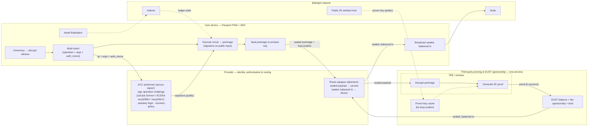
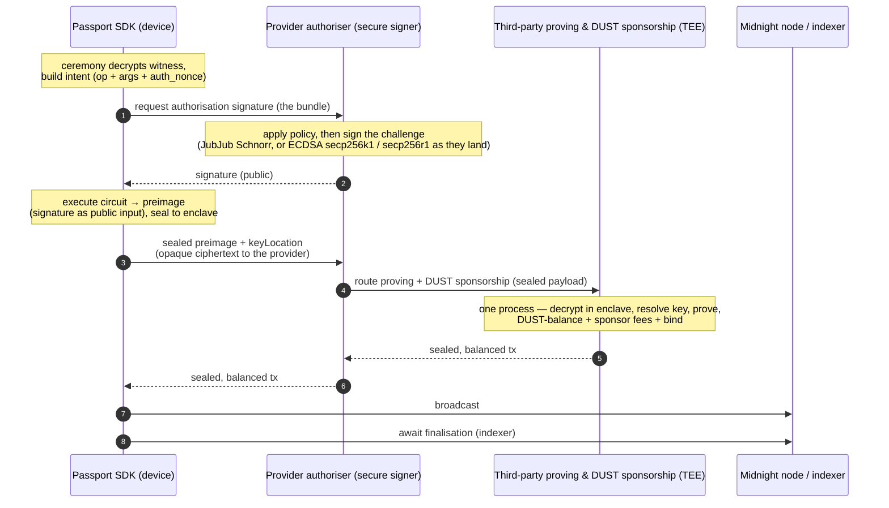
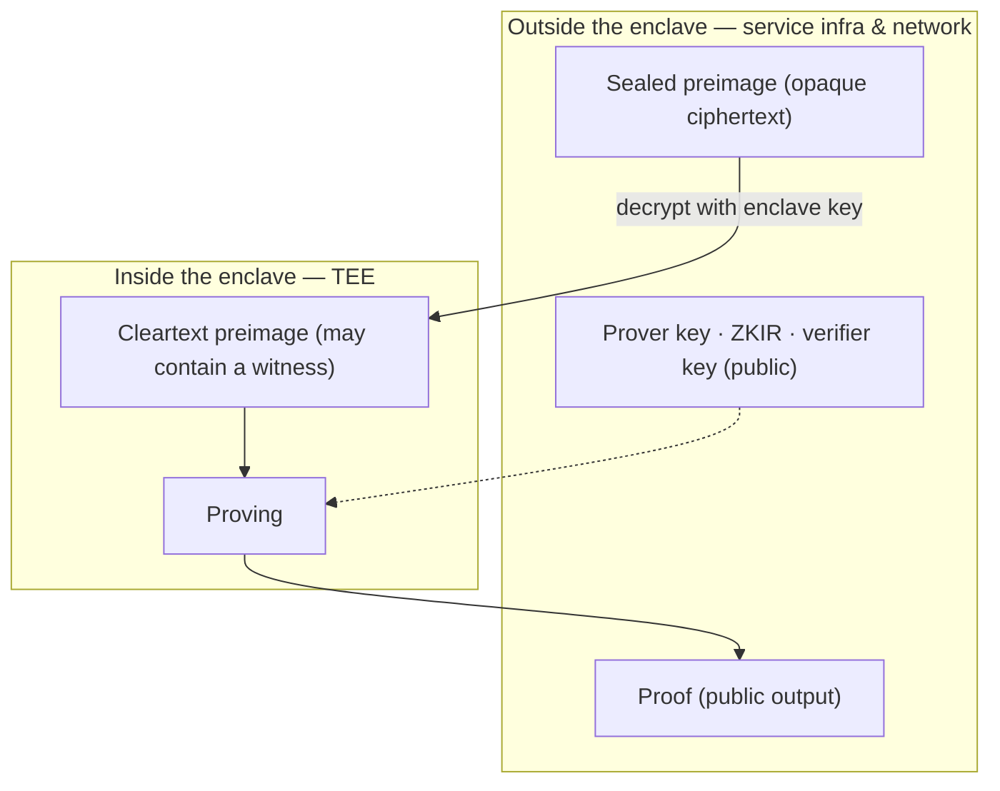

# Provider integration — contract execution, authorisation, and third-party proving & DUST sponsorship

> **Status:** draft · 2026/08/17
> **Audience:** the wallet-infrastructure provider ("the provider") backing
> Passport's managed custody path, the **third-party proving & DUST
> sponsorship service** it integrates, and the Passport SDK team.
> **Assumes:** the provider holds a signing key in its own secure signer and
> **routes proof creation (in a TEE) and DUST sponsorship to a third-party
> service**, which proves, balances, sponsors, and binds **in one process**;
> the sealed, balanced transaction returns through the provider and the **SDK
> broadcasts it**.
> **Companion to:** [`sdk-requirements.md`](./sdk-requirements.md) §2.5–§2.6,
> [`architecture.md`](./architecture.md) §4.2.1, and
> [`beta-scope.md`](./beta-scope.md). Canonical interfaces: the public **DApp
> Connector API** (`@midnight-ntwrk/dapp-connector-api`, `SPECIFICATION.md`) and
> the account-authorisation MIP (canvases **C1**, **C5**).

## 1. What this document is

This brief tells the parties behind Passport exactly what they must implement to
let a user **execute a Midnight contract call** — including deploying and using
their Account Custody Contract (ACC).

The single most important thing to internalise:

> **A Midnight contract call is a zero-knowledge proof, not a bare signature.**
> Authorisation *is* a signature, but one the ACC verifies **inside that proof**
> (C5), not at the ledger layer. The proven call is then balanced, fee-paid,
> cryptographically bound, and relayed.

### The three off-device actors

There are two external systems behind Passport, and it matters which one sees
what:

- **The provider — identity, authorisation, and routing.** Holds the account
  authoriser key in its secure signer, signs operation challenges, and runs
  passkey login and recovery policy. Once the circuit is executed on the
  device, it **routes the sealed proving payload to the third-party service,
  and the sealed, balanced transaction back to the device**. It sees operation
  *metadata* (what it is asked to authorise) and opaque ciphertext (what it
  routes); it **never sees the witness**.
- **The third-party proving & DUST sponsorship service — a third party the
  provider integrates.** Runs the TEE proof server and, **in the same
  process**, does DUST balancing, fee sponsorship, and binding, returning the
  sealed, balanced transaction. The sealed witness reaches **its enclave**; it
  **never holds the account key** — and it never broadcasts: **the SDK does**.

This separation is a feature: the party that authorises never sees the witness,
and the party that proves and settles never holds the authoriser key. Routing
does not change this — the payload the provider forwards is opaque ciphertext,
sealed to the service's enclave.

### The organising principle: two secrets, two holders

| Secret | What it is | Who holds it | How it is used |
|---|---|---|---|
| **Witness** | the proof's private inputs — per-dApp private state, shielded-coin data | **Passport (device)**, encrypted at rest, decrypted per transaction via the ceremony | consumed inside the proof; leaves the device only **sealed to the service's enclave**, for one proof |
| **Authoriser private key** | the key whose signature authorises ACC operations | **the provider** (secure signer); the **device** for a self-custody authoriser | signs a per-operation challenge; the **signature is public** and verified in-circuit; the **private key never leaves the holder and never enters the proof** |

## 2. Division of responsibilities

**The device does, and neither external party reimplements:** the ceremony,
witness storage and decryption, intent and circuit execution, preimage
construction, sealing to the enclave, **broadcasting the sealed, balanced
transaction**, and awaiting finalisation. Proving, balancing, sponsorship, and
binding all happen on the service, in one process, once the provider routes
the sealed payload; the finished transaction comes back through the provider
for the device to broadcast.

## 3. End-to-end sequence

The provider is touched twice — **sign**, then **route** (out with the sealed
payload, back with the finished transaction). The service does **prove and
settle in one process** and returns the sealed, balanced transaction; the
device does the circuit work in between and **broadcasts** — there is no proof
returned on its own, no device-side unsealed-tx assembly, and no separate
balance call.

## 4. The provider — identity & authorisation

### 4.1 ACC authorisation — the in-circuit co-signer

The ACC does **not** authorise operations with a ledger-level signature. Per the
account-authorisation MIP (C1, C5), authorisation is a **signature verified
inside the ZK circuit**: the ACC stores authoriser public keys, and each gated
circuit verifies a signature over a per-operation challenge. The provider is
**one registered authoriser**.

**What the provider holds.** At onboarding the provider generates its **own**
keypair; the ACC logs the **public** key as a registered authoriser. The private
key stays in the provider's secure signer and never leaves. This authoriser is also the
account's recovery backstop (below). Keys are **per-account and independent** —
the MIP forbids an HD tree, and per-account keys cap a compromise to one account.

**Signature scheme — one of:**

- **JubJub Schnorr** (RedDSA over JubJub) — verified in-circuit **today**
  (`s·G == R + c·pk`, native Compact built-ins); the specified,
  experiment-validated path (C5; `experiments/redjubjub-wallet`).
- **ECDSA over secp256k1** — the scheme most secure signers support, usable as
  native secp256k1 support lands in Compact and the ledger.
- **ECDSA over secp256r1 (P-256)** — the curve **native to WebAuthn passkeys**.
  Compact is going to verify secp256r1 in-circuit; once that lands, a
  passkey-held credential can authorise ACC operations directly (no binding
  hop), and a secure signer holding a P-256 key becomes a first-class
  authoriser.

Until the ECDSA curves ship, **JubJub Schnorr is the only in-circuit-verified
scheme** — choose with that timing in mind (§9).

All are **single-signer for now. FROST threshold signing is a future
improvement** (§9) and **requires a contract change**, so it is a deliberate post-beta upgrade
rather than a drop-in key swap. For
beta the provider signs with **its own single per-account key, held in its secure signer, via its own
process**.

**What the provider signs, and when.** A signature authorises exactly one call on
one account. The challenge binds the account, the circuit, the argument list, and
the account's `auth_nonce`, hashed with **SHA-256** — a fixed public definition,
so the provider computes it with no contract runtime. Flow: the SDK builds the
intent and reads `auth_nonce`; the provider **applies its policy** and returns a
signature (needing **only signing primitives — no compact-runtime, prover, or
node**); the SDK embeds the signature as **public** call data and builds the
preimage.

**Recovery — why the provider's key is on the ACC.** As a registered authoriser,
if the user loses their device the provider can sign a recovery operation that
registers the user's **new** device key and bumps the epoch (invalidating the
lost device). The provider's policy check is its recovery gate.

**Custodial vs bounded — an explicit decision.** In the current ACC any
registered authoriser is a full 1-of-n admin, so an authoriser that can "fully
back up" the account can also unilaterally **take it over** — custodial by
definition, and a single signing key is a single point of compromise.

- **Beta stance (recommended):** custodial — full authoriser, single per-account
  key in a secure signer. Stated plainly; matches the managed tier and the timeline.
- **Post-beta hardening:** bound the power — scope it and constrain recovery
  (time-lock + user notification/veto, or a guardian quorum via the ACC's BUSS
  mechanism), because a key that can rotate the user's device can otherwise
  rotate it to itself; and add FROST to remove the single-key risk.

### 4.2 `signData` and account data

Connector-surface methods the provider exposes:

- `signData(data, …)` — arbitrary-data signing for **Sign-In-with-Passport**
  (not ACC authorisation, which is §4.1). Prefix with
  `midnight_signed_message:<size>:`; return scheme (`schnorr_bip340` or
  `ecdsa_secp256k1_sha256`), the 64-byte signature, and the verifying key.
- `getShieldedAddresses`, `getUnshieldedAddress`, `getDustAddress`, the
  `get*Balances` methods, `getConnectionStatus`, and `hintUsage`.
- `getConfiguration` → indexer URI, indexer WS URI, node URI, and `networkId`.
  The proving endpoint it points to is the **service's** (§5).

## 5. Third-party proving & DUST sponsorship — one process

This is the third-party service the provider integrates and routes to. Per
transaction it does two things, **in the same process**: **create the proof in
a TEE**, then **DUST-balance, sponsor, and bind** the transaction, returning
the sealed, balanced result for the device to broadcast. The sealed witness
lives here (only in the enclave); the account key never does.

### 5.1 TEE proof server

Turns a **proof preimage** (which may encode a witness) into a **ZK proof**.

The device reaches it **via the provider**: the connector's delegated-proving
interface (`getProvingProvider` → `ProvingProvider`) is the device-side entry
point, and the provider routes each call to the service, whose surface is,
concretely, HTTP POSTs:

| Property | Value |
|---|---|
| Endpoints | `POST /check`, `POST /prove` |
| Request `Content-Type` | `application/octet-stream` |
| Request body | a single binary blob (`Uint8Array`) — **not JSON** |
| Response | `/check` → the check result (raw binary); `/prove` → the **sealed, balanced transaction** produced by the full in-process prove → balance → sponsor → bind run (encoding: §9) — the proof is never returned on its own |
| Timeout / retries | proving is slow; SDK default 5 min, retries on `500`/`503` |

**Two hardening changes vs. the stock proof server:**

1. **Sealed preimage.** The body carries the preimage **sealed to the enclave's
   public key**, not cleartext. Only the enclave can open it.
2. **Key by reference.** The body carries a **`keyLocation`** string, and the
   enclave **resolves and caches the prover key itself** from the public artefact
   host. Do **not** require the device to upload the 10–80 MB prover key per
   proof — that is the main mobile cost, and the keys are public (§6).

**The enclave privacy contract:**

The enclave MUST decrypt the preimage **only inside** the TEE; **never** log,
persist, or emit the cleartext preimage or any witness-revealing intermediate;
treat keys, ZKIR, and the proof as public; and be the only holder of the enclave
key. (For an operation whose only auth is the §4.1 signature and which has no
private witness, the preimage carries no secret — those proofs leak nothing.)

**Attestation is the service's responsibility.** The SDK **seals to a published
enclave key and does not verify a fresh attestation quote per call**. The service
MUST provision the enclave with a stable key pair, publish the public key over a
channel Passport can pin, back it with a remote-attestation quote, and document
rotation/re-attestation.

> **Accepted residual risk:** enclave-key provenance — the SDK trusts the
> published key rather than verifying attestation itself. A compromised or
> substituted enclave key would expose witnesses. Recorded as an accepted beta
> risk; SDK-side attestation (RA-TLS) is the mitigation path. Message-layer
> sealing (HPKE to the enclave key) or transport-layer (RA-TLS) are both fine;
> the service owns attestation either way.

**`/check` vs `/prove`:** `check` returns the public transcript values for
pre-validation; `prove` produces the proof and carries straight on into
settlement in the same process (§5.2), returning the sealed, balanced
transaction. Both take the sealed preimage + `keyLocation`. **Artefact integrity:** pin keys by a content hash tied to the
verifier key so a stale or swapped key fails loudly rather than producing an
invalid proof (`ZkArtifactIntegrityError` on the SDK side).

### 5.2 DUST balancing & sponsorship — in-process, after proving

*After* proving — **inside the same process, on the service** — the transaction
is unsealed (proof present, no settlement signatures, not yet bound). Distinct
from §4.1 authorisation — this is ledger-level fee/coin settlement. There is
no device-side `balanceUnsealedTransaction` call: the device never holds the
unsealed transaction. The service MUST:

- add coin inputs/outputs to remove imbalances **in the same intent** as the call;
- **pay/sponsor the DUST fees** (the service is the fee sponsor — §7);
- **cryptographically bind** the transaction, signing for its own coin inputs;
- return the **sealed, balanced tx** to the routed call, ready to broadcast (§5.3).

### 5.3 Broadcast — the device's job

The sealed, balanced tx flows back through the provider to the device, and the
**SDK broadcasts it** to the network, then awaits finalisation on the indexer
(§3). The service never submits; its process ends when it returns the finished
transaction.

## 6. Where the ZK artefacts live (and don't)

ZKIR, prover key, and verifier key are **deterministic, public outputs of
compiling the contract** — not secret, not user-specific. The **device** resolves
them to build the preimage; the **service's enclave** fetches the prover key by
`keyLocation` from the public artefact host and caches it (§5.1) rather than
receiving it from the phone. The **witness** is the only secret, on the device,
encrypted at rest, reaching the service **only sealed, only for the enclave, only
for one proof** — and only for operations that have a witness at all.

## 7. Beta scope (what must be ready first)

Per [`beta-scope.md`](./beta-scope.md), beta is the managed path only and needs:

1. **Provider — ACC authoriser** (§4.1): a single per-account key in a secure signer, registered
   on the ACC, signing challenges with **JubJub Schnorr** (or ECDSA —
   secp256k1, or passkey-native secp256r1 — once in-circuit support lands).
   Custodial (full authoriser); FROST and bounded
   recovery are post-beta.
2. **Provider — routing** (§3): forward the device's sealed proving payload to
   the service, and the sealed, balanced transaction back to the device.
3. **Service — TEE proof server** (§5.1), reached via the provider's routing,
   for **every** proof (no local WASM path, no size-based routing).
4. **Service — in-process DUST balancing & fee sponsorship** (§5.2), including
   ACC-deploy and name-claim, so a zero-DUST user can onboard.
5. **Provider — passkey confirmation** on every managed action (passkey login is
   the presence gate).
6. account data (§4.2); the device broadcasts (§5.3).

Out of beta: FROST, bounded recovery, local/WASM proving, size-based routing,
external wallet connections, agents, and the Capacity-Exchange fee path.

## 8. Implementation checklist

**Provider — authorisation**
- [ ] Per-account keypair; register the **public** key on the ACC; private key in a secure signer.
- [ ] Sign the challenge — SHA-256 over `{account, circuit, args, auth_nonce}` — with **JubJub Schnorr** (today) or **ECDSA** (secp256k1, or passkey-native secp256r1, as in-circuit support lands).
- [ ] No compact-runtime / prover / node needed for signing.
- [ ] Apply authorisation policy **before** signing (the enforcement point, especially for recovery).
- [ ] Route the sealed proving payload (sealed preimage + `keyLocation`) to the service, and the sealed, balanced transaction back to the device; the proving payload is opaque ciphertext to the provider.
- [ ] `signData`, addresses/balances, `getConfiguration` (pointing at the service's prover), `getConnectionStatus`, `hintUsage`.
- [ ] _(Future)_ FROST; bounded-recovery constraints.

**Service — proving**
- [ ] `POST /check` and `POST /prove`, `application/octet-stream`, binary in/out.
- [ ] Accept a **sealed** preimage; decrypt **only** inside the enclave.
- [ ] Accept a **`keyLocation`**; resolve + cache the prover key server-side.
- [ ] Never emit the cleartext preimage outside the enclave.
- [ ] Publish an attestation-backed enclave public key; document rotation.
- [ ] Pin keys by content hash; handle large payloads, multi-minute proofs, and SDK retries idempotently.

**Service — settlement (same process as proving)**
- [ ] After proving, in the same process: balance in-intent, pay/sponsor DUST, bind.
- [ ] Return the sealed, balanced tx to the routed call; the device broadcasts.

## 9. Open items to confirm

- **Provider ↔ service integration topology — decided: the provider routes.**
  The device hands the sealed proving payload to the provider, which routes it
  to the service; the preimage is sealed to the **service's** enclave, so the
  provider cannot read what it forwards. Still open: the trust chain for
  obtaining/pinning the service's enclave key, and the **wire encoding of the
  returned sealed, balanced transaction** the device broadcasts.
- **Authoriser signature scheme + timing** — JubJub Schnorr is the only
  in-circuit-verified scheme today; confirm the Compact/ledger timelines for
  **secp256k1** and for **secp256r1 (P-256, passkey-native)** — in-circuit
  gadget vs ledger-native authorisation, or both — before committing to an
  ECDSA curve.
- **Custodial stance** — beta is custodial (full authoriser, single per-account
  key). Confirm and record; schedule bounded-recovery + FROST hardening.
- **DUST sponsorship mechanics** — the service's fee-payer account, its funding,
  and whether the provider tops it up per account; whether sponsorship is
  unconditional in beta.
- **Sealing scheme** — message-layer (HPKE to the service's enclave key) vs
  transport-layer (RA-TLS). Fixes what the SDK's `adapter-prover-remote` builds.
- **Artefact host** — the shared public location the enclave resolves prover keys
  from, and its integrity/versioning scheme.

## 10. References

- Account-authorisation model: `C1-account-custody-contract.md`,
  `C5-signing-primitive.md`, ACC prototype `experiments/account-custody-prototype`.
- Schnorr-in-circuit validation: `experiments/redjubjub-wallet` (TS) and
  `experiments/redjubjub-wallet-rs` (Rust).
- Public DApp Connector API — `@midnight-ntwrk/dapp-connector-api`,
  `SPECIFICATION.md`.
- [`sdk-requirements.md`](./sdk-requirements.md) §2.5–§2.6,
  [`architecture.md`](./architecture.md) §4.2.1,
  [`beta-scope.md`](./beta-scope.md).
- Reference dApp flow: `example-bboard` (`BrowserDeployedBoardManager.ts`).
