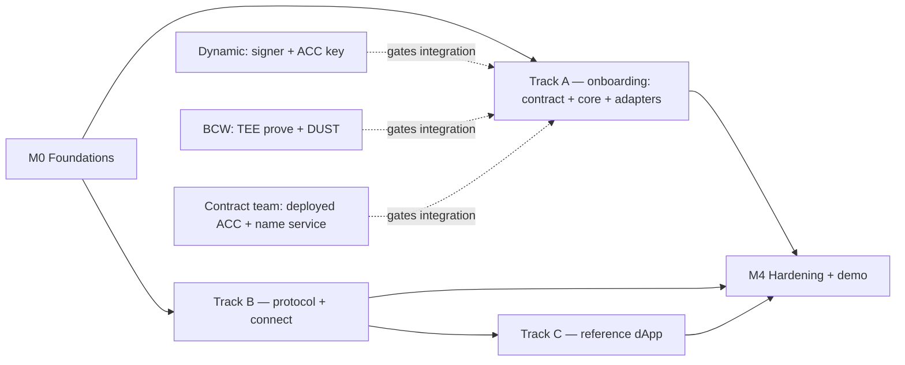

# Midnight Passport SDK — Roadmap (Beta v1)

> **Status:** draft · 2026/07/29
> **Turns into a plan:** the specs in [`sdk-requirements.md`](../sdk-requirements.md),
> [`beta-scope.md`](../beta-scope.md), and [`provider-integration.md`](../provider-integration.md),
> reduced to the smallest slice that ships. Built the way
> [`development-workflow.md`](../development-workflow.md) describes (issue-anchored,
> small PRs, `STATE.md`).
> **North star:** the public demo in **October 2026**. There is no fixed MVP
> deadline; this maps the work and its dependencies so progress is bounded by
> capacity and by our two external partners, not by one ordered chain.

## 1. What beta delivers

Two things, done well (from [`beta-scope.md`](../beta-scope.md) §1):

1. **Full account setup** on the managed path — deploy the Account Custody
   Contract (ACC) and claim the name (`alice.passport.night`), with fees
   sponsored so a zero-DUST user can onboard.
2. **A first reference dApp** — a **marketing experience** — that **issues a
   new Passport in place** (partner-origin onboarding, FS-2.3 /
   [`partner-onboarding.md`](../partner-onboarding.md)), signs a user in,
   and reads their profile (`{ name, account }`).

Everything else is deferred (§9). Beta is deliberately **managed-path first**
— with `adapter-signer-local` built as the self-custody contingency fallback
should the provider gate slip (beta-scope §2 item 2, ADR 0001) — and it uses
the three-actor model from
[`provider-integration.md`](../provider-integration.md): the **device** (our
SDK), **Dynamic** (the provider — identity and authorisation), and **BCW** (the
proving & settlement service — remote TEE proof plus DUST).

## 2. Milestones

Each milestone has a **brief file** in [`milestones/`](./milestones/) (one per
milestone) listing its feature specs; `mn-passport-skills-spec-author` expands a
brief into a full spec in [`specs/`](./specs/), which
`mn-passport-skills-spec-driver` plans into tranches.

| # | Milestone | Delivers | Depends on |
|---|---|---|---|
| **M0** | Foundations | scaffolding, dev workflow, ACC-artefact wiring, seam interfaces | — (start now) |
| **M1** | Managed onboarding | deploy ACC + claim name end-to-end, fees sponsored | M0 · Dynamic · BCW · deployed ACC |
| **M2** | Connect | Sign-In-with-Passport returning `{ name, account }`; the partner-origin issuance facade (FS-2.3) | M0 (soft: a deployed ACC to read) · FS-2.3 also: FS-0.3–0.8 + M1 rails |
| **M3** | Reference dApp | the marketing experience wired to `connect` + `onboard` (issues Passports in place) | M2 |
| **M4** | Hardening & demo | audit, conformance, privacy disclosure, beta demo | M1 · M2 · M3 |

### M0 — Foundations
Monorepo and package skeletons; the `mn-passport-skills` plugin, CI gate
(`.github/workflows/pr-checks.yml`), and `STATE.md` live; the `deps`
(7-day cooldown) and `devenv` watchers run. Wire `mn-passport-contract` over the
**externally-owned ACC artefact** (compiled circuit + ZKIR + verifier key) and
**pin the binding version**. Define the core seam interfaces (signer, prover,
settlement, storage, platform) — one spec per seam, each shipping a
**provider-free dev backend** wired to the local environment (dev signer key,
local proof server, devnet settlement with user-held DUST) per architecture
§4.2 / [P8] (ADR 0002).
*Exit:* `core` and `contract` build, a stub wiring compiles end-to-end, CI green.

### M1 — Managed onboarding
The account-setup path (§2 / §3.1 of requirements, C1 + C2). `mn-passport-core`
carries the onboarding flow; `mn-passport-contract` binds the deploy and
name-claim circuits; `adapter-signer-managed` requests the authorisation
signature from **Dynamic**; `adapter-prover-remote` seals the preimage and calls
**BCW**'s TEE (`/prove`, key by `keyLocation`); settlement (DUST balancing and
submit) runs through **BCW**. *Exit:* a zero-DUST user deploys an ACC and claims
`alice.passport.night` end-to-end on the managed path.

### M2 — Connect
`mn-passport-protocol` (the C23 wire types + the §3.13 shared constants),
`mn-passport-connect` (Sign-In-with-Passport + profile read only), and
**`mn-passport-onboard`** (FS-2.3, the partner-origin issuance facade over
`core` + adapters — passkey under the Passport RP ID via ROR, ACC deploy via
a direct connection to the third-party proving and DUST sponsorship service,
largeBlob bootstrap, sign-in; the managed-authoriser variant is a future
iteration; see [`partner-onboarding.md`](../partner-onboarding.md)). No witness
provisioning, no grants, no deposits (§4 of beta-scope). *Exit:* a dApp signs
a user in and reads `{ name, account }`, and a dApp issues a new Passport
that the Passport app recognises from one ceremony.

### M3 — Reference dApp
Install `mn-passport-onboard` + `mn-passport-connect` into the **marketing
experience**: it issues a new Passport in place, signs existing users in,
and personalises — never spends, never asks for a grant, never touches
witness state. *Exit:* the reference dApp runs issuance and sign-in
end-to-end.

### M4 — Hardening & demo
Run the review lenses (`security-audit`, `conformance`, `verify`) and `doc-sync`;
land the **reduced-privacy disclosure at onboarding plus the standing reminder**
(beta proves remotely by default, so the posture is disclosed, per
requirements §2.5); ship the beta demo. *Exit:* the demo runs, the residual-risk
register and docs are current.

## 3. Package & adapter build order

| Package | Beta role | Built in |
|---|---|---|
| `mn-passport-core` (slim) | kernel, onboarding flow, connect answer, seams | M0–M1 |
| `mn-passport-contract` | ACC bindings: deploy + name claim | M0–M1 |
| `mn-passport-protocol` | C23 wire types (dApp ↔ wallet) + §3.13 shared constants | M2 |
| `mn-passport-connect` | sign-in + profile read | M2 |
| `mn-passport-onboard` | partner-origin issuance facade (FS-2.3) | M2 |
| `adapter-signer-managed` | Dynamic authoriser signing | M1 |
| `adapter-signer-local` | self-custody signer — contingency fallback (ADR 0001) | M1 |
| `adapter-prover-remote` | BCW TEE proving (seal + `/prove`) | M1 |
| `adapter-*` settlement seam | BCW DUST balancing + submit | M1 |
| `adapter-browser` | platform target (the PWA) + WebAuthn/ROR and largeBlob ceremonies (FS-2.3) | M1–M2 |

**Not built for beta:** `adapter-prover-wasm`, `adapter-agent-ows`,
`adapter-wallet-connect`, `adapter-fee-capacity-exchange`, and the
witness-provisioning half of the connector.

## 4. External dependencies (the gates)

These are owned outside the SDK and gate M1's end-to-end integration. They do
**not** gate the SDK-side build, which we develop against mocks and integrate
when each is ready (see §5).

| Dependency | Owner | Needed for | Blocking |
|---|---|---|---|
| Authoriser signer producing **JubJub Schnorr** (ECDSA secp256k1 later) + its public key registered on the ACC | **Dynamic** | M1 | yes |
| **TEE proof server** (`/check`, `/prove`, sealed preimage, key by `keyLocation`) + an attestation-backed enclave key | **BCW** | M1 | yes |
| **DUST fee sponsorship** | **BCW** | M1 | yes |
| A **deployed ACC** carrying the C5 Schnorr verifier, plus the name service (C2) | contract team | M0 binding · M1 e2e | yes |

The confirmations we still need from Dynamic and BCW are the open items at the
end of [`provider-integration.md`](../provider-integration.md).

**Contingency (ADR 0001):** `adapter-signer-local` is built in M1 alongside
the managed signer, behind the same signer seam — so the Dynamic signer gate
blocks only the *managed-path integration*, not beta onboarding as a whole. If
the gate slips past the activation checkpoint (beta-scope §5), the fallback is
promoted to the beta onboarding path.

## 5. Parallelisation map

Three tracks run in parallel once M0 lands: **A** (managed onboarding, the
contract bindings, core and the adapters), **B** (protocol and connect, built
against a fixture ACC so it does not wait on M1), and **C** (the reference dApp,
built against a mock connector). They converge at M4. Crucially, the external
gates block only the *integration* of Track A, not its SDK-side construction —
so the adapters are built and unit-tested against mocks while Dynamic and BCW
get ready.

## 6. How it is delivered

Per [`development-workflow.md`](../development-workflow.md): each milestone is
anchored to a **GitHub issue** (planning stops if there is no issue), planned
into small, reviewable PRs by `/mn-passport-skills:spec-driver`, with progress and
backlog tracked in `STATE.md`. The review lenses and the CI gate enforce; the
skills assist and judge. The residual-risk register stays gitignored (the
private `../mn-passport-sdk-debts` sibling).

## 7. Definition of done for beta

- A zero-DUST user onboards end-to-end on the managed path: ACC deployed, name
  claimed, fees sponsored by BCW, authorised by Dynamic, proven in BCW's TEE.
- A dApp completes Sign-In-with-Passport and reads `{ name, account }`.
- A dApp issues a new Passport in place (passkey under the Passport RP ID,
  ACC deployed, largeBlob bootstrap) and the Passport app recognises the
  account from one ceremony — or, below the compatibility floor, the
  redirect fallback carries the user to first-party onboarding.
- The reference marketing experience runs those flows for a real user.
- The reduced-privacy posture is disclosed and reminded (requirements §2.5).
- Security audit, conformance, and doc-sync have run; the risk register is
  current.

## 8. Beyond beta (deferred, with pointers)

**The ACC upgrade path** — each user's deployed contract pins the artefact
version it was deployed at (FS-0.2 D-8); post-beta, an explicit upgrade flow
migrates an account to a newer contract version (redeploy or the contract
team's upgrade mechanism, state and name binding preserved) and updates the
binding registry in lockstep. Until then the SDK serves every supported
version side by side, and the prototype's own note stands: `transientHash`
commitments do not survive toolchain upgrades, so an upgrade is a
redeploy-and-migrate event (C8). Also deferred, from
[`beta-scope.md`](../beta-scope.md) §4 and the full specs: the decentralised
self-custody path **as the default** (the fallback adapter itself is in beta,
ADR 0001) and progressive decentralisation; in-tab WASM proving with the k-threshold router; witness
provisioning to dApps (#58); scoped grants (issue and spend); agents / OWS;
external wallet connections; DUST sponsorship via the Capacity Exchange; the
deposit mechanism; recovery flows (lost-device and total-loss); `did:midnight`;
multi-device beyond the provider's own; and, on the provider side, **FROST
threshold signing (a contract change)** and bounded, non-custodial recovery.
