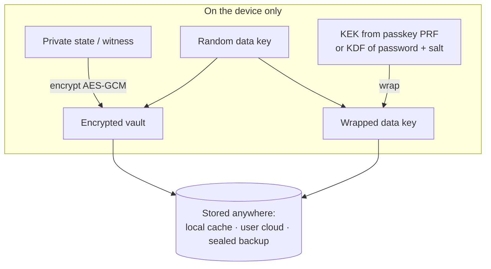
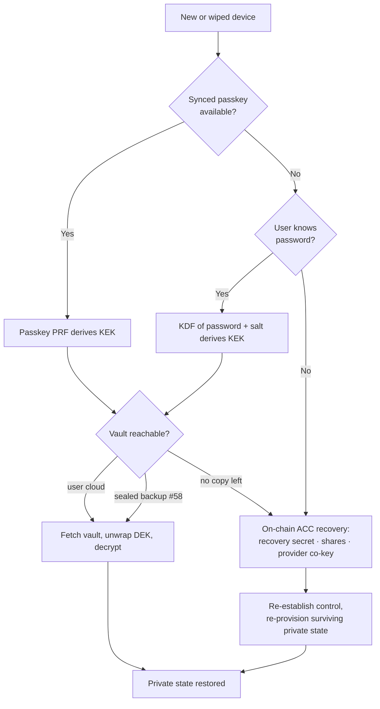

# Storage, backup, and recovery

Status: draft 2026/07/31. Companion to [`dapp-connection.md`](./dapp-connection.md),
which covers how the witness is *provisioned* across origins; this doc covers
how it is *kept, backed up, and recovered*.

## 1. Purpose

Passport holds private state (witnesses) that is not reconstructible from the
chain, on a device whose browser storage is unreliable (per-context jars,
eviction) and where Passport hosts no plaintext of the user's secrets. This doc
sets out:

- what actually needs to persist, and what is already recoverable from the
  network;
- one encryption model — **encrypt on the device, store only ciphertext** — that
  is independent of *where* the ciphertext lives;
- the storage locations that ciphertext can live in, including **the user's own
  cloud (Google Drive, iCloud, Dropbox)** as a first-class option;
- the recovery flows for every realistic loss, and how off-chain private-state
  recovery composes with on-chain account recovery.

The guiding constraint: **no single loss — of a device, a passkey, a password,
a cloud account, or the provider — may be fatal.** That means at least two
independent durable copies, reachable by at least two independent factors.

## 2. What needs to persist

Three classes of data, handled differently:

- **Secret payload** — private state / witnesses and any non-derived secrets.
  Not reconstructible; must be backed up *and* encrypted.
- **Metadata / index** — the pointers a client needs to *find and use* its own
  on-chain state. Individually public, but bootstrap-critical and
  privacy-sensitive in aggregate.
- **Authoritative on-chain state** — the ledger. The source of truth; never
  backed up, but you need the index to know where to read it.

| Data | Lives in | Reconstructible from nothing? | Kept in the vault? |
|---|---|---|---|
| ACC ledger state, device/recovery **commitments**, epoch, alias binding | on-chain ledger | Yes — *if* you know where to look | No (it is the truth) |
| **Metadata / index** — ACC address, network, contract-binding version, alias(es), resolver addresses, connected dApps + their contracts/scopes, `privateStateId`s, credential IDs, KDF salts, vault-copy locations, vault version | device / vault | **No** (see below) | **Yes** — small, non-secret, privacy-sensitive |
| Passkey / PRF secret | platform authenticator (Secure Enclave), iCloud/Google-synced | Yes, while the passkey survives | No |
| `device_secret` | PRF-derived (demo) or random | If PRF-derived: yes | Only if not PRF-derived |
| **Private state / witnesses** (ACC and per-dApp) | device, encrypted | **No** — off-chain, app-specific | **Yes** |
| `recovery_secret` (shares committed on-chain) | off-chain secret | No | **Yes**, unless split (§7) |

**Reconstructible is not the same as findable.** The ledger *is* the source of
truth, but a fresh device cannot ask for "my account" without an anchor — a
Midnight contract address is fixed at deploy time and **not derivable from the
user's key**, so the ACC address cannot be recomputed from the passkey alone.
Two things recover it: the **alias** (the user remembers `alice.night`; resolving
it on-chain yields the ACC address) or a **stored metadata index**. So the index
is backed up not because its facts are secret — they are public — but because
(a) without it, or the alias, a recovered key has nowhere to point, and (b) the
*aggregate* — one user's accounts, aliases, dApp graph, and cloud locations — is
precisely the linkage a privacy-preserving wallet must not leak. Keep it **in the
same encrypted vault** as the private state. (No chicken-and-egg: the vault is
*located* without the index — a cloud's fixed per-app folder, or a #58 lookup key
derived from the credential or alias — so you find and decrypt the vault first,
then read the index inside it.)

So **losing the account identity is not the risk** — the ledger holds it and the
alias re-finds it. The risks are losing the **private state** (no one else holds
it) and exposing the **index** (individually public, but a linkage leak in
aggregate). And if `device_secret` is PRF-derived, it rides the passkey's own
sync and never needs a backup file.

## 3. The encryption model: encrypt on the device, store ciphertext anywhere

The crypto is the pattern popularised by password managers such as Bitwarden and
1Password — **envelope encryption with a zero-knowledge boundary**:

- A random **data key (DEK)** encrypts the vault plaintext — the private state
  **and the metadata index** (§2) — with AES-256-GCM. The DEK is per-vault and
  never changes when the user re-authenticates.
- A **key-encryption key (KEK)** *wraps* the DEK. The KEK comes from the
  ceremony — the passkey **PRF**, or `KDF(password, salt)` (Argon2id) — exactly
  as in `dapp-connection.md` §6.
- **Only the ciphertext and the wrapped DEK ever leave the device.** The KEK is
  never stored and never transmitted; whoever holds the file learns nothing.

Because the KEK never leaves, the storage location is **untrusted**. Re-keying
(a new passkey, a changed password) only re-wraps the DEK — a few bytes — never
re-encrypts the vault. This is what lets us treat "where the ciphertext lives"
as a free choice.

## 4. Two independent axes

Every storage decision is a pair: **how you get the key**, and **where the
ciphertext sits**. They compose freely — any key source with any location.

**Key source (the KEK).** Recap from `dapp-connection.md` §6:

- **Passkey PRF** — preferred. Derived on demand, Secure-Enclave-backed,
  iCloud/Google-synced, jar-independent, phishing-resistant. Stores nothing.
- **Passkey largeBlob** — stores a ~2 KB blob *on* the credential (synced,
  jar-independent). Room for a wrapped key or seed, not the vault itself.
- **Password KDF** — fallback for no-passkey devices. `KDF(password, salt)`;
  password never stored, salt travels with the ciphertext.

**Ciphertext location (the vault):**

- **Local cache** — IndexedDB / OPFS on the device. Fast, but not synced and
  not jar-independent; a convenience copy, never the only copy.
- **User cloud** — the user's own Google Drive, iCloud, or Dropbox (§5). Synced,
  jar-independent, user-owned, Passport hosts nothing.
- **Sealed backup service (#58)** — a Passport/network-run store that holds only
  sealed ciphertext. Synced, jar-independent, but provider-hosted.

The earlier "three legs" (ceremony key + on-chain ACC + #58) still hold; **user
cloud is a new option on the ciphertext-location leg**, and for many users a
better one than a service we have to run.

## 5. The user-cloud option (the Bitwarden model)

Store the encrypted vault in the storage the user already has and trusts, rather
than in infrastructure Passport operates.

**Why it is attractive**

- **User-owned and already paid for** — no custody liability for us, no
  bill for us, nothing to off-board when a user leaves.
- **Synced and jar-independent** by construction — the cloud client, not the
  browser, moves the file between the user's devices, so a fresh Safari context
  or a reinstalled PWA can still fetch it.
- **Zero-knowledge holds** — the provider sees ciphertext only (§3). A
  compromised cloud account does **not** yield the vault without the KEK.

**Per-platform reality — this is where it gets uneven:**

| Cloud | Write path from a web PWA | Notes |
|---|---|---|
| **Google Drive** | OAuth 2.0 + Drive API, `appDataFolder` scope | Works from a PWA today. `appDataFolder` is a hidden per-app space — the vault never clutters the user's file list |
| **Dropbox** | OAuth 2.0 + API (scoped app folder) | Works from a PWA |
| **iCloud Drive** | **No public third-party web write API** | Only reachable via a **native wrapper** (CloudKit, own container) or the OS share sheet / File System Access API — a real gap for a pure PWA |
| **OS-native** | File System Access API (Chromium desktop), share sheet, native app | User-gated per write, or native-only |

The honest caveat: the user named iCloud, but **a pure PWA cannot silently write
a user's iCloud Drive** — Apple exposes no third-party web API for it. On iOS the
realistic iCloud path needs a thin native wrapper (a CloudKit container the app
owns) or the share sheet. **Google Drive `appDataFolder` is therefore the
realistic first cloud target for a web-only beta**, with iCloud deferred to a
native shell.

**Trade-offs to hold**

- Availability is the user's: they can delete the file, revoke the OAuth grant,
  or lose the cloud account. Hence it is *one* durable copy, not the only one.
- Cloud account + a phished password defeats the vault — so the KEK factor must
  be strong (prefer PRF; rate-limit and salt the password KDF).
- OAuth consent is friction at setup, once per cloud per device.

## 6. Storage tiers compared, and the default

| Tier | Who hosts | Synced | Jar-independent | Sees plaintext | Fails if… |
|---|---|---|---|---|---|
| Local cache | the device | No | No | No | device lost/wiped, storage evicted |
| **User cloud** | user's provider | Yes | Yes | No | user deletes it, cloud account lost, outage |
| Sealed backup (#58) | Passport/network | Yes | Yes | No | service outage, user off-boards |
| On-chain ACC | the network | Yes | Yes | control state only | — (holds no private state) |

**Recommended default (layered):**

- **Key:** passkey **PRF** primary; **password KDF** (Argon2id) fallback.
- **Ciphertext:** **local cache** for speed, **plus at least one durable synced
  copy** — Google Drive `appDataFolder` where the user connects a cloud, else
  the **#58 sealed backup**.
- **Backstop:** on-chain **ACC recovery** (§7).
- **Invariant:** at least **two independent durable copies** reachable by **two
  independent factors** (e.g. passkey *and* password, or user cloud *and*
  on-chain), so no single loss is fatal.

## 7. Recovery

Recovery has **two distinct halves that must not be conflated:**

- **Account control** — *who may authorise ACC operations.* Recovered
  **on-chain**: the `recovery_secret` (committed as `recovery: Field`) plus its
  2-of-3 Shamir `recovery_shares`, and — once it exists — the provider's recovery
  co-key (see [`provider-integration.md`](./provider-integration.md)). This is
  the C14 concern.
- **Private state** — *the witnesses themselves.* Recovered **off-chain** from a
  surviving encrypted vault (local, user cloud, or #58).

**They are independent.** Recovering control does **not** restore private state,
and vice versa. If every vault copy is gone, the private state is gone even
though the account identity is fully recoverable from the chain — which is
exactly why §6 insists on a durable synced copy.

**Scenarios:**

1. **New device, synced passkey.** The passkey syncs via iCloud/Google → PRF
   yields the KEK → fetch the vault from the user cloud (or #58) → unwrap the DEK
   → decrypt. Seamless; no password, no on-chain step.
2. **New device, no passkey, password known.** `KDF(password, salt)` yields the
   KEK → fetch and decrypt as above. Then register a fresh passkey and re-wrap
   the DEK to it.
3. **Cloud vault lost, device intact.** Re-push from the local cache (or #58) to
   a new cloud target. No secret is at risk.
4. **Passkey lost *and* password forgotten.** Off-chain factors are gone → run
   **on-chain ACC recovery** to re-establish control (reconstruct
   `recovery_secret` from 2-of-3 shares, and/or the provider co-key), then
   re-provision whatever private state survives in a vault. Private state with no
   surviving vault copy is unrecoverable.
5. **Everything lost (no passkey, no password, no vault, no shares).**
   Unrecoverable by design — this is the case the two-copies/two-factors
   invariant exists to prevent.

**Prototype gap to be honest about:** in
`experiments/account-custody-prototype`, `recovery_shares` are stored as
plaintext in the ledger — a placeholder for publicly verifiable secret sharing
(shares encrypted to each helper's public key). And the provider recovery co-key
is **not yet on the ACC** (the contract is still hash-preimage, no signature
verification). So on-chain recovery today is the Shamir placeholder only; the
provider co-key is the intended, not the current, state.

## 8. Backup write path

- **When private state changes**, re-encrypt with the existing DEK and push the
  new ciphertext to every configured location. The DEK is stable, so a rotation
  of the passkey/password does not trigger a re-upload — only a re-wrap.
- **Versioning / conflicts.** Tie a monotonically increasing version to the ACC
  `round`/`device_epoch` so a stale copy is detectable. Default policy:
  last-writer-wins by version, with the newest surviving copy authoritative;
  revisit if concurrent multi-device writes become common.
- **Integrity.** AES-GCM authenticates the vault; a tampered or truncated cloud
  file fails to open rather than decrypting to garbage.

## 9. Trust boundaries

- **Cloud provider / #58:** ciphertext only. No plaintext, no KEK.
- **Passport:** never sees the user's plaintext private state or the KEK
  (zero-knowledge); it orchestrates, it does not custody.
- **Platform authenticator:** custodies the passkey/PRF in the Secure Enclave.
- **User memory:** custodies the password (fallback factor).
- **Residual risks:** phished password + reachable ciphertext defeats the
  fallback factor (mitigate: strong rate-limited KDF, clear domain cue, prefer
  PRF); a user who connects no cloud and no #58 keeps only the local copy and is
  one wipe from scenario 4.

## 10. Open items / what this feeds

- **iCloud web gap** — accept Google Drive `appDataFolder` for the web beta and
  scope a native shell for iCloud, or drop iCloud from beta.
- **Is `device_secret` PRF-derived or random?** Decides whether it is in the
  vault at all (§2). Pin this in the ACC binding spec.
- **Account rediscovery anchor** — mandate the **alias** as the recoverable root
  (resolve → ACC address), so rediscovery never depends solely on a backed-up
  index, given contract addresses are not key-derivable (§2). Decide the **#58
  lookup key** (credential- or alias-derived) that lets a fresh device locate the
  vault before it can read the index.
- **#58 vs user cloud** — whether we run #58 at all once user cloud covers the
  durable-copy slot, or keep it only for users who connect no cloud.
- **Conflict resolution** beyond last-writer-wins, if multi-device concurrent
  editing is in scope.
- **PVSS for `recovery_shares`** and the **provider recovery co-key** — both
  depend on the ACC gaining signature verification (C5) and a registered-key
  slot; tracked with the account-recovery work (**C14**).
- Feeds **C14** (recovery), the account-binding spec, and the
  `mn-passport-connect` spec (**FS-2.2**); pairs with **C23** and
  `dapp-connection.md` on the provisioning side.
